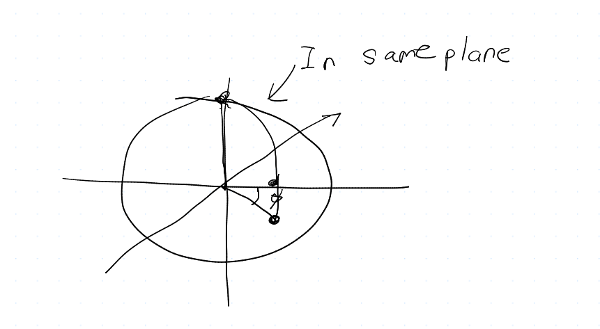

$$
\phantom {derivatives}
\newcommand\d{\text{d}}
\def\ffrac(#1/#2){\frac{#1}{#2}}
\def\hfrac #1(#2/#3){\ffrac (#1#2/#1#3)}
\def\deri#1/#2;{\hfrac \d(#1/#2)}
\def\dderi#1/#2;{\nderi #1/#2^2; }
\def\nderi#1/#2^#3;{\ffrac (\d^#3 #1/\d #2^#3)}
\def\derin #1;{\deri /#1;}
\def\pderi#1/#2;{\hfrac \part(#1/#2) }
\def\ppderi#1/#2;{\npderi #1/#2^2;}
\def\npderi#1/#2^#3;{\ffrac (\part^#3 #1/\part #2^#3)}
\def\pderin1/#1;{\ffrac (\part / \part #1)}
\def\fac #1/#2;{\frac{#1}{#2}}

\phantom {fraction}
\def\inv#1{\ffrac (1/#1)}
\newcommand\invsqrt[1]{\frac{1}{\sqrt{#1}}}
\newcommand\half{\frac{1}{2}}
\newcommand\tri{\frac{1}{3}}
\newcommand\quar{\frac{1}{4}}
\phantom {vectors}
\newcommand\vfunc[2]{}

\phantom {common vectors}
\def\vfn #1(#2){\vec #1(\vec #2)}
\def\v #1{\vec #1}
\newcommand\vf{\v f}
\newcommand\vx{\v x}
\newcommand\vy{\v y}
\newcommand\vz{\v z}
\newcommand\vr{\v r}
\newcommand\vv{\v v}
\newcommand\va{\v a}
\newcommand\vtheta{\v \theta}
\newcommand\vphi{\v \phi}
\newcommand\vs{\v s}

\phantom {randomstaff}
\def\tsub#1;{_{\text {#1}}}
\def\sub#1;{_{#1}}
\def\(#1);{\left(#1\right)}
\def\intl#1;{\int_{#1}}
\def\intlh#1;#2;{\int_{#1}^{#2}}
\def\sup#1;{^{#1}}
\def\tsup#1;{^{\text{#1}}}
\def\align[[#1]]{\begin{align*}#1\end{align*}}
\def\note#1!{\fbox{$#1$}}
\def\.#1|;{\left.#1\right|}
\def\ssqrt/#1/;{\sqrt{#1}}
\def\noteeq#1!#2!{\begin{equation} \label{eq:#2} \fbox{$#1$}\end{equation}}
\def\raf#1;{\ref{#1}}
\def\eqraf#1;{\eqref{#1}}
\def\dfac#1/#2;{\dfrac{#1}{#2}}
\def\sqt#1/;{\sqrt{#1}}
\def\sgrt#1/>{\sqrt{#1}}
\def\txt#1;{\text{#1}}
\def\const{\text{const}}
\def\eq#1!#2!{\begin{equation} \label{eq:#2} #1 \end{equation}}
\def\kg{\txt kg;}
\def\s{\txt s;}
\def\m{\txt m;}
\def\stwo{\txt s;^2}
\def\iv#1;{\inv{#1}}
\def\sumninfin{\sum\sub n=1;\sup\infin;}
\def\sumninfinz{\sum\sub n = 0;\sup\infin;}
\def\intinfin{\int\sub-\infin;\sup\infin;}
\def\cases[[#1]]{\begin{cases}#1\end{cases}}
$$

##### Question 1: Air force practice

The zero order motion is
$$
\ddot x_0(t) = 0 \\
\ddot y_0(t) = 0 \\
\ddot z_0(t) = -g
$$
and with initial condition
$$
x(0) = 0 \\
y(0) = 0 \\
z(0) = h \\
\dot x(0) = \fac u / \sqrt2; \\
\dot y(0) = -\fac u/ \sqrt2; \\
\dot z(0) = 0
$$
and thus
$$
x_0(t) = \fac u/\sqrt 2; t \\
y_0(t) = -\fac u/\sqrt 2;t \\
z_0(t) = h - \half gt^2
$$
and for the first order
$$
\ddot x_1 = 2\omega (-\fac u/\sqrt2;)\sin\theta - 2\omega \cdot 0\cos\theta = -\sqrt 2 \omega u \sin\theta \\
\ddot y_1 = -2\omega (\fac u/\sqrt2;)\sin\theta = -\sqrt 2\omega u \sin \theta \\
\ddot z_1 = -g + 2\omega (\fac u/\sqrt2;)\cos\theta =\sqrt 2 \omega u \cos \theta
$$
and thus
$$
x_1 = -\fac \sqrt 2/2; \omega u \sin\theta t^2 \\
y_1 = -\fac \sqrt 2/2; \omega u \sin\theta t^2 \\
z_1 = \fac \sqrt 2/2; \omega u \cos\theta t^2
$$
and thus, combining the terms, we got
$$
x(t) = \fac u/\sqrt 2; t-\fac \sqrt 2/2; \omega u \sin\theta t^2  \\
y(t) = -\fac u/\sqrt 2;t -\fac \sqrt 2/2; \omega u \sin\theta t^2  \\
z(t) = h - \half gt^2 + \fac \sqrt 2/2; \omega u \cos\theta t^2 \\
$$
thus, the time when Humvee lands is
$$
z(t) = 0 \\
(\half g - \fac \sqrt 2/2;\omega u \cos \theta) t^2 = h \\
t^* = \sqrt {\fac 2h/ g - \sqrt 2\omega u \cos \theta;}
$$
and it thus lands on
$$
x(t^*) = \fac u/\sqrt 2; \sqrt {\fac 2h/ g - \sqrt 2\omega u \cos \theta;}-\fac \sqrt 2/2; \omega u \sin\theta \fac 2h/ g - \sqrt 2\omega u \cos \theta; \\
y(t^*) = -\fac u/\sqrt 2;\sqrt {\fac 2h/ g - \sqrt 2\omega u \cos \theta;} -\fac \sqrt 2/2; \omega u \sin\theta \fac 2h/ g - \sqrt 2\omega u \cos \theta;  \\
$$
and, trying to simplify a bit
$$
x(t^*) = \sqrt {\fac u^2h/ g - \sqrt 2\omega u \cos \theta;}- \fac \sqrt 2h\omega u \sin\theta/ g - \sqrt 2\omega u \cos \theta; \\
y(t^*) = -\sqrt {\fac u^2h/ g - \sqrt 2\omega u \cos \theta;}- \fac \sqrt 2h \omega u \sin\theta/ g - \sqrt 2\omega u \cos \theta;  \\
$$

##### Question 2: Golf on an alien planet

The period $T$ is $2 * 3600 = 7200 \s$, and thus $\omega = \fac 2\pi/T; = \fac \pi/3600; \approx  0.000873  \txt rad;/\s$

We could just use the formula $R = \fac |v| / 2\omega \sin\theta;$, and thus
$$
R = \fac v / 2\cdot \omega \sin 45^\circ ; = \fac v/\sqrt 2 \omega;
$$
notice that since the ground is frictionless, so the golf ball will continue to move on the ground, and since the Coriolis force is $F = -2m\vec \omega \cross \vec v$, it's always perpendicular to the motion (thus doesn't change it's speed). Therefore
$$
T = \fac 2\pi R/v; = \fac 2\pi/\sqrt 2\omega; = \fac \sqrt 2 \pi/\omega; \approx 5091.17\s
$$

##### Question 3: Great circles 

> Show that the shortest distance between two points on a sphere is a great circle. Start with the expression for the line element in spherical polar coordinates $(r, \theta, \phi)$, given by
> $$
> \d l^2 = \d r^2 + r^2 (\d \theta^2 + \sin^2\theta \d \phi^2)
> $$
> Consider two points on the sphere for which $r = R = \const$ (and $\d r = 0$), specified by $P_1 = (\theta_1, \phi_1)$

We know that line elements is $\d l^2 = \d r^2 + r^2 (\d \theta^2 + \sin^2\theta \d \phi^2)$. Since $r = R = \const$
$$
\d l^2 = R^2(\d\theta^2 + \sin^2\theta \d \phi^2)
$$
and thus
$$
\deri l/\theta; = \sqrt{R^2 \(\fac \d \theta^2/\d \theta^2;); + \sin^2\theta \(\fac \d \phi^2/\d \theta^2;);}
$$

$$
\d l = R \sqrt {1 + \sin^2\theta \(\deri \phi/\theta;);^2} \d \theta
$$

Then, the path between two points is
$$
L = \int\sub \theta_1;\sup \theta_2;\d l = R\int\sub \theta_1;\sup \theta_2;\sqrt {1 + \sin^2\theta \(\deri \phi/\theta;);^2} \d \theta
$$
etaand sietance the Euler-Lagrange equation in this case is
$$
\derin \theta;\(\pderi L/\dot \phi;); = \pderi L/\phi; = 0
$$
because $L$ is not dependent directly on $\phi$. Thus
$$
\pderi L/\dot \phi; = c \\
\half (1 + \sin^2\theta \dot\phi^2 )\sup -1/2; \cdot 2 \sin^2\theta  \dot \phi = c \\
\fac \sin^2\theta \dot \phi/\sqrt {1 + \sin^2\theta \dot \phi^2}; = c
$$
Without loss of generality, we could see set $z$ axis to pass the $P_1 = (\theta_1, \phi_1)$ where $\theta_1 =0$, and thus
$$
\fac \sin^2 0 \dot \phi/\sqrt {1 + \sin^20 \dot \phi^2}; = c
$$
and thus it is evident that $c = 0$, and thus
$$
\sin\theta = 0 \quad \txt or; \quad \dot \phi  = 0
$$
If $\theta = 0$, then both points are on same location, it is trivially the great circle. If $\dot \phi = 0$, then two points only different in $\theta$, which should roughly looks like this:

so they are indeed in the same great circle.

##### Question 4 Variational derivatives

Using the same technique in Lecture Notes 21
$$
\delta F = \int_0^1 \pderi f(x, y, y', y'')/y'';\delta y'' \d x = \int_0^1 2y''\delta y''\d x 
$$
We find that
$$
2y''\delta y'' = \derin x; (2y''\delta y')  - 2y'''\delta y'
$$

$$
2y''' \delta y' = \derin x; (2y'''\delta y) - 2y''''\delta y
$$

and thus
$$
\delta F = \int_0^1 \d x \derin x; (2y''\delta y' - 2y'''\delta y) + \int_0^1 2y''''\delta y \d x
$$
and thus
$$
\delta F = \int_0^1 2y''''\delta y \d x + 2y''\delta y'\Bigg|_0^1  -2y'''\delta y \Bigg|_0^1
$$

As question indicate, we must satisfy that
$$
\eta'(0)y''(0) = 0, \quad \eta'y''(1) = 0 \quad \eta(0) y'''(0) = 0, \quad \eta (1)y'''(1) = 0 \\
\eta(0) = \eta(1) = \eta'(0) = 0
$$
and $\eta'(1)$ doesn't necessarily to be $0$. This means $y''(1)$ must be $0$.

and thus we have the equation and the boundary conditions
$$
y'''' = 0 \\
y(0) = y(1) = y'(0) = y''(1) = 0
$$
and thus
$$
y = Ax^3 + Bx^2 + Cx +D \\
y' = 3Ax^2 + 2Bx  + C \\
y'' = 6A x +2B \\
$$
and applying boundary condition, we know
$$
D = 0\\
A + B + C = 0 \\
C = 0 \\
6A + 2B = 0
$$
and thus
$$
A = B = C = D = 0
$$
and thus
$$
\note y = 0!
$$

which turns out to be really simple.
