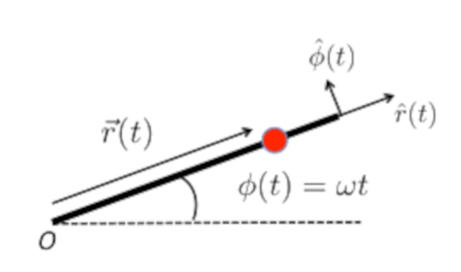
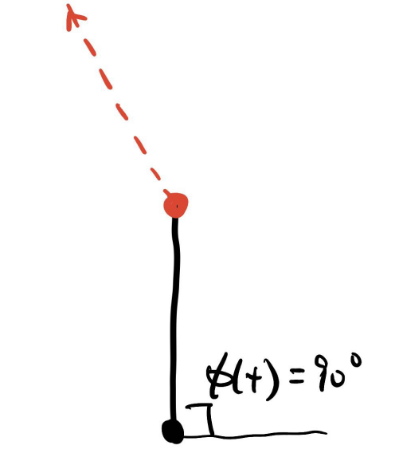
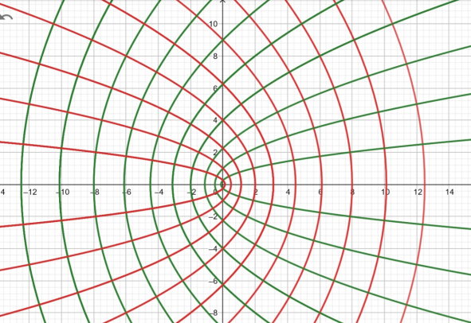

$$
\newcommand\rt{\vec{r}(t)}
\newcommand\tt{t^2}
\newcommand\ttt{t^3}
\newcommand\t[1]{t^#1}
\newcommand\ex{\vec{e}_x}
\newcommand\ey{\vec{e}_y}
\newcommand\ez{\vec{e}_z}
\newcommand\er{\vec{e}_r}
\newcommand\e[1]{\vec{e}_#1}

\newcommand\aone{\alpha_1}
\newcommand\atwo{\alpha_2}
\newcommand\athr{\alpha_3}
\newcommand\vt{\vec{v}(t)}
\newcommand\deri[2]{\frac{d#1}{d#2}}
\newcommand\derit[1]{\deri{#1}{t}}
\newcommand\deritn{\derit{}}
\newcommand\at{\vec{a}(t)}

\newcommand\vt{\vec{v}(t)}
\newcommand\ats{\vec{a}’(t)}
\newcommand\dvt{\dot{v}(t)}
\newcommand\drt{\dot{r}(t)}
\newcommand\ddrt{\ddot{r}(t)}
\newcommand\dvts{\dot{v}'(t)}
\newcommand\drts{\dot{r}'(t)}
\newcommand\ddrts{\ddot{r}'(t)}
\newcommand\ux{U(x)}
\newcommand\derix[1]{\deri{#1}{x}}
\newcommand\xx{x^2}
\newcommand\xxx{x^3}
\newcommand\half{{1\over2}}
\newcommand\pderi[2]{\frac{\part #1}{\part #2}}
\newcommand\pderin[1]{\pderi{}{#1}}
\newcommand\a{\alpha}
\newcommand\ao{\alpha_1}
\newcommand\at{\alpha_2}
$$

#### Question 1: Particle motion in 1D

>A particle moves along the $x$ direction under the influence of a force $F = F(v, t)$ that varies with both time and velocity given by
>$$
>F(v, t) = -ktv^2
>$$
>where $k > 0$ is a constant

##### (a)

> At initial time $t = 0$ the particle is located at $x(t = 0) = v_0$. Determine the particle's velocity $v(t)$ at a later time.

Set up the equation:
$$
F = m \derit v = -ktv^2 \\
m \frac{dv}{v^2} = -ktdt \\
\int_{v_0}^{v(t)}m{dv \over v^2} = \int_{0}^{t}-kudu \\
-m \left.\left({1\over v}\right)\right|^{v(t)}_{v_0} = -k\half \tt \\
{1 \over v(t)} - {1\over v_0} = {k \over 2m}t^2  \\
{1 \over v(t)} = {1\over v_0} + {k \over 2m}t^2 = {2m + kv_0\tt \over 2mv_0} \\
\fbox{$v(t) = {2mv_0 \over 2m + kv_0t^2}$}
$$

##### (b)

>How much time, $t_f$, does it take the particle to stop?

$\lim_{t \to \infin} v(t) = 0$. As the time goes to infinity, the particle tends to stop. $t_f = \infin$

##### (c)

>Determine the distance $x_f = x(t_f)$ at which the particles stops. You may leave the final expression in the form of an integral.

Simply do the integral:
$$
dx = v(t)dt \\
\int_{x(0) = 0}^{x(t)}dx = \int_{t = 0}^{t_f = \infin} \frac{2mv_0}{2m + kv_0t^2}dt \\
\fbox{$x(t) = \int_{t_0 = 0}^{t_f = \infin} \frac{2mv_0}{2m + kv_0t^2}dt$}
$$

#### Question 2: Bead on a rope

>A bead slides out along a frictionless rod of length $R$ that is fixed at point $O$ and rotating in a horizontal plane at a constant rate $\omega$ as shown below. At time $t = t_0$ and angle $\phi = 90^\circ$, the bead flies off the rod (i.e. when $r = R$). Just before the lead slides off the rod it has $\dot r (t = t_0) = {3\over 4}\omega R$. After the bead slides off the rod it experiences a friction force with $\vec F_f = -\kappa\vec v$, where $\kappa$ is a constant.
>
>

##### (a)

> What is the bead's trajectory after it flies off the rod? Draw a sketch and be as accurate as you can.

##### (b)

>Determine the velocity $\vt $ of the bead as the function of time, after it flies off the rod. How long will it take the bead to stop?

it basically becomes a 1D problem. Set up the equation
$$
F_f = -\kappa v = m\derit v \\
-{\kappa \over m}dt = \frac{dv}{v} \\
\int_{0}^{t} -{\kappa \over m}dt = \int_{v_i}^{v(t)} {dv \over v} \\
-{\kappa \over m}t = \left. \ln(v) \right|^{v(t)}_{v_i} = \ln(v(t)) - \ln(v_i) = \ln({v(t) \over v_i}) \\
v(t) = v_i e^{{-\kappa \over m}t}
$$
When the bead flies off the bead $\hat r = \hat y$, $\hat \phi = -\hat x$, and thus 
$$
\vec v = \dot r(t) \hat r + r(t)\dot \phi \hat \phi = (\frac{3}{4}\omega R)\hat r + (R\omega)\hat \phi = (\frac{3}{4}\omega R)\hat y - (R\omega)\hat x 
$$
and thus, the speed of the bead when it flies off:
$$
v_i = |\vec v| = \sqrt{({3 \over 4} \omega R)^2+ (\omega R)^2} = {5 \over 4}\omega R
$$
So, the velocity $v(t)$
$$
\fbox{$v(t) = \frac{5}{4}\omega R e^{{-\kappa \over m}t}$}
$$
$\lim_{t \to \infin} v_f = 0$. It takes infinite amount of time $t = \infin$ to stop.

#### Question 3: Curvilinear coordinates

>Denote Cartesian coordinates $(x, y, z)$, and introduce parabolic cylindrical coordinates $(u, v, z)$ determined by the transformation:
>$$
>x = \half(u^2 - v^2),\quad  y = uv, \quad z= z
>$$

##### (a)

>In Cartesian coordinates we are given points $P_1 = (1, 0, 1) = \ex + \ez$, $P_2 = (0, 1, -1)$ and $P_3 = (0, 0, 3)$. What are their components in parabolic cylindrical coordinates $(u, v, z)$?

For $P_1$:
$$
1 = \half(u^2 - v^2) \\
0 = uv \\
z = 1
$$
$u = \sqrt 2, v = 0, z = 1$.

For $P_2$:
$$
0 = \half(u^2 - v^2)\\
0 = uv \\
z = 3
$$
$u = 0, v = 0, z = 3$

For $P_2$:
$$
0 = \half(u^2 - v^2)\\
1 = uv \\
z = -1
$$
$u = 1, v = 1, z = -1$ or $u = -1, v = -1, z = -1$ 

##### (b)

>Determine the basis vectors $(\e u, \e v, \ez)$ in terms of Cartesian ones. Draw the coordinate lines, i.e., lines of $u$ = constant, and lines of $v$ = constant, in the $u, v$ plane with $z = 0$

Find the Jacobian matrix
$$
J = \left[ \matrix { \pderi{x}{u} & \pderi{x}{v} & \pderi{x}{z} \\ \pderi{y}{u} & \pderi{y}{v} & \pderi{y}{z} \\ \pderi{z}{u} & \pderi{z}{v} & \pderi{z}{z} }  \right] = \left[ \matrix { u & -v & 0 \\ v & u & 0 \\ 0 & 0 & 1 }  \right]
$$

$$
\vec u = J \left[\matrix{1 \\ 0 \\ 0}\right] = u\ex - v\ey \\
\vec v = J \left[\matrix{0 \\ 1 \\ 0}\right] = v\ex + u\ey \\
\vec z = J \left[\matrix{0 \\ 1 \\ 1}\right] = \ez
$$

$$
\e u = \frac{u\ex - v\ey}{\sqrt{u^2 + v^2}} \\
\e v = \frac{v\ex + u\ey}{\sqrt{u^2 + v^2}} \\
\ez = \ez
$$

the red line is when $u$ = constant, the greed line is when $v$ = constant.

##### (c)

>Derive the gradient of a scalar function, $\vec \nabla f (u,v ,z)$ in parabolic cylindrical coordinates $(u, v, z)$. Hint: recall the Nabla operator in Cartesian coordinates $\vec \nabla = \ex \pderi{}{x} + \ey \pderin{y} + \ez \pderin{z}$

the line element is
$$
d \vec l = \deri{\bold r }{u}du  + \deri{\bold r}{v}dv + \deri{\bold r}{z}dz = \sqrt{u^ 2+ v^ 2} \e u du + \sqrt{u^ 2+ v^ 2} \e v dv + \ez dz
$$
So, the corresponding gradient is:
$$
\vec \nabla f = {1 \over \sqrt{u^2 + v^2}}\pderi{f}{u}\e u + {1 \over \sqrt{u^2 + v^2}}\pderi{f}{v}\e v + \pderi{f}{z}\ez
$$

#### Question 4: Conservative forces

##### (a)

$\vec F = (\ao y^2 z^3 - 6\at xz^2)\ex + 2\ao xyz^3 \ey + (3\ao xy^2z^2 - 6\at x^2z)\ez$
$$
\pderi{F_x}{y} = 2\ao yz^3 \\
\pderi{F_y}{x} = 2\ao yz^3 = \pderi{F_y}{x} \\
\pderi{F_x}{z} = 3\ao y^2z^2 - 12\at xz\\
\pderi{F_z}{x} = 3\ao y^2z^2 - 12\at xz = \pderi{F_x}{z}\\
\pderi{F_y}{z} = 6\ao xyz^2 \\
\pderi{F_z}{y} = 6\ao xyz^2 = \pderi{F_z}{y}
$$
Thus $\vec F(\vec r)$ is conservative. 

##### (b)

It does. Suppose $\vec F = \nabla V$
$$
V = \int (\ao y^2 z^3 - 6\at xz^2) dx =  \ao x y^2 z^3 - 3\at x^2z^2 + \phi_1(yz) + \phi_2(y) + \phi_3(z) + C
$$

$$
\pderi{V}{y} = 2\ao xyz^3 + \phi_1'(yz) + \phi_2'(y)  =  2\ao xyz^3  \\
\phi_1'(yz) + \phi_2'(y) = 0 \\
\phi_1(yz) + \phi_2(y) = D \\
$$

$$
\pderi{V}{z} = 3\ao xy^2z^2 - 6\at x^2 z + \phi'_1(yz) + \phi_3'(z) = 3\ao xy^2z^2 - 6\at x^2 z  \\
\phi_1'(yz) + \phi_3'(z) = 0 \\
\phi_1(yz) + \phi_3(y) = E \\
$$

$$
\fbox{$V = \ao x y^2 z^3 - 3\at x^2z^2 + C_0$}
$$

#### Question 5: Variable mass and drag

##### (a)

$$
V = \frac{4}{3}\pi R^3 \\
\deri{V}{t} = \frac{4}{3}\pi \cdot 3 R^2 \derit{R} = 4\pi\gamma R^2 \\
4\pi R^2 \derit{R} = 4\pi \gamma R^2 \\
\derit{R} = \gamma \\
R(t) = \gamma t + R_0
$$

##### (b)

$$
\derit{m} = \rho \derit{V} = 4\rho \pi \gamma R^2 = 4\rho \pi\gamma (\gamma t + R_0)^2
$$

##### (c)

$$
m = \frac{4}{3}\rho \pi  (\gamma t + R_0)^3 = \frac{4}{3}\rho\pi R^3
$$

$$
F_f = mg -\a R^2 v = \derit{p} = \derit{m}v + \derit{v}m = (4\rho\pi\gamma R^2)v + m \derit{v} \\
mg -(4\rho\pi\gamma + \alpha)R^2 v = m\derit{v} \\
g - \frac{(4\rho\pi\gamma + \alpha)}{\frac{4}{3}\rho\pi R}v = \deri{v}{R} \derit{R} \\
g - \frac{3(4\rho\pi\gamma + \alpha)}{4\rho\pi R}v = \deri{v}{R} \gamma \\
{g \over \gamma} - \frac{3(4\rho\pi\gamma + \alpha)}{4\rho\pi\gamma R}v = \deri{v}{R} \\
$$

let $c = {g \over \gamma}$, $a = 3(4\rho\pi\gamma + \alpha)$, $b = 4\rho\pi\gamma$ .
$$
c = \frac{a}{bR}v + v' \\
v = \frac{bcR}{a +b} + k R^{-{a \over b}} \\
$$
let $v(0) = 0$, $R(0) = R_0$
$$
0 = \frac{bcR_0}{a + b} + kR_0^{-a/b} \\
-\frac{bcR_0^{\frac{a}{b} + 1}}{a + b} = k
$$
Thus:
$$
v = \frac{bcR}{a +b} -\frac{bcR_0^{\frac{a}{b} + 1}}{a + b} R^{-{a \over b}}
$$

$$

$$

