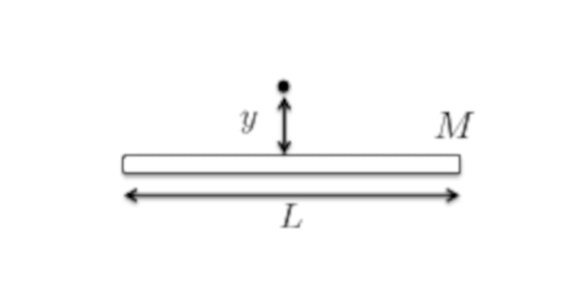

$$
\newcommand\rt{\vec{r}(t)}
\newcommand\tt{t^2}
\newcommand\ttt{t^3}
\newcommand\t[1]{t^#1}
\newcommand\ex{\vec{e}_x}
\newcommand\ey{\vec{e}_y}
\newcommand\ez{\vec{e}_z}
\newcommand\er{\vec{e}_r}
\newcommand\e[1]{\vec{e}_#1}

\newcommand\aone{\alpha_1}
\newcommand\atwo{\alpha_2}
\newcommand\athr{\alpha_3}
\newcommand\vt{\vec{v}(t)}
\newcommand\deri[2]{\frac{\d#1}{\d#2}}
\newcommand\derit[1]{\deri{#1}{t}}
\newcommand\deritn{\derit{}}
\newcommand\at{\vec{a}(t)}

\newcommand\vt{\vec{v}(t)}
\newcommand\ats{\vec{a}’(t)}
\newcommand\dvt{\dot{v}(t)}
\newcommand\drt{\dot{r}(t)}
\newcommand\ddrt{\ddot{r}(t)}
\newcommand\dvts{\dot{v}'(t)}
\newcommand\drts{\dot{r}'(t)}
\newcommand\ddrts{\ddot{r}'(t)}
\newcommand\ux{U(x)}
\newcommand\derix[1]{\deri{#1}{x}}
\newcommand\xx{x^2}
\newcommand\xxx{x^3}
\newcommand\half{{1\over2}}
\newcommand\pderi[2]{\frac{\part #1}{\part #2}}
\newcommand\pderin[1]{\pderi{}{#1}}
\newcommand\a{\alpha}
\newcommand\ao{\alpha_1}
\newcommand\at{\alpha_2}
\newcommand\const{\text{const}}
\newcommand\d{\text{d}}
\newcommand\invfrac[1]{\frac{1}{#1}}
\newcommand\note[1]{\fbox{$#1$}}
\newcommand\textsub[1]{_{\text{#1}}}
$$

#### Question 1: Rocket in the atmosphere

>A rocket travels horizontally through the atmosphere and experiences a linear drag force $F_{\text{drag}} = -kv$, where $k > 0$ is a constant. Let $m_i$ be the initial mass of the rocket plus fuel and let $m_f$ be the final mass of the rocket after all fuel has burned. Let $u$ be the speed of the fuel relative to the rocket. Assume that all other external forces are negligible, i.e., ignore gravity.

##### (a)

>Write down the differential equation of motion, i.e, Newton's 2nd law

From the Lecture 05 Notes:
$$
\begin{align}
dp &= p_f - p_i \\ 
&= (M - \d m)(v + \d v) + \d m(v - u) - Mv \\ 
&= Mv + M\d v - v\d m -\d m\d v + v\d m - u\d m - Mv \\
&= M\d v  - u\d m
\end{align}
$$
Thus
$$
\note{ F_{\text{drag}} = -kv = \derit{p} =  M\derit{v} - u\derit{m} }\\
$$

#####   (b)

>The rocket burns a fuel at a constant rate $\derit{M} = -\a = \const$. Assume that the rocket starts from rest. Determine the final speed of the rocket in terms of $m_i$, $m_f$, $\alpha$, $u$ and $k$.

We know that $\derit{m} = -\derit{M} = \a$, and notice $M(t)$ depends on time. 
$$
\derit{M} = -\a \\
\int_{m_i}^{m(t)}\d M = -\int_{0}^{t} \a \d t \\
M(t) = m_i -\a t
$$
and thus 
$$
\begin{align}
-kv &= M\derit{v} - u\derit{m} \\
-kv &= M\derit{v} - u\a \\
u\a - kv &= M\derit{v} \\
\invfrac{M} \d t &= \frac{\d v}{u\a - kv} \\
\int_0^{t} \invfrac{m_i - \a t} \d s &= \int_{v(0)}^{v(t)} \frac{\d v}{u\a - kv} \\
-\invfrac \a \ln (m_i -\a t)\vline^t_0 &= -\invfrac k \ln (u\a - kv)\vline^{v(t)}_{v(0)} \\
k\ln(\frac{m_i - \a t}{m_i}) &=\a \ln(\frac{u\a - kv}{u\a - kv_0}) \\
\left (\frac{m_i -\a t}{m_i} \right )^k &= \left (\frac{u\a - kv}{u\a - kv_0} \right )^\a 
\end{align}
$$
$M(t_f) = m_f = m_i - \a t_f$ and thus $\a t = m_i - m_f$
$$
\left(\frac{m_f}{m_i} \right)^{k} = \left (\frac{u\a - kv}{u\a - kv_0} \right )^\a \\
\left(\frac{m_f}{m_i} \right)^{k \over \a} = \frac{u \a - kv}{u\a - kv_0} \\
(u\a -kv_0)\left(\frac{m_f}{m_i} \right)^{k \over \a} = u\a - kv \\
\fbox{$v = \invfrac{k} \left(u\a - (u\a -kv_0)\left(\frac{m_f}{m_i} \right)^{k \over \a}\right)$}
$$

#### Question 2: Particle motion

>A particle of mass $m$ moves in 3D in response to the force field
>$$
>\vec F(\vec r) = Az^2 \ex + Ay^3 \ey + 2Axz\ez
>$$

##### (a)

>Show that $\vec F$ is a conservative force and determine the potential energy.

$$
\pderi{F_x}{y} = 0 = \pderi{F_y}{x} \\
\pderi{F_x}{z} = 2Az  = \pderi{F_z}{x} \\
\pderi{F_y}{z} = 0 = \pderi{F_z}{y}
$$

So, exist $-\grad U = F$.
$$
U = \int -F_x \d x = -Az^2x +\phi_1(y, z) \\
$$

$$
\pderi{U}{y} = \pderi{\phi_1(y, z)}{y} = -Ay^3
$$

$$
\pderi{U}{z} = -2Axz + \pderi{\phi_1(y, z)}{z} = -2Axz \\
$$

$$
\phi_1(y,z) = \int Ay^3 \d y = -\frac{Ay^4}{4} + \psi_1(z)
$$

$$
\pderi{\phi_1(y, z)}{z} = \pderi{\psi_1(z)}{z} = 0
$$

$$
\phi_1(y, z) = -\frac{1}{4}Ay^4 + C_1
$$

$$
\fbox{$U = -Az^2x - \frac{1}{4}Ay^4 + C_1$}
$$

##### (b)

>Let $v_0$ be the speed of the particle through origin $(0, 0, 0)$. Determine the speed of the particle when it passes through the position $\vec r = -\ex + 2\ey + \ez$.
>
>Hint: use conservation of energy

$$
E = T_0 + U_0 = T_f + U_f
$$

$$
\begin{align}
T_f - T_0 &= U_0 - U_f \\
&= U(0, 0, 0) - U(-1, 2, 1) \\ 
&= 0 - (-A\cdot 1^2 \cdot (-1) - \frac{1}{4}A\cdot(2)^4) \\
&= -A +4A \\
&= 3A
\end{align}
$$

$$
\half mv^2 = \half mv_0^2 + 3A \\
v^2 = v_0^2 + \frac{6A}{m} \\
\fbox{$v = \sqrt{v_0^2 + \frac{6A}{m}}$}
$$

#### Question 3: Nuclear forces and Yukawa potential

>In the Yukawa theory of the nuclear force, a proton and a neutron interact with a potential
>$$
>V(r) = \frac{Ke^{-\a r}}{r}
>$$
>where $K < 0$ and $\a \geq 0$ are constants. 

##### (a)

>Find the resulting force and compare it to a force with an inverse square law (i.e., with $\a = 0$).

$$
\begin{align}
f(r) &= -\deri{V}{r} \\
&= -K(-\a e^{-\a r} r^{-1} + (-1)\cdot r^{-2}e^{-\a r}) \\
&= \a K \frac{e^{-\a r}}{r} + K\frac{e^{-\a r}}{r^2} \\
&=Ke^{-\a r}(\frac{a}{r} + \frac{1}{r^2})
\end{align}
$$

Note since this function have $e^{-\a r}$ term, it will decrease more quickly as $r \to \infin$ when compare to $\frac{1}{r^2}$.

##### (b)

>Find the effective potential and discuss the types of motion that are possible if a particle of mass $m$ moves in this potential

according to the Lecture Notes, we could get:
$$
\fbox{$U_{\text{eff}} = \frac{L^2}{2mr^2} + \frac{Ke^{-\a r}}{r}$}
$$

We want to find the critical point of the $U_{\text{eff}}$:
$$
\deri{U}{r}  = -\frac{L^2}{mr^3} - K\invfrac {e^{\a r}}(\frac{\a}{r} + \invfrac{r^2})
$$

$$
\lim_{r \to 0} U_{\text{eff}}  = \infin \quad \lim_{r \to \infin}U_{\text{eff}} = 0
$$

We want to let $\deri{U}{r} = 0$, for $r > 0$
$$
\frac{L^2}{mr^3} = -Ke^{-\a r}(\frac{\a}{r} + \frac{1}{r^2}) \\
-\frac{L^2}{Km} = e^{-\a r}(\a r^2 + r)
$$
but the above equation seems unsolvable:

So, we will examine the property of $y = e^{-\a r}(\a r^2 + r)$
$$
\deri{y}{r} = e^{-\a r}(1+2\a r) - \a e^{-\a r}(r + \a r^2)
$$
Set the $\deri{y}{r} = 0$, we find
$$
\a^2 r^2 - \a r -1 = 0 \\
r = \frac{1 \pm \sqrt 5}{2\a}
$$
Since $\a \ge 0$, we know that there is only one root (one critical point for $y$) when $r > 0$. For $y$
$$
\lim_{r \to 0} y = 0 \quad \lim_{r \to \infin} y = 0 \quad y(r) > 0 \ \text{for}\  (r>0)
$$
That means $y$ will start $0$, goes to a maximum, and then approach to $0$, which looks roughly like:

So, for the original $\deri{U}{r} = 0$, there are few situations:

1. , $-\frac{L^2}{Km} > \max( e^{-\a r}(\a r^2 + r))$, as indicated by the green line, there is no solution for $\deri{U}{r} = 0$, and thus no critical point for $U$, and it will decrease from $\infin$ to $0$ monotonically, in this case, particles will always repulse from the origin and goes to infinity.
2. $-\frac{L^2}{Km} = \max( e^{-\a r}(\a r^2 + r))$, as indicated by the orange line, there is single solution for $\deri{U}{r} = 0$, and $\deri{U}{r} < 0$ for all $r > 0$ except when $-\frac{L^2}{Km} = e^{-\a r}(\a r^2 + r)$. That means there is one inflection point for $U$, and except the inflection point, $U$ will decrease from $\infin$ to $0$. In this case, there is a semi-stable equilibrium point where  $-\frac{L^2}{Km} = e^{-\a r}(\a r^2 + r)$ holds (the particle will follow a circular orbit), when there is small disturbance, the particle will quickly goes to $r = \infin$.
3. $-\frac{L^2}{Km} < \max( e^{-\a r}(\a r^2 + r))$, as indicated by the blue line, there are two solutions for $\deri{U}{r}$, which means there are one maximum and minimum point for $U$. In this case $U$ will first decrease from $\infin$ to a minimum point, then increase to a maximum point, and eventually approaches to 0. In this case, there is an energy valley where particle could be trapped in, and make periodic motion in it. (could be circular or elliptic) , there is also an unstable equilibrium (circular orbit) (the maximum) where the particle will either quickly go to $r = \infin$ or trapped in the energy valley if there is small disturbance.

##### (c)

>Find the angular momentum $L$ and energy of a particle on a circular orbit of radius $a$

That means $\deri{U}{r} = 0$ so that particle could have orbit with fixed radius
$$
\fbox{$L = \left(\sqrt{-Kme^{-\a r}(\a a^2 + a)}\right)\ez$}
$$
and since there is no change in the radius $\dot r = 0$ the energy is thus
$$
\begin{align}
E = \half m\dot r^2 + U_{\text{eff}} &= U_{\text{eff}} \\
&= \frac{L^2}{2mr^2} + \frac{Ke^{-\a r}}{r} \\
&= \frac{-Kme^{\a a}(\a a^2 + a)}{2ma^2} + \frac{Ke^{-\a a}}{a} \\ 
&= \frac{-Ke^{-\a a}(\a a + 1)}{2a} + \frac{Ke^{-\a a}}{a} \\
&= \frac{Ke^{-\a a}}{a}(-\frac{\a a + 1}{2} + 1) \\
&= \fbox{$\frac{Ke^{-\a a}}{2a}(1 -\a a)$}
\end{align}
$$

##### (d)

>Determine the period of the circular orbit of radius $a$.

We know
$$
L_z = m\omega a^2 =\sqrt{-Kme^{-\a a}(\a a^2 + a)}
$$
and thus
$$
\omega = \sqrt{\frac{-Kme^{-\a a}(\a a^2 + a)}{m^2a^4}} = \sqrt{\frac{-Ke^{-\a a}(\a a + 1)}{ma^3}} \\
$$
which means
$$
\fbox{$T = \frac{2 \pi}{\omega} -= \frac{a}{2\pi} \sqrt{\frac{ma}{-Ke^{-\a a}(\a a+1)}}$}
$$

##### (e)

>Find the frequency of small oscillations about the circular orbit of radius $a$. That is, suppose $r = a + \delta r$, where $\delta r \ll a$, what is the frequency of the resulting small oscillations about $r = a$?

$$
\frac{\d^2 U_{\text{eff}} }{\d r^2}  = \frac{3L^2}{mr^4}+Ke^{-\a r}(\frac{2}{r^3} + \frac{2\a}{r^2} + \frac{\a ^2}{r})
$$

$$
\begin{align}
\omega_{r} &= \sqrt{\frac{U''(a)}{m}} \\
&= \sqrt{\frac{3L^2}{m^2a^4} + \frac{K}{m}e^{-\a a}(\frac{2}{a^3} + \frac{2\a}{a^2} + \frac{\a ^2}{a})} \\ 
&= \sqrt{\frac{3\cdot -Kme^{-\a a}(\a a^2 + a)}{m^2a^4} + \frac{K}{m}e^{-\a a}(\frac{2}{a^3} + \frac{2\a}{a^2} + \frac{\a ^2}{a})} \\
&=  \sqrt{\frac{K}{m}e^{-\a a} \frac{-3(\a a^2 + a)}{a^4} + \frac{K}{m}e^{-\a a}(\frac{2}{a^3} + \frac{2\a}{a^2} + \frac{\a ^2}{a})} \\
&= \fbox{$ \sqrt{\frac{K}{m}e^{-\a a} \left(\frac{-3\a a -1}{a^3} + \frac{2\a}{a^2} + \frac{\a ^2}{a}\right)} $}
\end{align}
$$

#### Question 4

> Calculate the gravitational potential $\Phi$ due to uniform thin rod of length $L$ and mass $M$ at a distance $y$ from the center of the rod, and in the direction perpendicular to the rod. (see in the figure below).
>
> 
>
> Check that reduces to the correct limit $\Phi \to -\frac{Gm}{y}$ when $y \gg L$.

$$
\begin{align} 
\int_{M} -{G \d m \over r} &= \int_{-{L \over 2}}^{L \over 2} -\lambda \frac{G}{\sqrt{y^2 + x^2}}\d x \\
&= -\lambda G \int_{-{L \over 2}}^{L \over 2}\frac{\d x}{\sqrt{x^2 + y^2}} \\
&= -\lambda G \cdot \left.\ln(x + \sqrt{x^2 + y^2})\right|_{-\frac{L}{2}}^{\frac{L}{2}} \\
&= -\frac{GM}{L}\cdot\ln(\frac{\frac{L}{2} + \sqrt{\frac{L^2}{4} + y^2 }}{-\frac{L}{2} + \sqrt{\frac{L^2}{4} + y^2}}) \\ 
&= -\frac{GM}{L}\cdot\ln(\frac{
	\left(\frac{L}{2} + \sqrt{\frac{L^2}{4} + y^2 }\right)^2
}{y^2 + \frac{L^2}{4} - \frac{L^2}{4}}) \\
&= \fbox{$-\frac{2GM}{L}\cdot \ln(\frac{\frac{L}{2} + \sqrt{\frac{L^2}{4}+y^2}}{y})$}
\end{align}
$$
When $y \gg L$, $y^2 \gg L^2$
$$
\begin{align}
\Phi &= -\frac{2GM}{L}\cdot \ln(\frac{\frac{L}{2} + \sqrt{\frac{L^2}{4}+y^2}}{y}) \\
&= -\frac{2GM}{L}\cdot \ln(\frac{\frac{L}{2} + \sqrt{y^2}}{y}) \\
&= -\frac{2GM}{L}\cdot \ln(\frac{L}{2y} + 1) \\
\end{align}
$$
Since $y \gg L$ and $\frac{L}{2y} \approx 0$, $\ln(\frac{L}{2y} + 1) \approx \frac{L}{2y}$
$$
\fbox{$\Phi \approx -\frac{2GM}{L} \cdot \frac{L}{2y} = -\frac{GM}{y}$}
$$
as expected.

#### Question 5

>Consider two particles with masses $m_1$ and $m_2$ respectively. Initially, at $t = 0$, both particles are at rest and they are separated by a distance $r(t = 0) = r_0$. The particles gravitationally attract each other, with the gravitational force being the only one acting in the problem. At a later time, $t > 0$, the particles will move towards each other due to their gravitational attraction and eventually they will collide with each other

##### a)

>Derive expressions for the particles' speed $v_1(r)$ and $v_2(r)$ as a function of their distance $r$ before they collide (i.e., when $0 < r < r_0$).

In the entire process, the energy and the momentum are conserved:
$$
U_i + T_i = U_f + T_f \\
\vec p_1 + \vec p_2 = 0
$$
which is
$$
-\frac{Gm_1m_2}{r_0} + 0 = -\frac{Gm_1m_2}{r} + \half m_1v_1^2 + \half m_2v_2^2 \\
m_1v_1 = m_2v_2
$$
and we could set the equation:
$$
\begin{align}
-\frac{Gm_1m_2}{r_0} + 0 &= -\frac{Gm_1m_2}{r} + \half m_1v_1^2 + \half m_2 (\frac{m_1v_1}{m_2}) ^2 \\
v_1^2( m_1 + \frac{m_1^2}{m_2}) &= 2\left(\frac{Gm_1m_2}{r} -\frac{Gm_1m_2}{r_0}\right) \\ 
v_1^2(\frac{m_1m_2 + m_1^2}{m_2}) &= 2\left(\frac{Gm_1m_2}{r} -\frac{Gm_1m_2}{r_0}\right) &= \\
v_1^2  &= 2\left(\frac{1}{r} -\frac{1}{r_0}\right) \frac{Gm_2^2}{m_2 + m_1} \\
\end{align}
$$
which yields
$$
\fbox{$v_1 = \sqrt{2\left(\frac{1}{r} -\frac{1}{r_0}\right) \frac{Gm_2^2}{m_1 + m_2} }$} \\
\fbox{$v_2 = \sqrt{2\left(\frac{1}{r} -\frac{1}{r_0}\right) \frac{Gm_1^2}{m_1 + m_2} }$}
$$

##### b)

>Now consider the special case of equal masses, $m_1 = m_2 = m$. Instead of both particles starting from rest, let one of the particles be initially at rest and the other particle has an initial velocity $v_0$ in a direction that is perpendicular to the line connecting their masses. Derive an expression for the maximum $v_0$ for which the masses will be bound in elliptic motion.

If the masses are bounded in the elliptic motion, that means that total energy $E_{\text{total}} \le 0$,
$$
-\frac{Gm^2}{r_0} + \half mv_0^2 \le 0 \\
v_0 \le \sqrt\frac{2Gm}{r_0} \\
$$
thus, the maximum possible speed is
$$
\fbox{$v_{0, \text{max}} = \sqrt\frac{2Gm}{r_0} $}
$$

