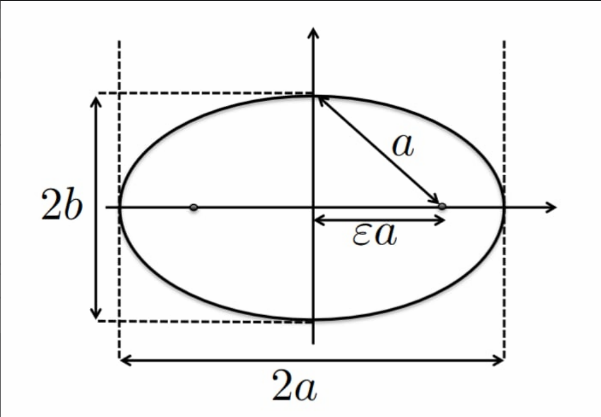
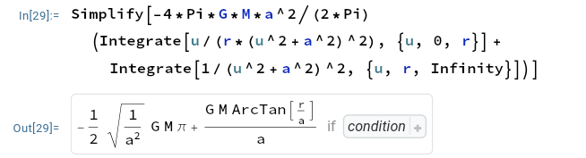
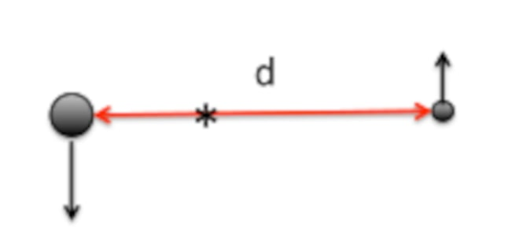
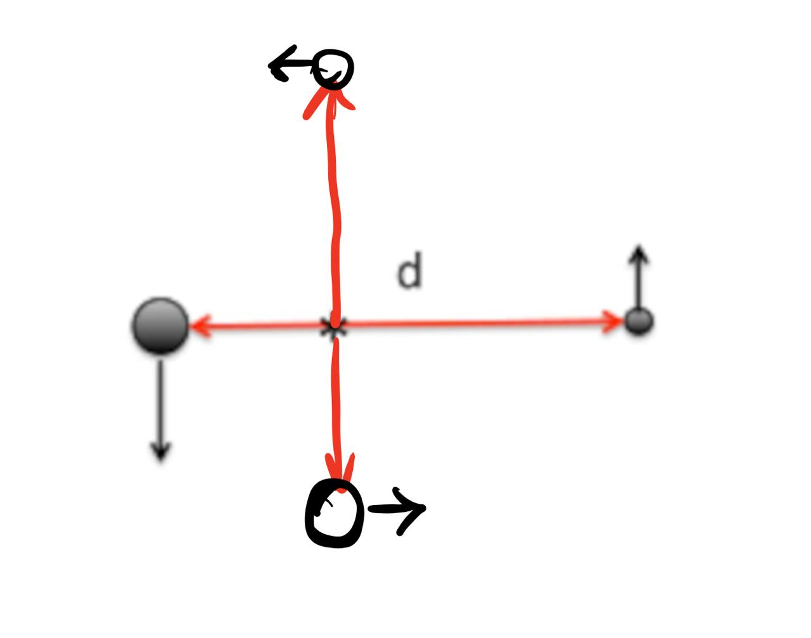
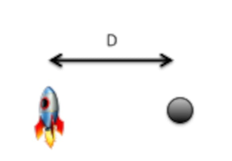

$$
\phantom {derivatives}
\newcommand\d{\text{d}}
\def\ffrac(#1/#2){\frac{#1}{#2}}
\def\hfrac #1(#2/#3){\ffrac (#1#2/#1#3)}
\def\deri#1/#2;{\hfrac \d(#1/#2)}
\def\dderi#1/#2;{\nderi #1/#2^2; }
\def\nderi#1/#2^#3;{\ffrac (\d^#3 #1/\d #2^#3)}
\def\derin1/#1{\ffrac (1/#1) }
\def\pderi#1/#2;{\hfrac \part(#1/#2) }
\def\ppderi#1/#2;{\npderi #1/#2^2;}
\def\npderi#1/#2^#3;{\ffrac (\part^#3 #1/\part #2^#3)}
\def\pderin1/#1;{\ffrac (\part / \part #1)}
\def\fac #1/#2;{\frac{#1}{#2}}

\phantom {fraction}
\def\inv#1{\ffrac (1/#1)}
\newcommand\invsqrt[1]{\frac{1}{\sqrt{#1}}}
\newcommand\half{\frac{1}{2}}
\newcommand\tri{\frac{1}{3}}
\newcommand\quar{\frac{1}{4}}
\phantom {vectors}
\newcommand\vfunc[2]{}

\phantom {common vectors}
\def\vfn #1(#2){\vec #1(\vec #2)}
\def\v #1{\vec #1}
\newcommand\vf{\v f}
\newcommand\vx{\v x}
\newcommand\vy{\v y}
\newcommand\vz{\v z}
\newcommand\vr{\v r}
\newcommand\vv{\v v}
\newcommand\va{\v a}
\newcommand\vtheta{\v \theta}
\newcommand\vphi{\v \phi}
\newcommand\vs{\v s}

\phantom {randomstaff}
\def\tsub#1;{_{\text {#1}}}
\def\sub#1;{_{#1}}
\def\(#1);{\left(#1\right)}
\def\intl#1;{\int_{#1}}
\def\intlh#1;#2;{\int_{#1}^{#2}}
\def\sup#1;{^{#1}}
\def\tsup#1;{^{\text{#1}}}
\def\align[[#1]]{\begin{align*}#1\end{align*}}
\def\note#1!{\fbox{$#1$}}
\def\.#1|;{\left.#1\right|}
\def\ssqrt/#1/;{\sqrt{#1}}
\def\noteeq#1!#2!{\begin{equation} \label{eq:#2} \fbox{$#1$}\end{equation}}
\def\raf#1;{\ref{#1}}
\def\eqraf#1;{\eqref{#1}}
\def\dfac#1/#2;{\dfrac{#1}{#2}}
\def\sqt#1/;{\sqrt{#1}}
\def\sgrt#1/>{\sqrt{#1}}
\def\txt#1;{\text{#1}}
\def\const{\text{const}}
$$

##### Question 1: Satellite orbiting Earth

>A satellite is in a circular orbit (label 1) around the Earth (mass M) at a radius $R$ and with speed $v\tsub initial; = \ssqrt /GM/R/;$. We wish to bring the satellite to a higher orbit (label 3) with radius $R' > R$ where it has the speed $v\tsub final; = \sqrt{GM/R'}$. We will do this via an elliptical *Hohmann* transfer orbit (label 2). Therefore, the satellite applies an impulse (giving a change in the speed, $\Delta v$) at $t = 0$ which puts it into the transfer orbit (label 2). When the satellite arrives on its new circular orbit with radius $R'$, it is at the apogee of the elliptical transfer orbit. It then applies an additional impulse $\sim  \Delta v'$, increasing its speed again, to enter the final circular orbit (label 3).
>
>All answers should in terms $M$, $G$, $R$, $R'$

###### (a)

>What is the angular momentum per unit mass, $\ell$, and the energy per unit mass $e$, of the transfer orbit?
>
>Hint: recall the energy at the perigee and apogee of an ellipse.

From Lecture notes 9, we know that
$$
a = \fac(r\tsub max; + r\tsub min;)/2; = \fac GM /2|e|;
$$
thus
$$
R' + R = \fac GM/|e|; \\
|e| = \fac GM/R' + R;
$$
and since this is an elliptic orbit, we know that $e < 0$, thus
$$
\noteeq e = -\fac GM/R'+R;!e!
$$
we also know that (using some geometry)
$$
b = a\sqt (1-\varepsilon^2) /; = \fac \ell / {\sqt 2|e|/;};
$$

Since the planet is one focus of the ellipse, we thus now that $\varepsilon a = \fac R' - R/2;$

and thus
$$
\varepsilon \fac R' + R/2; = \fac R' - R/2; \\
\varepsilon = \fac R'- R/R' + R;
$$
and
$$
\align[[
\ell &= a\sgrt 2|e|(1 - \varepsilon^2) /> \\
&= \fac GM/2|e|; \sgrt 2|e|(1 - \varepsilon^2) /> \\
&= GM \sgrt \half \fac (1 - \varepsilon^2)/|e| ; /> \\
&= GM\sgrt \half \fac R'+R/GM; \cdot \(1 - \(\fac R' - R/R' +R ; );^2 ); /> \\
&= GM\sgrt \half \fac R'+R/GM; \cdot \fac (R'+R)^2 - (R'-R)^2/(R' + R)^2; /> \\
&= GM\sgrt \inv {2GM} \cdot \fac 4R'R / R' + R; /> \\
]]
$$
that is
$$
\noteeq \ell = \sgrt  GM \fac 2R'R / R'+R; />!ell!
$$

###### (b)

>What are the needed changes in speeds, $\Delta v$ and $\Delta v'$

when changing from $v\tsub initial;$ to $v$, the total energy of the elliptic orbit is
$$
e = \Phi + t \\
-\fac GM/R' + R; = -\fac GM/R; + \half v_i^2 \\
v_i = \sgrt 2GM (\inv R - \inv {R' + R})  />
$$
so
$$
\Delta v = v_i - v\tsub initial; = \sgrt 2GM (\inv R - \inv {R' + R})  /> - \sgrt \fac GM/R; />
$$
and when changing form $v$ to $v\tsub final;$, then total energy of the elliptic orbit is
$$
e = \Phi + t \\
-\fac GM/R' +R; = -\fac GM/R'; + \half v_f^2 \\
v_f = \sgrt 2GM(\inv {R'} - \inv {R' + R}) />
$$
so
$$
\Delta v' = v\tsub final; - v_f = \sgrt \fac GM/R'; /> - \sgrt 2GM(\inv {R'} - \inv {R' + R}) />
$$

##### Question 2: Elliptic orbits

>According to Kepler's first law, the orbit of a small mass $m$ around a larger mass $M \gg m$ is described by planar ellipses, with $M$ being at a focus point, with $M$ being at a focus point of the ellipse. Their motion can be described by the conservation of energy and the conservation of angular momentum. Introducing the energy per unit mass, $e = E/m$, and the angular momentum per unit mass $\v \ell = \v L / m$, the conservation laws are
>$$
>\v \ell = \v r \times \v v \qquad e = \half v^2 - \fac GM/r;
>$$
>The apogee $r_a$ and perigee $r_p$, corresponding to the maximum and minimum distance from the origin at $M$, are given by
>$$
>r\tsub p,a; = \fac \ell / v{\tsub p,a;} ; \quad\text{with}\quad v\tsub p,a; = \fac GM/\ell; \pm \sqt \(\fac GM/\ell;);^2 + 2e /;
>$$

###### (a)

>Use the conservation laws to explain whether the following statements are true, false, or not determinable. Take the "midway" point to be at either midpoint of the orbit between apogee and perigee

we notice that energy and angular momentum is conserved, and thus

* $e\tsub a; = e\tsub p;$, correct
* $\ell_a> \ell\tsub midway;$, incorrect

we further notice that this is an elliptic orbit, and thus

* $e < 0$, correct

we could rewrite the energy per mass equation
$$
v = \sgrt 2\(e + \fac GM/r;);/>
$$
and thus

* $v\tsub p; > v\tsub a;$, correct, since $r\tsub p; < r\tsub a;$
* $v\tsub p; > v\tsub midway;$, correct, since $r\tsub p; > r\tsub midway;$

Also, at pedigree and apogee, the $\deri \v r/t; = 0$, and thus $\v v = \dot r \hat r + r\dot\phi \hat \phi = r\dot\phi \hat \phi$. The $\v r \cdot \v v = 0$, and they are perpendicular, and thus the angle $\theta$ between $\v r$ and $\v v$ is $\half \pi$. Thus

* $v\tsub a;r \tsub a; = v\tsub p;r\tsub p;$, correct, since at pedigree and apogee, $\ell\tsub a; = v\tsub a;r\tsub a;\sin \theta = v\tsub a;r\tsub a;$, and  $\ell\tsub p; = v\tsub p;r\tsub p;\sin \theta = v\tsub p;r\tsub p;$ and that angular momentum is conserved.

* $v\tsub a; r\tsub a; > v\tsub midway; r\tsub midway;$, incorrect, since at some midway point, 
  $$
  \ell\tsub midway; = \ell\tsub a; \\ 
  v\tsub midway;r\tsub midway;\sin \theta\tsub midway; = v\tsub a;r\tsub a;
  $$
  and only when at pedigree and apogee, the $\v r \cdot \v v = 0$, and the $\theta = \half \pi$, thus
  $$
  \theta\tsub midway; \neq \half \pi \\
  \sin \theta\tsub midway; < 1 \\
  v\tsub midway;r\tsub midway;\sin \theta\tsub midway; < v\tsub midway;r\tsub midway; \\
  v_a r_a < v\tsub midway;r\tsub midway;
  $$

Last

* $\fac v_a^2/r_a; = \fac GM/r_a^2;$ happens only when the orbit is circular. Well, it depends on our definition of a "elliptic orbit", if we consider "elliptic orbit" is a general case of "circular orbit", then there is a chance (not determinable) for the statements to be true. If "elliptic orbit" excludes the "circular orbit", then the statement is incorrect. To show that the statement is true iff the orbit is circular, we have
  $$
  \def\va{v\tsub a;}
  \def\ra{r\tsub a;}
  $$

  $$
  \fac v^2\tsub a;/\ra; = \fac GM/\ra^2;\\
  v\tsub a; = \sgrt \fac GM/\ra; /> \\
  e = \half \fac GM/\ra; - \fac GM/\ra; \\
  e = -\half \fac GM/\ra;
  $$

  from $e$, we could see the orbit will be circular if it satisfy the statement. 

###### (b)

>What speed of the test particle would be required for the orbit to be circular with a radius $R$

as we solved in previous question, when $v = \sgrt \fac GM/r; />$, the $e = -\fac GM/2r;$ and the orbit will become circular.

##### Question 3: Gravitational field of a star

>Consider a star of mass $M$ whose density $\rho(r)$ is a function of the distance $r$ from the center of the star and it is given by
>$$
>\rho = \fac Ma^2/2\pi r(r^2 + a^2)^2;, \quad\txt with;\quad 0 \le r \le \infin \  \ \  \txt and; \ \ \  a = \const \\
>$$

###### (a)

>Show that the gravitational potential of the star is
>$$
>\Phi = -\fac GM/2a; \(\pi - 2\arctan(\fac r/a;));
>$$

According to the formula (28) in the Lecture notes 7, the gravitational potential follows the equation: (given that the density is symmetric in $\phi$ and $\theta$)
$$
\d \Phi = \begin{cases}
-4\pi G\fac \rho/r;u^2\d u \ \ \txt for ;  r>u\\
-4\pi G\rho u \d u \ \ \ \ \  \txt for ; r < u
\end{cases}
$$
Thus, the total potential should be
$$
\Phi(r) = -4\pi G\(\int_0^r \fac \rho/r; u^2 \d u + \int _r^\infin \rho u\d u); \\
= -4\pi G\(\int_0^r \fac Mua^2/2\pi r (u^2 + a^2)^2; \d u + \int_r^\infin \fac Ma^2/2\pi(u^2 +a^2)^2;\d u); \\
= -4\pi G \cdot \fac Ma^2/2\pi;\( \int_0^r \fac u/r(u^2 + a^2)^2;\d u +  \int_r^\infin \fac 1/(u^2+a^2)^2;\d u  );
$$

which is just
$$
\Phi = -\fac GM/2a; \(\pi - 2\arctan(\fac r/a;));
$$

###### (b)

>Find the gravitational field $\v g(r)$ of the stars

Since we know the potential, the $\v g(r)$ is simply
$$
\v g(r) = -\grad \Phi = -\fac GM/a; \fac a^2/r^2 + a^2; \cdot \inv a \hat r = -\fac GM/r^2 + a^2;\hat r
$$

##### Question 4: Orbiting black holes

>Two black holes of masses $m_1 =10 M\tsub solar;$ and $m_2 = 5M\tsub solar;$ are in a circular orbit around each other. Their separation is $d = 10000 \txt km;$, They each have a speed relative to the joint center of mass (indicated in the figure by a $*$). 
>
>Note: a solar mass is $M\tsub solar; = 2\cdot 10\sup 30;\txt kg;$ and Newton's gravitational constant is $G = 6.67\cdot 10^{-11} \txt Nm;^2/\txt kg;^2$

###### (a)

>What is the ratio of the black holes' speed relative to the center of mass? Which one is moving faster?
>
>Hint: consider the total momentum of the system

The total momentum in the system $L = 0$, and since they are in a circular orbit around each other:
$$
m_1v_1 = m_2v_2 \\
\fac v_1/v_2; = \fac m_2/m_1; = \half
$$
The $v_2 > v_1$ and that the smaller black hole is moving faster.

###### (b)

>What is the period $P$ of their orbit in seconds?

The position of the center of the mass is 
$$
\v C = \fac m_1\v r_1 + m_2\v r_2/ m_1 + m_2; = \fac 2/3;\v r_1 + \fac 1/3; \v r_2 = \v r_1 + \inv 3(\v r_2 - \v r_1)
$$
That is, the distance between center of mass and $m_1$ is $d_1 = \inv 3 d$ and distance between center of mass and $m_2$ is $d_2 = \fac 2/3; d$. 

The orbit is circular, and that means
$$
\fac v^2/r; = \fac F/m;
$$
Thus
$$
v_1 = \sgrt \fac Gm_1m_2d_1/m_1d^2; /> = \sgrt \fac 5/3; \fac GM\tsub solar;/d; /> \approx 4.715 \cdot 10^6 \txt m/s; \\
v_2 = \sgrt \fac Gm_1m_2d_2/m_2d^2; /> = \sgrt \fac 20/3; \fac GM\tsub solar;/d; /> \approx 9.430 \cdot 10^6 \txt m/s;
$$
and thus the period $P$ is
$$
P_1 = \fac 2\pi d_1/v_1; = \fac 2\pi/3; \fac d/v_1; \approx 4.442 \txt s; \\
P_2 = \fac 2\pi d_2/v_2; = \fac 4\pi/3; \fac d/v_2; \approx 4.442 \txt s;
$$

###### (c)

>Where is each black hole after $t = \quar P$ later than the time is the figure, Indicate these positions in the figure.

##### Question 5: Rocket near a black hole

>A spaceship is in a circular orbit around a black hole of mass $M$. The orbit has a radius $D$.
>
>Note: a solar mass is $M\tsub solar; = 2\cdot 10\sup 30;\txt kg;$ and Newton's gravitational constant is $G = 6.67\cdot 10^{-11} \txt Nm;^2/\txt kg;^2$

###### (a)

>Determine the spaceship's acceleration in terms of $G$, $M$, and $D$.

$$
a = \fac F/m; = \fac GMm/D^2m; = \fac GM/D^2;
$$

The direction is towards the center of the black hole.

###### (b)

>What is the period $P$ of the spaceship's orbit?

Since it's a circular orbit,
$$
\fac v^2/D;  = a \\
v = \sgrt \fac GM/D; />
$$
and
$$
P = \fac 2\pi D/v; = 2\pi \sgrt \fac D^3/GM; />
$$

###### (c)

>Evaluate the period $P$ numerically for $M = 5M\tsub solar;$ and $D = 5000\txt km;$

$$
P = 2\pi \sgrt \fac D^3/GM; /> = 2 \cdot 3.1415 \cdot \sgrt \fac (5000 000)^3 /6.67 \cdot 10{\sup -11;} \cdot 5 \cdot 2 \cdot 10^{30} ; /> \approx 2.720 \txt s;
$$

###### (d)

>What is the tidal effect on a particle floating in the spaceship? That is, given a particle at a distance $h \ll D$ to the right of the spaceship's center of mass, what is the particle's acceleration relative to the ship's center of mass? Evaluate this numerically for $D = 5000\txt km;$ and $h = 1\txt m;$

According the to the formula (8) of Lecture Notes 10
$$
hg' = \fac 2GMh/D^3; \approx 10.672 \txt m/s;^2
$$
which is little bigger than a $g$, not very big effect.
