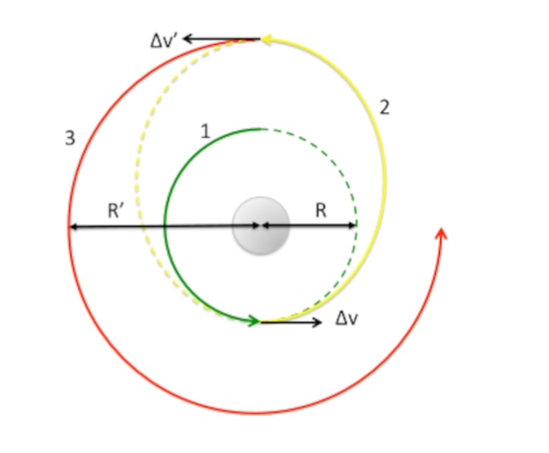

$$
\newcommand\rt{\vec{r}(t)}
\newcommand\tt{t^2}
\newcommand\ttt{t^3}
\newcommand\t[1]{t^#1}
\newcommand\ex{\vec{e}_x}
\newcommand\ey{\vec{e}_y}
\newcommand\ez{\vec{e}_z}
\newcommand\er{\vec{e}_r}
\newcommand\e[1]{\vec{e}_#1}

\newcommand\aone{\alpha_1}
\newcommand\atwo{\alpha_2}
\newcommand\athr{\alpha_3}
\newcommand\vt{\vec{v}(t)}
\newcommand\deri[2]{\frac{\d#1}{\d#2}}
\newcommand\derit[1]{\deri{#1}{t}}
\newcommand\deritn{\derit{}}
\newcommand\at{\vec{a}(t)}

\newcommand\vt{\vec{v}(t)}
\newcommand\ats{\vec{a}’(t)}
\newcommand\dvt{\dot{v}(t)}
\newcommand\drt{\dot{r}(t)}
\newcommand\ddrt{\ddot{r}(t)}
\newcommand\dvts{\dot{v}'(t)}
\newcommand\drts{\dot{r}'(t)}
\newcommand\ddrts{\ddot{r}'(t)}
\newcommand\ux{U(x)}
\newcommand\derix[1]{\deri{#1}{x}}
\newcommand\xx{x^2}
\newcommand\xxx{x^3}
\newcommand\half{{1\over2}}
\newcommand\pderi[2]{\frac{\part #1}{\part #2}}
\newcommand\pderin[1]{\pderi{}{#1}}
\newcommand\a{\alpha}
\newcommand\ao{\alpha_1}
\newcommand\at{\alpha_2}
\newcommand\const{\text{const}}
\newcommand\d{\text{d}}
\newcommand\invfrac[1]{\frac{1}{#1}}
\newcommand\note[1]{\fbox{$#1$}}
\newcommand\textsub[1]{_{\text{#1}}}
$$

##### Question 1: Satellite orbiting Earth

>A satellite is in a circular orbit (label 1) around the Earth (mass M) at a radius $R$ and with speed $v\tsub initial; = \ssqrt /GM/R/;$. We wish to bring the satellite to a higher orbit (label 3) with radius $R' > R$ where it has the speed $v\sub final; = \sqrt{GM/R'}$. We will do this via an elliptical *Hohmann* transfer orbit (label 2). Therefore, the satellite applies an impulse (giving a change in the speed, $\Delta v$) at $t = 0$ which puts it into the transfer orbit (label 2). When the satellite arrives on its new circular orbit with radius $R'$, it is at the apogee of the elliptical transfer orbit. It then applies an additional impulse $\sim  \Delta v'$, increasing its speed again, to enter the final circular orbit (label 3).
>
>All answers should in terms $M$, $G$, $R$, $R'$

###### (a)

>What is the angular momentum per unit mass, $\ell$, and the energy per unit mass $e$, of the transfer orbit?
>
>Hint: recall the energy at the perigee and apogee of an ellipse.

