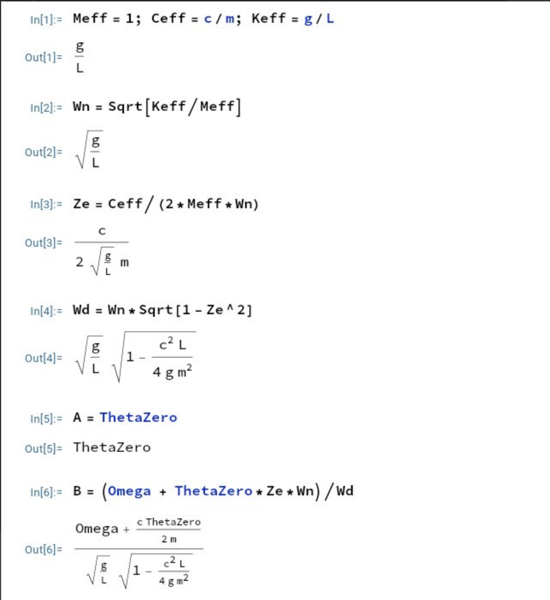
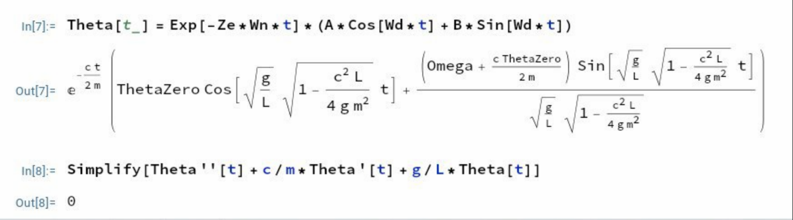
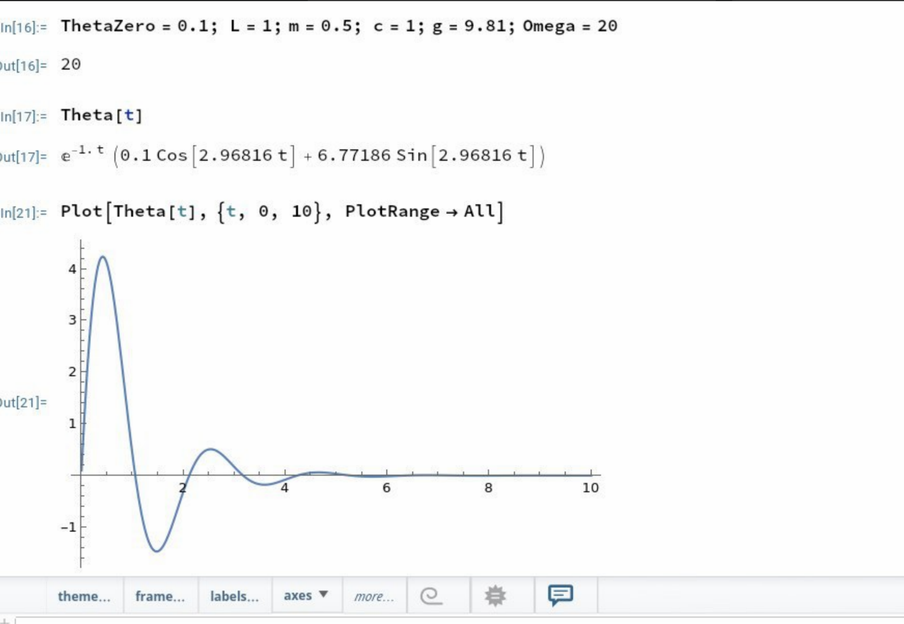

$$
\phantom {derivatives}
\newcommand\d{\text{d}}
\def\ffrac(#1/#2){\frac{#1}{#2}}
\def\hfrac #1(#2/#3){\ffrac (#1#2/#1#3)}
\def\deri#1/#2;{\hfrac \d(#1/#2)}
\def\dderi#1/#2;{\nderi #1/#2^2; }
\def\nderi#1/#2^#3;{\ffrac (\d^#3 #1/\d #2^#3)}
\def\derin1/#1{\ffrac (1/#1) }
\def\pderi#1/#2;{\hfrac \part(#1/#2) }
\def\ppderi#1/#2;{\npderi #1/#2^2;}
\def\npderi#1/#2^#3;{\ffrac (\part^#3 #1/\part #2^#3)}
\def\pderin1/#1;{\ffrac (\part / \part #1)}
\def\fac #1/#2;{\frac{#1}{#2}}

\phantom {fraction}
\def\inv#1{\ffrac (1/#1)}
\newcommand\invsqrt[1]{\frac{1}{\sqrt{#1}}}
\newcommand\half{\frac{1}{2}}
\newcommand\tri{\frac{1}{3}}
\newcommand\quar{\frac{1}{4}}
\phantom {vectors}
\newcommand\vfunc[2]{}

\phantom {common vectors}
\def\vfn #1(#2){\vec #1(\vec #2)}
\def\v #1{\vec #1}
\newcommand\vf{\v f}
\newcommand\vx{\v x}
\newcommand\vy{\v y}
\newcommand\vz{\v z}
\newcommand\vr{\v r}
\newcommand\vv{\v v}
\newcommand\va{\v a}
\newcommand\vtheta{\v \theta}
\newcommand\vphi{\v \phi}
\newcommand\vs{\v s}

\phantom {randomstaff}
\def\tsub#1;{_{\text {#1}}}
\def\sub#1;{_{#1}}
\def\(#1);{\left(#1\right)}
\def\intl#1;{\int_{#1}}
\def\intlh#1;#2;{\int_{#1}^{#2}}
\def\sup#1;{^{#1}}
\def\tsup#1;{^{\text{#1}}}
\def\align[[#1]]{\begin{align*}#1\end{align*}}
\def\note#1!{\fbox{$#1$}}
\def\.#1|;{\left.#1\right|}
\def\ssqrt/#1/;{\sqrt{#1}}
\def\noteeq#1!#2!{\begin{equation} \label{eq:#2} \fbox{$#1$}\end{equation}}
\def\raf#1;{\ref{#1}}
\def\eqraf#1;{\eqref{#1}}
\def\dfac#1/#2;{\dfrac{#1}{#2}}
\def\sqt#1/;{\sqrt{#1}}
\def\sgrt#1/>{\sqrt{#1}}
\def\txt#1;{\text{#1}}
\def\const{\text{const}}
$$

##### Question 1 Particle on a spring

>A particle of mass $m$ is constrained to move along a line in the $x$ direction. It's attached to a spring with constant $k$ that is connected to a point at a distance $L$ perpendicular to the line. The natural length of the spring is $L_0 = L/2$.

###### (a)

> Determine the system's potential energy $U$ in terms of the particle's position $x = x(t)$

The potential energy is
$$
U = \half k\(\Delta L);^2 = \half k\(\sgrt L^2 + x^2 /> - \fac L/2;);^2
$$

###### (b)

>Find the position $x = x\sub min;$ where the potential energy has a minimum

From the intuition, the minimum potential energy happens when $x = 0$ (the spring is least stretched). The calculation also agrees on that:
$$
U' = \half k \cdot 2 \(\sgrt L^2 + x^2 /> - \fac L/2; ); \cdot \half (L^2 +x^2)\sup -\half; \cdot 2x = kx\cdot\(1 - \fac L/2\sgrt L^2 +x^2 />;);
$$
is equal to zero only when $\note x = 0!$, and that
$$
U'' = k(1 - \fac L / 2\sgrt L^2 + x^2 />;) + kx(-\fac L/2; \cdot -\half (L^2 + x^2)\sup -3/2;) \\
$$
with $U''(0) = \half k > 0$ show that the point is indeed the minimum.

###### (c)

>Determine the effective spring constant $k\tsub eff; = U'' (x = x\tsub min;)$

From the previous calculation, we know that $\note k\tsub eff; = U''(0) = \half k!$

###### (d)

>Determine the system's oscillation frequency

The oscillation frequency $\note w = \sgrt \fac k\tsub eff; / m ; /> = \sgrt \fac k /2m; />!$

##### Question 2 Simple Pendulum

>(A pendulum, with a massless rod of length $L$ and a point bob of mass $m$, swings in a gravitational field $\vec g$ as shown. Assume the pendulum to be near the Earth's surface such that $g = \const$. The pendulum has energy $E$, that is not necessarily small. We choose the reference frame such that the potential energy vanishes at $\theta =0$, i.e., $U(\theta = 0) = 0$

###### (a)

>Determine the pendulum maximum angular speed $\dot \theta$, in terms of $E$, $L$, $m$ and $g$

The total energy $E$ is equal to
$$
E = U +T = mgL(1 - \cos \theta) + \half mL^2\dot \theta^2
$$
Thus
$$
\dot \theta = \sgrt \fac 2E/mL^2; - \fac 2g/L;(1 - \cos \theta)/>
$$
and maximum is achieved when setting $\cos \theta = 1$.
$$
\noteeq \dot \theta = \sgrt \fac 2E/mL^2; /> !dottheta!
$$

###### (b)

>Determine the maximum amplitude, $\theta\tsub max;$, of the oscillation in terms of $E$, $L$, $m$, $g$

From the question (a), we could rearrange the equation to
$$
\theta = \arccos(1 - \fac E/mgL; - \fac L/2g; \dot\theta^2)
$$
and the maximum is achieved when setting $\dot \theta = 0$.
$$
\noteeq \theta = \arccos (1 - \fac E/mgL;) !theta!
$$

###### (c)

>How large must the energy $E$ be such that the pendulum whirls around rather than just oscillates?

For pendulum to whirls around, the maximum $\theta$ must be at least $\pi$ (see the graph). Thus
$$
\pi = \arccos(1 - \fac E/mgL;) \\
-1 = 1 - \fac E/mgL; \\
$$

$$
\noteeq E = 2mgL!energy!
$$

###### Question 3 Compound pendulum

>A compound pendulum is formed of a rigid rod of length $2a$, with one mass $m_1 = m$ at its tip and another mass $m_2 = 2m$ at its midpoint as shown.
>
>Determine the pendulum's period for small oscillations, i.e. , $\theta(t)$ small.
>
>Hint: one approach is start by constructing the formulas for its kinetic energy as a function of $\dot\theta$ and for its potential energy as a function of $\theta$

The potential energy is
$$
\align[[
U &= U\tsub small; + U\tsub big; \\ 
&= m_1g \cdot 2a(1 - \cos \theta) + m_2 g\cdot a(1 - \cos \theta) \\ 
&= 4mga(1 - \cos \theta)
]]
$$
and the kinetic energy is
$$
\align[[
T &= T\tsub small; + T\tsub big; \\ 
&= \half m_1 (2a \dot \theta)^2 + \half m_2 (a \dot \theta)^2 \\ 
&= \half m \cdot 4 a^2 \dot \theta^2 + \half \cdot 2m \cdot a^2\dot\theta^2 \\ 
&= 3ma^2\dot \theta^2
]]
$$
so, the total energy is
$$
E = U + T = 4mga(1 - \cos \theta) + 3ma^2\dot\theta^2
$$
and since the total energy is conserved
$$
\deri E/t; = 4mga\sin \theta \cdot \dot \theta + 3ma^2 \cdot 2\dot \theta \cdot \ddot \theta  = 0
$$
and thus
$$
4mga \sin \theta + 6ma^2\ddot\theta = 0
$$
since $\theta$ is small, we use the approximation that $\sin \theta \approx \theta$
$$
4mga\theta + 6ma^2 \ddot \theta = 0
$$
which we recognize that
$$
M\tsub eff; = 6ma^2 \\
K\tsub eff; = 4mga
$$
and thus the
$$
\omega = \sgrt \fac K\tsub eff; / {M\tsub eff;}; /> = \sgrt \fac 4mga / 6ma^2; /> = \sgrt \fac 2g/3a; />
$$
and thus the period is
$$
\noteeq P = \fac 2\pi /\omega; = 2\pi \sgrt \fac 3a/2g; />!period!
$$

##### Question 4

>A pendulum, with a massless rod of length $L$ and a point bob of mass $m$ at its tip, oscillates in an oil bath. The drag force acting on the bob is $\v F = -c\v v$ and is directed opposite to the bob's velocity vector $\v v$. You may ignore buoyancy and assume motion near the Earth's surface such that $g = \const$

###### (a)

>Derive the differential equation describing the bob's motion $\theta(t)$ for an arbitrary amplitude $\theta\tsub max;$ (but such that the bob remains submerged in the oil).

Doing some forces analysis:
$$
I\ddot\theta = -mgL\sin \theta - cL(L\dot\theta)
$$
that is
$$
\note mL^2\ddot\theta + cL^2\dot\theta + mgL\sin\theta = 0!
$$

###### (b)

>Linearize the differential equation that you obtained in $(a)$ and check it for obvious errors: is the damping positive? Its the effective stiffness (or "effective spring constant") positive? What is the damped frequency of the vibration?
>
>Assume that the system is underdamped.

Assume that $\theta$ is small, so $\sin \theta \approx \theta$. So, the equation is
$$
mL^2\ddot\theta + cL^2\dot \theta + mgL\theta = 0
$$
which is equivalent to solving 
$$
\noteeq \ddot\theta + \fac c/m;\dot\theta + \fac g/L;\theta =0!equation!
$$
The $M\tsub eff; = 1$, $C\tsub eff; =\fac c/m;$, $K\tsub eff; = \fac g/L;$. and thus
$$
\omega_n = \sgrt \fac K\tsub eff;/ {M\tsub eff;}; /> = \sgrt \fac g/L; />
$$
and thus the damping zeta $\zeta$ is
$$
\zeta = \fac C\tsub eff; /{2M\tsub eff;} \omega_n; = \fac c/2m;\sgrt \fac L/g; />
$$
by assumption, $c > 0$. and obviously $L > 0$ and $m > 0$. Thus, the $\zeta > 0$.

The effective spring constant is just $K\tsub eff; = g/L > 0$, (or $mgL$ for original equation) is obviously greater than zero.

By assumption of that system is underdamped, the damped frequency $\omega_d$ is
$$
\omega_d = \omega_n \sgrt 1 - \zeta^2 /> = \sgrt \fac g/L;(1 - \fac c^2/4m^2; \cdot \fac L/g;) /> = \sgrt \fac g/L;  - \fac c^2/4m^2; />
$$

###### (c)

>Setting the initial conditions $\theta(t = 0) = \theta_0$ and $\dot \theta(t = 0) = \Omega$, find the trajectory $\theta(t)$

By the Lecture note 13, Equation (43), the solution has the form of
$$
\theta(t) = \exp(-\zeta \omega_n t)(A\cos(\omega_d t) + B\sin(\omega_dt))
$$
It's derivative is
$$
\dot\theta(t) = -\zeta\omega_n\exp(-\zeta\omega_nt)(A\cos(\omega_dt) + B\sin(w_dt)) + \exp(-\zeta\omega_nt)(-A\omega_d\sin(\omega_dt) + B\omega_d\cos(\omega_d t))
$$
By the initial conditions
$$
\theta(0) = 1(A\cdot 1 + B\cdot 0) = \theta_0\\
\dot\theta(0) = -A\zeta\omega_n + B\omega_d = \Omega
$$
and thus
$$
\note \align[[A &= \theta_0 \quad  B = \fac \Omega + \theta_0\zeta\omega_n/\omega_d; ]]!
$$
and the solution is thus
$$
\noteeq \theta(t) = \exp(-\zeta \omega_n t)(\theta_0\cos(\omega_d t) -\fac \Omega/\zeta\omega_n\omega_d; \sin(\omega_dt))!thetaresult!
$$
where the $\omega_n$, $\omega_d$, and $\zeta$ is calculated in $(b)$

##### Question 5

> Computer Algebra programs like mathematica are useful tools to do lengthy computations. Here you will practice working with mathematica using the problem in Question 4, In particular,

###### (a)

>Verify that your solution in $(4c)$ does indeed solve the differential equation of $(4b)$ by inserting your solution

We define some constants first

and write the $\theta(t)$ function, put it back into $\eqref{eq:equation}$

we get $0$ as expected, which shows that our solution is correct.

###### (b)

> Plot the motion $\theta(t)$ in the interval $t = 0\txt s;,...,10\txt s;$. Set the parameters $\theta_0 = 0.1$, $L = 1m$, $m = 0.5\txt kg;$, $c = 1\txt kg/s;$, $g = 9.81\txt m/s;^2$,$\Omega = 20\txt Hz;$
>
> Hint: it is useful to introduce the dimensionless time parameter $\bar t = t/s$, and plot $\theta(\bar t)$

Giving value to the constants, and plot the $\theta(\bar t)$. As we could see, this is indeed a damped oscillation.