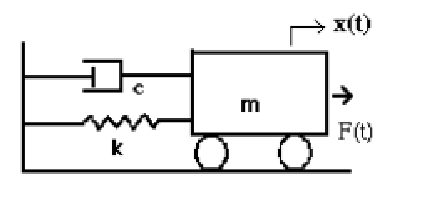
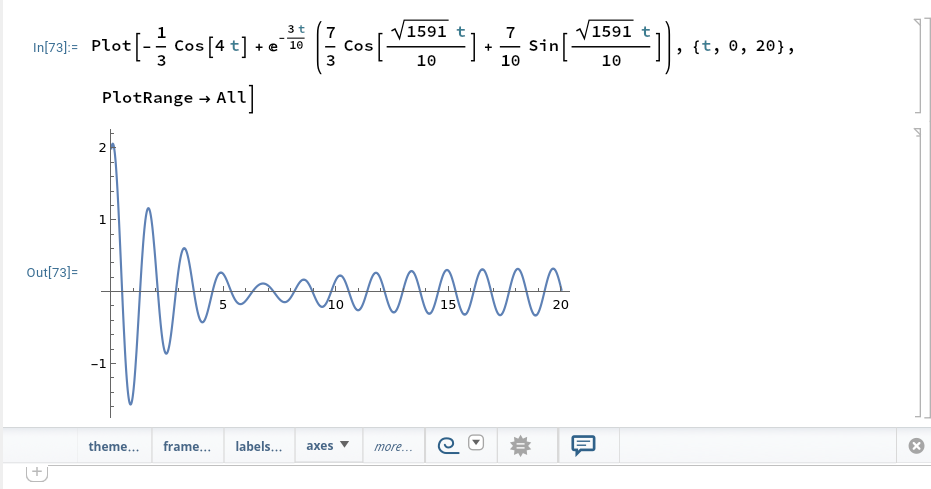
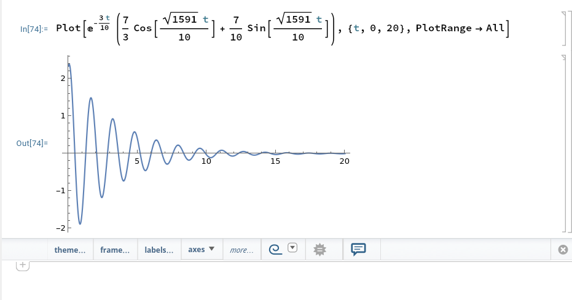
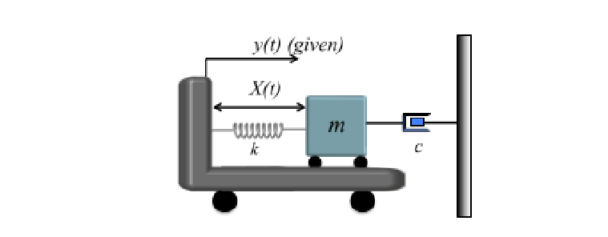

$$
\phantom {derivatives}
\newcommand\d{\text{d}}
\def\ffrac(#1/#2){\frac{#1}{#2}}
\def\hfrac #1(#2/#3){\ffrac (#1#2/#1#3)}
\def\deri#1/#2;{\hfrac \d(#1/#2)}
\def\dderi#1/#2;{\nderi #1/#2^2; }
\def\nderi#1/#2^#3;{\ffrac (\d^#3 #1/\d #2^#3)}
\def\derin1/#1{\ffrac (1/#1) }
\def\pderi#1/#2;{\hfrac \part(#1/#2) }
\def\ppderi#1/#2;{\npderi #1/#2^2;}
\def\npderi#1/#2^#3;{\ffrac (\part^#3 #1/\part #2^#3)}
\def\pderin1/#1;{\ffrac (\part / \part #1)}
\def\fac #1/#2;{\frac{#1}{#2}}

\phantom {fraction}
\def\inv#1{\ffrac (1/#1)}
\newcommand\invsqrt[1]{\frac{1}{\sqrt{#1}}}
\newcommand\half{\frac{1}{2}}
\newcommand\tri{\frac{1}{3}}
\newcommand\quar{\frac{1}{4}}
\phantom {vectors}
\newcommand\vfunc[2]{}

\phantom {common vectors}
\def\vfn #1(#2){\vec #1(\vec #2)}
\def\v #1{\vec #1}
\newcommand\vf{\v f}
\newcommand\vx{\v x}
\newcommand\vy{\v y}
\newcommand\vz{\v z}
\newcommand\vr{\v r}
\newcommand\vv{\v v}
\newcommand\va{\v a}
\newcommand\vtheta{\v \theta}
\newcommand\vphi{\v \phi}
\newcommand\vs{\v s}

\phantom {randomstaff}
\def\tsub#1;{_{\text {#1}}}
\def\sub#1;{_{#1}}
\def\(#1);{\left(#1\right)}
\def\intl#1;{\int_{#1}}
\def\intlh#1;#2;{\int_{#1}^{#2}}
\def\sup#1;{^{#1}}
\def\tsup#1;{^{\text{#1}}}
\def\align[[#1]]{\begin{align*}#1\end{align*}}
\def\note#1!{\fbox{$#1$}}
\def\.#1|;{\left.#1\right|}
\def\ssqrt/#1/;{\sqrt{#1}}
\def\noteeq#1!#2!{\begin{equation} \label{eq:#2} \fbox{$#1$}\end{equation}}
\def\raf#1;{\ref{#1}}
\def\eqraf#1;{\eqref{#1}}
\def\dfac#1/#2;{\dfrac{#1}{#2}}
\def\sqt#1/;{\sqrt{#1}}
\def\sgrt#1/>{\sqrt{#1}}
\def\txt#1;{\text{#1}}
\def\const{\text{const}}
\def\eq#1!#2!{\begin{equation} \label{eq:#2} #1 \end{equation}}
$$

##### Problem 1: Driven oscillator

>Consider a mass on a spring with an exponentially decreasing external (i.e. driving) force described by the equation of motion
>$$
>\eq m\ddot x + kx = F_0e^{-\lambda t}!eq1!
>$$
>with $\lambda > 0$ constant.

###### (a)

>Write down the general **homogeneous** solution, $x_h(t)$, of the **homogeneous** part of the equation of motion, i.e., without the driving force. Determine the natural frequency $\omega_t$ in terms of $m$ and $k$.

The **homogeneous** equation is
$$
m\ddot x + kx = 0
$$
and its solution is just
$$
x = A\cos(\sgrt \fac k/m; /> t) + B\sin(\sgrt \fac k/m; />t) \quad \txt where; \quad w_t = \sgrt \fac k/m; />
$$

###### (b)

>Derive the particular solution, $x_p(t)$, of Equation $\eqref {eq:eq1}$ using the ansatz $x(t) = De^{-\lambda t}$. Determine $D$ in terms of $m$, $k$, $F_0$, and $\lambda$

Put the ansatz $x(t) = De\sup -\lambda t;$ into the equation
$$
m\lambda^2 De\sup -\lambda t; + kDe\sup -\lambda t; = F_0e\sup- \lambda t;
$$
and thus
$$
D = \fac F_0 / m\lambda^2 + k ;
$$

###### (c)

>Show that the general (total) solution Equation $\eqref{eq:eq1}$ is $x(t) = x_h(t) + x_p(t)$.

The general solution is
$$
x(t) =  A\cos(w_t t) + B\sin(w_t t) + \fac F_0 / m\lambda^2 + k;e\sup -\lambda t;
$$
Put the general solution back into the original equation
$$
\align[[
&-mw_t^2(A\cos(w_t t) + B\sin(w_t t)) + \fac F_0 \lambda^2 m / m\lambda^2 + k;e\sup -\lambda t; +k(A\cos(w_t t) + B\sin(w_t t)) + \fac F_0k / m\lambda^2 + k;e\sup -\lambda t; \\
&= (A\cos(w_t t) + B\sin(w_t t))(k - mw_t^2) + F_0e\sup -\lambda t;\(\fac m\lambda^2 + k/m\lambda^2 + k;); \\
&= F_0e\sup -\lambda t;
]]
$$
we get the right hand side as desired. The general solution we find is indeed the general solution of the Equation $\eqref{eq:eq1}$

###### (d)

>Now consider initial conditions $x_0 = x(t=0) = 0$ and $\dot x_0 = \dot x_0(t = 0) = 0$ and determine the two free constants of the general homogeneous solution. Write down the full solution $x(t)$. Explain the behavior of $x(t)$ as $t \gg \inv \lambda$ 

$$
x(t = 0) = A + \fac F_0/m\lambda^2+k; = 0 \\
\dot x(t=0) = Bw_t - \fac F_0\lambda/m\lambda^2+k; = 0
$$

and thus
$$
A = -\fac F_0/m\lambda^2+k;\\
B = \fac F_0\lambda/w_t(m\lambda^2+k);
$$
when $t \gg \fac 1/\lambda;$, $F\tsub ext; = F_0e\sup -\lambda t; \approx 0$ and
$$
x(t) \approx A\cos(w_t t) + B\sin(w_t t)
$$
that is, when $t \gg \inv \lambda$, the external force is negligible, and the motion is reduced to a no damping simple harmonic oscillation. 

##### Question 2

>Consider a lightly damped system driven near a resonance, as pictured. The driving force is given by
>$$
>\eq F = F_0\sin(\omega t)!eq2!
>$$
>Consider the parameters $c = 6\txt kg/s;$, $k = 160 \txt N/m;$, $m = 10\txt kg;$, $F_0 = 8\txt N;$, and $\omega= 4\txt Hz;$

###### (a)

>Write down the steady-state response, $x_p(t)$, to this forcing

we could express the $F = F_0\cos(\omega t - \fac \pi / 2;)$, and thus
$$
x_p(t) = F_0G(\omega)\cos(\omega t - \fac \pi / 2; - \phi) = F_0G(\omega)\sin(\omega t  - \phi)
$$
where $G(\omega)$ and $\phi(\omega)$ is, according to Lecture Notes 15
$$
G(\omega) = \inv {k} \fac 1 / \sgrt(1 - ({\fac \omega/\omega_n;})^2)^2 + (2\zeta {\fac \omega/\omega_n;})^2 />; \\
\phi(\omega)  =\arctan(\fac 2 \zeta \omega\omega_n/(\omega_n^2 - \omega^2);)
$$
where $\omega_n = \sgrt \fac k/m; />$ and $\zeta = \fac c/2m\omega_n;$

we could do numerical evaluation
$$
\omega_n = \sgrt \fac k / m; /> = 4 \txt Hz; \\
\zeta = \fac c/2m\omega_n; = \fac 6/2 \cdot 10 \cdot 4; = \fac 3/40 ; < 1
$$
we could see the system is underdamped.

###### (b)

>Write down the total solution $x(t) = x_h(t) + x_p(t)$ that satisfies the initial conditions $x_0 = x(t = 0) = 2\txt m;$ and $\dot x_0 = \dot x(t = 0) = 0$

Since the system is underdamped. The complement solution $x_h(t)$ has the form of
$$
x_h(t) = \exp(-\zeta\omega_n t)(A\cos(\omega_d t) + B\sin(\omega_d t))
$$
and thus the total solution is
$$
x(t) = \exp(-\zeta\omega_n t)(A\cos(\omega_d t) + B\sin(\omega_d t)) +  F_0G(\omega)\sin(\omega t  - \phi)
$$
and its derivative is
$$
\align [[
\dot x(t) = &-\zeta \omega_n \exp(-\zeta \omega_n t)(A\cos(\omega_d t) + B\sin(\omega_d t)) \\
&+\omega_d\exp(-\zeta \omega_n t)(-A\sin(\omega_d t) + B\cos(\omega_d t)) \\
&+\omega F_0G(\omega)\cos(\omega t  - \phi) 
]]
$$
Apply the initial condition
$$
x_0 = A + F_0G(\omega)\sin(-\phi) = 2 \\
\dot x_0 = -\zeta\omega_nA + \omega_d B + \omega F_0 G(\omega)\cos(-\phi) = 0
$$
and thus
$$
A = 2 + F_0G(\omega)\sin(\phi) \\
B = \fac 2\zeta\omega_n  + F_0G(\zeta\omega_n\sin(\phi) + \omega\cos\phi)/w_d;
$$

###### (c)

>Make a numerical plot of your solution from $t = 0\txt s;$ to $t = 20\txt s;$. Verify that the initial conditions at $t = 0$ are satisfied.

The $\phi(\omega)$, if we calculate, we result in $\arctan(\infin)$, which is not desired. We could calculate the phase angle directly from $\tilde G(\omega)$
$$
\tilde G(\omega) = \inv k \fac 1/2i\zeta; = -\fac i/2k\zeta;
$$
and thus
$$
\phi(\omega) = -\arg \tilde G(\omega) = \fac \pi/2;
$$
with this, we could proceed.

Using Mathematica to plot the graph

When $t = 0$, $x(t = 0) = 2$ as expected.

###### (d)

>Using your plots, estimate the duration of your transient, i.e., the time that it takes for the homogeneous solution decay. Compare this to what you would expect from the homogeneous solution.

We could plot the graph of the only transient response

and combine two plots, we could see that the transient response almost completely decay around $\txt 12-13s;$. The difference is that that object stops moving in homogeneous solution around this time, while the object start moving according to the steady-state response in the non-homogeneous solution.

 ##### Question 3

>Consider a damped harmonic oscillator driven by a damped harmonic force
>$$
>\eq F(t)=F_0e\sup -\alpha t;\cos(\omega t + \theta) !eq3!
>$$
>where $\alpha > 0$ is a constant. Write down the differential equation of motion for a damped harmonic oscillator with effective mass $m$, stiffness $k$ and damping $c$ driven by the damped harmonic force in Equation $\eqref{eq:eq3}$. Solve for the particular solution using the ansatz $x = \mathfrak{R}(Ae\sup \gamma t + i\phi;)$ and $\gamma = -\alpha + i \omega$
>
>Hint: Recall that $e^{-\alpha t} \cos(\omega t + \theta) = \mathfrak{R}(e\sup \gamma t + i\theta;)$

The differential equation is
$$
m\ddot x + c\dot x + kx = F_0e\sup -\alpha t;\cos(\omega t + \theta)
$$
using ansatz $x = \mathfrak{R}(Ae\sup \gamma t + i\phi;)$, we know
$$
\dot x = \mathfrak{R}(A\gamma e\sup \gamma t + i\phi;) \\
\ddot x = \mathfrak{R}(A\gamma^2 e\sup \gamma t + i\phi;) \\
$$
and thus
$$
m\mathfrak{R}(A\gamma^2 e\sup \gamma t + i\phi;) + c\mathfrak{R}(A\gamma e\sup \gamma t + i\phi;) + k\mathfrak{R}(Ae\sup \gamma t + i\phi;) = F_0 \mathfrak{R}(e\sup \gamma t + i\theta;)
$$
thus
$$
A\gamma^2 m + A\gamma c + Ak = F_0 \\
\phi = \theta
$$
and
$$
A = \fac F_0 / \gamma^2 m + \gamma c + k;
$$
and
$$
x_p = \mathfrak{R}(\fac F_0 /\gamma^2 m + \gamma c + k; e\sup \gamma t + i\theta;)
$$

##### Question 4: Forced motion -- cart on a moving cart

>Consider the pictured mass-spring system excited by a moving base $y(t)$ and with a drag force $F\tsub d; = -cv$ where $v$ is the mass' velocity relative to the lab. The base's motion is oscillatory with $y(t) = A_0\cos(\omega t)$.
>
>Find the steady-state motion $x_p(t) = X(t) - X\tsub eq;$ representing the displacement from the equilibrium $X\tsub eq;$ relative to the moving base. We will tackle this problem in two stages. 

###### (a

>Derive the differential equation and show that it is given by
>$$
>M\tsub eff;\ddot x + C\tsub eff;\dot x + K\tsub eff; x = D\ddot y + E\dot y
>$$
>Identify the five coefficients $M\tsub eff;$, $C\tsub eff;$, $K\tsub eff;$, $D$, and $E$.
>
>Check the differential equation you derived: Does the equation reduced to what you should have if $y(t) = 0$? Are the effective damping and stiffness positive? Does the effective force (i.e. right-hand-side) scale sensibly with $\dot y$ and $\ddot y$. Is you equation dimensionally consistent?
>
>Hint 1: You are advised to use $F = ma$ for the derivation. The force has two terms, namely the spring force and the drag force.
>
>Hint 2: Be careful in you derivation: $x$ and $X$ represent motion relative to the moving base (not the lab). The mass' velocity and acceleration in the lab frame are therefore not $\dot x$ and $\ddot x$. Think about the position of the mass as described from the lab. This will involve the position $y(t)$ of the cart relative to the lab, as well as the position $X(t)$ of the mass relative to the cart.

We know that the $F\tsub d; = -cv = -c(\dot x + \dot y)$, thus
$$
F\tsub total; = m\dderi (x+y)/t; \\
m(\ddot x + \ddot y) = F\tsub spring; + F\tsub d; \\
m\ddot x + m \ddot y= -kx -c\dot x - c\dot y \\
$$
and thus
$$
\noteeq m\ddot x + c\dot x + kx  = -m\ddot y - c\dot y!sol4!
$$
and thus
$$
M\tsub eff; = m \\
C\tsub eff; = c \\
K\tsub eff; = k \\
D = -m \\
E = -c
$$
If $y(t) = 0$, this is just a damped equation, as expected.

The $C\tsub eff;$ and $K\tsub eff;$ is both positive, and as the velocity and acceleration of $y(t)$ increase, we do expect more spring resistance and damping resistance, so the part $F\tsub external; -m\ddot y - c\dot y$ makes sense.

###### (b)

>Obtain the particular solution $x_p(t)$. Substitute $y(t) = A_0\cos(\omega t)$ and use the formulas for the harmonic responses in terms of $G(\omega)$ and $\phi(\omega)$. You do not need to re-derive them, but you will have to substitute for all the forms of the coefficients.
>
>Hint 1: You may save a lot of algebra if you remember that the particular solution associated with the sum of two force is the sum of the particular solutions.
>
>Hint 2: You need not consider the initial conditions. They only affect the constants of the homogeneous part of the solution, $x_h(t)$, which decay due to the damping. The question only asks for the steady-state, i.e., particular solution $x_p(t)$

The right hand side is
$$
F\tsub ext; = m\omega^2 A_0 \cos(\omega t) + c\omega A_0\sin(\omega t)
$$
which is
$$
F\tsub ext; = m\omega^2 A_0 \cos(\omega t) + c\omega A_0\cos(\omega t - \fac \pi/2;)
$$
and using the formula from Lecture Notes 15
$$
\fac \omega/\omega_n; = \omega\sgrt \fac m/k; /> \\
\zeta = \fac c/2m\omega_n;
$$
and
$$
G(\omega) = \fac 1/k;\fac 1/\sgrt 
	(1 - \omega^2 {\fac m/k;})^2 + ({\fac c/k;}\omega)^2 
/>; \\
\phi(\omega) = \arctan(\fac c\omega/k-m\omega^2;)
$$
and thus
$$
x_p(t) = m\omega^2 A_0 G(\omega) \cos(\omega t - \phi(\omega)) + c\omega G(\omega)A_0\sin(\omega t - \phi(\omega))\\
= A_0G(\omega) (m\omega^2 \cos (\omega t -\phi(\omega) + c\omega\sin(\omega t- \phi (\omega)))
$$
and we could expand it (if you prefer)
$$
\align[[
x_p(t) = &A_0\fac 1/k;\fac 1/\sgrt 
	(1 - \omega^2 {\fac m/k;})^2 + ({\fac c/k;}\omega)^2 
/>;\\ 
&\(m\omega^2 \cos (\omega t -\arctan(\fac c\omega/k-m\omega^2;)) + c\omega\sin(\omega t- \arctan(\fac c\omega/k-m\omega^2;)));
]]
$$

