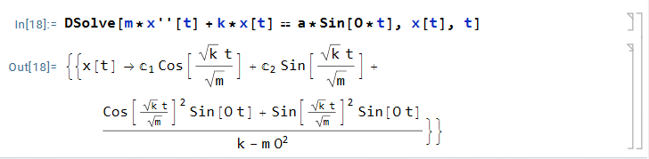
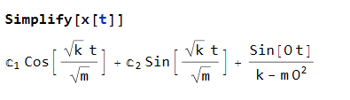

$$
\phantom {derivatives}
\newcommand\d{\text{d}}
\def\ffrac(#1/#2){\frac{#1}{#2}}
\def\hfrac #1(#2/#3){\ffrac (#1#2/#1#3)}
\def\deri#1/#2;{\hfrac \d(#1/#2)}
\def\dderi#1/#2;{\nderi #1/#2^2; }
\def\nderi#1/#2^#3;{\ffrac (\d^#3 #1/\d #2^#3)}
\def\derin1/#1{\ffrac (1/#1) }
\def\pderi#1/#2;{\hfrac \part(#1/#2) }
\def\ppderi#1/#2;{\npderi #1/#2^2;}
\def\npderi#1/#2^#3;{\ffrac (\part^#3 #1/\part #2^#3)}
\def\pderin1/#1;{\ffrac (\part / \part #1)}
\def\fac #1/#2;{\frac{#1}{#2}}

\phantom {fraction}
\def\inv#1{\ffrac (1/#1)}
\newcommand\invsqrt[1]{\frac{1}{\sqrt{#1}}}
\newcommand\half{\frac{1}{2}}
\newcommand\tri{\frac{1}{3}}
\newcommand\quar{\frac{1}{4}}
\phantom {vectors}
\newcommand\vfunc[2]{}

\phantom {common vectors}
\def\vfn #1(#2){\vec #1(\vec #2)}
\def\v #1{\vec #1}
\newcommand\vf{\v f}
\newcommand\vx{\v x}
\newcommand\vy{\v y}
\newcommand\vz{\v z}
\newcommand\vr{\v r}
\newcommand\vv{\v v}
\newcommand\va{\v a}
\newcommand\vtheta{\v \theta}
\newcommand\vphi{\v \phi}
\newcommand\vs{\v s}

\phantom {randomstaff}
\def\tsub#1;{_{\text {#1}}}
\def\sub#1;{_{#1}}
\def\(#1);{\left(#1\right)}
\def\intl#1;{\int_{#1}}
\def\intlh#1;#2;{\int_{#1}^{#2}}
\def\sup#1;{^{#1}}
\def\tsup#1;{^{\text{#1}}}
\def\align[[#1]]{\begin{align*}#1\end{align*}}
\def\note#1!{\fbox{$#1$}}
\def\.#1|;{\left.#1\right|}
\def\ssqrt/#1/;{\sqrt{#1}}
\def\noteeq#1!#2!{\begin{equation} \label{eq:#2} \fbox{$#1$}\end{equation}}
\def\raf#1;{\ref{#1}}
\def\eqraf#1;{\eqref{#1}}
\def\dfac#1/#2;{\dfrac{#1}{#2}}
\def\sqt#1/;{\sqrt{#1}}
\def\sgrt#1/>{\sqrt{#1}}
\def\txt#1;{\text{#1}}
\def\const{\text{const}}
\def\eq#1!#2!{\begin{equation} \label{eq:#2} #1 \end{equation}}
\def\kg{\txt kg;}
\def\s{\txt s;}
\def\m{\txt m;}
\def\stwo{\txt s;^2}
\def\iv#1;{\inv{#1}}
\def\sumninfin{\sum\sub n=1;\sup\infin;}
\def\sumninfinz{\sum\sub n = 0;\sup\infin;}
$$

##### Question 1 Bumpy Road

>Consider a unicycle fitted with a damped, shock-absorbing spring with spring constant $k$ and damping coefficient $c$. When a rider of mass $m = 80 \txt kg;$ sits on the unicycle. the spring compresses and the seat sags by $0.02\m$. Recall $g = 9.81\m/\stwo$
>
>The unicycle (including the rider) goes over a crack that sets the spring in motion. It takes $\tau = 5\s$ for the amplitude of the underdamped spring oscillations to decay by a factor of $1/e$.
>
>Hint: recall the equation for a free, damped spring
>$$
>m\ddot x + c\dot x + kx = 0, \quad \txt or, equivalently; \quad \ddot x + 2\zeta\omega_n\dot x + \omega_n^2 x = 0
>$$
>with $\omega_n = \sgrt \fac k/m; />$ and $\zeta = \fac c/2m\omega_n;$. When underdamped, this has the general (homogeneous) solution $x(t) = e\sup -\zeta\omega_n t;\(A\exp(i\omega_n \sgrt 1 - \zeta^2 /> t) + B \exp(-i \omega_n \sgrt 1- \zeta^2 />t) );$.

###### (a)

>Find the dimensionless damping parameter $\zeta$. Justify calling the system "underdamped".

Call the distance seat sags $\Delta h = 0.02\m$, thus
$$
mg = k\Delta h \\
k = \fac mg/\Delta h;
$$
we know t2hat after $\tau = 5\s$, the oscillation decay by a factor of $1/e$. Thus
$$
e\sup -\zeta\omega_n \tau;  = e\sup -1; \\
$$
and that
$$
\zeta = \iv w_n \tau ; = \tau\sup -1; \sgrt \fac m/k; /> = \tau\sup -1; \sgrt \fac \Delta h/g; />
$$

$$
\note \zeta = 0.2\cdot \sgrt \fac 0.02/9.81; /> \approx 0.00903!
$$

which is less than $1$, and this shows that the system is indeed "underdamped".

###### (b)

>Find the damping coefficient $c$

$$
c = \zeta \cdot 2m\omega_n = 2\zeta m\sgrt \fac k/m; /> = 2\tau\sup -1;\sgrt \fac \Delta h/g; mk /> = 2\tau\sup -1; m 
$$

and thus
$$
\note c = 2\fac m/\tau; = 32\kg/\s!
$$

###### (c)

>Now suppose that the unicycle is ridden over a "washboard" road with bump spaced $1\m$ apart. Treat the surface of the road as sinusoidal. At what speed must the unicycle go for the spring to be forced into resonance?

Then the frequency of bumping $\omega_b$ should be equal to natural frequency $\omega_n$. Thus
$$
w_b = w_n = \sgrt \fac k/m; /> = \sgrt \fac mg/m\Delta h; /> = \sgrt \fac g/\Delta h;/>
$$
and thus
$$
\note v = \omega_b d = \sgrt \fac 9.81/0.02; /> \cdot 1 \approx  22.15 \m/\s!
$$

###### (d)

>Calculate the steady-state phase difference between the spring oscillations and the driving force caused by the bumps in the road near the resonance.

we know that $\omega_b = \omega_n$, and thus from lecture notes 15,
$$
\tilde G(\omega) = \iv k; \iv {2i\zeta}; = -\iv 2k\zeta; i
$$
and thus
$$
\phi(\omega) = -\arg \tilde G(\omega) = -\fac 3/2;\pi \stackrel{\mathclap{\text{equiv}}}= \half \pi
$$

##### Question 2 Wave Rectifier

> A full-wave rectifier acting on a sinusoidal function of the form $F(t) = F_0\sin(\omega t)$, with $F_0 > 0$ constant, will produce a rectified function $F\tsub rec;= |F_0 \sin(\omega t)|$ 

##### (a)

>Find the Fourier series representation of $F\tsub rec; = |F_0\sin(\omega t)|$

The period of the function is $T = \fac \pi/\omega;$, and for $t \in [0, \pi]$, the $F\tsub rec; = F_0\sin(\omega t)$. For the function, we could see that is purely even, and thus $b_n = 0$. For $a_n$, they are
$$
\align[[
a_n &= \fac 2/T;\int_0\sup \pi/\omega; F_0\sin(\omega t)\cos(n\omega t)\d t \\
&= \fac \omega/\pi;F_0 \.\(\iv {(2n+1)}\omega; \cos((2n+1)\omega t) + \iv {(2n-1)}\omega; \cos((2n-1)\omega t) );|;\sup \pi/\omega;\sub 0; \\
&= \fac -4F_0/\pi(4n^2 - 1);
]]
$$
and thus
$$
F\tsub rec; = \sumninfinz \fac -4F_0/\pi(4n^2 - 1);\sin(n\omega t)
$$

###### (b)

Using mathematica

the first and then

two parts is just the homogeneous solution, we use the third part, and thus the particular solution should be
$$
x_p(t) = \sumninfinz \iv k-m\omega^2; \sin (\omega t) = \infin
$$
this makes sense because there is no damping, and external force is in resonance with motion.

##### Question 3

###### (a)

The frequency $\Omega = \fac 2\pi / T; = 2\pi$. Note the function is odd from the graph, and the average value should be $0$, and thus
$$
F(t) = \sumninfin b_n\sin(n\Omega t)
$$
we know that
$$
b_n = \fac 2/T;\int\sub -\half;\sup\half;2F_0 t\sin(2\pi nt) = \fac 2/1; \cdot \fac F_0/\pi;
$$
and thus
$$
F(t) = \fac 2F_0/\pi; \sumninfin \sin(2\pi n t)
$$

###### (b)

the particular solution will have the form of 
$$
x_p(t) = \sumninfin c_n \sin(n\Omega t)
$$
and thus
$$
\sumninfin c_n(-m n^2\Omega^2 + cn\Omega + k)\sin(n\Omega t) = \sumninfin \fac 2F_0/\pi; \sin(n\Omega t)
$$
and thus
$$
c_n = \fac 2F_0/(-m n^2\Omega^2 + cn\Omega + k)\pi;
$$
and we could see the $c_n$ decrease as $n$ increase. That means $c_1$ term $c_1\sin(\Omega t)$ (with frequency $\Omega$) dominate the response.

##### Question 4

###### (a)

>What is the period $T$ of the force?

From the graph, we could see it's $T = 2\s$

###### (b)

From the plot, we could see that the function is even. Thus, $F\tsub odd; = 0$, and all the $b_n$ should thus vanish.

###### (c)

From $(b)$, we know that the function reduced to
$$
F(t) = \fac a_0/2; + \sumninfin a_n\cos(\fac 2n\pi t/T;)
$$
and thus a solution of
$$
x_p(t) = c + d_n \sumninfin \cos(\fac 2n\pi t/T;)+ \sumninfin e_n \sin(\fac 2n\pi t/T;)
$$
the frequency is just $\Omega = \fac 2\pi /T;$. For shorthand, just denote $\cos_n = \cos(n\Omega t)$ and $\sin_n = \sin(n\Omega t)$

and thus
$$
x''_p(t) = -d_n(n\Omega)^2 \cos_n - e_n (n\Omega)^2 \sin_n \\
x'_p(t) = -d_n(n\Omega)\sin_n + e_n (n\Omega)\cos_n
$$
and thus
$$
(-md_n(n\Omega)^2 + ce_n(n\Omega) + kd_n)\cos_n + (-me_n (n\Omega) ^2 - cd_n(n\Omega) + ke_n)\sin_n + kc = \fac a_0/2; + a_n\cos_n
$$

$$
\begin{cases}
c = \fac a_0/2k; \\
a_n = -md_nA^2 + ce_nA + kd_n \\
0 = -me_n A ^2 - cd_nA + ke_n \\
\end{cases}
$$

with result
$$
c = \fac a_0/2k;\\
d_n = \fac (k - mA^2)a_n / (k - mA^2)^2 + (cA)^2; \\
e_n = \fac cA\cdot a_n / (k - mA^2)^2 + (cA)^2;
$$

###### (d)

For a long time, the oscillator will result in steady-state $x_p(t)$. Therefore, we could just integrate over one period $T$ for $x_p(t)$ and divide the time $T$ to get the average position. Do notice that
$$
\int\tsub period;\sin(\omega t + \phi)\d t = \int\tsub period; \cos(\omega t + \phi)\d t = 0
$$
where $\omega$ and $\phi$ could be arbitrary constant, and thus
$$
\iv T;\int\tsub period; x_p(t)\d t  = \fac cT/T; = \fac a_0/2k;
$$

