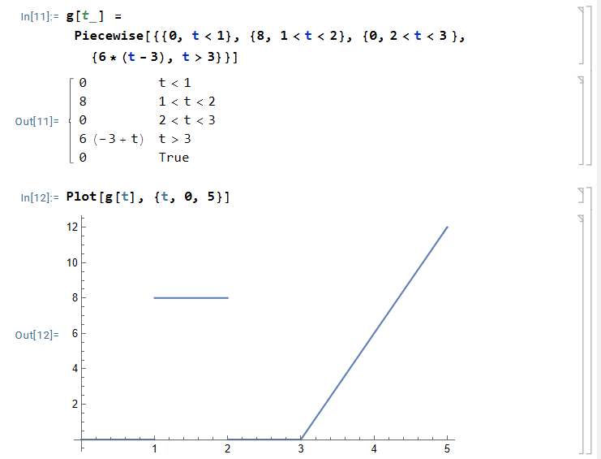
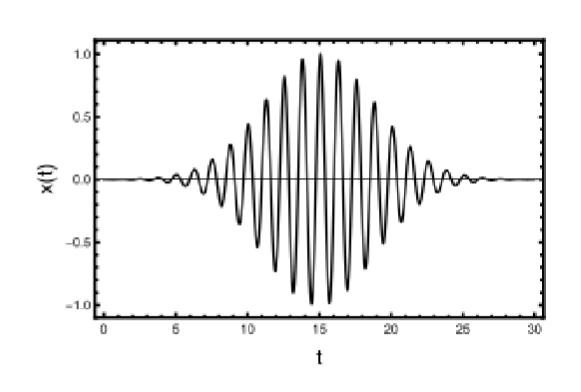
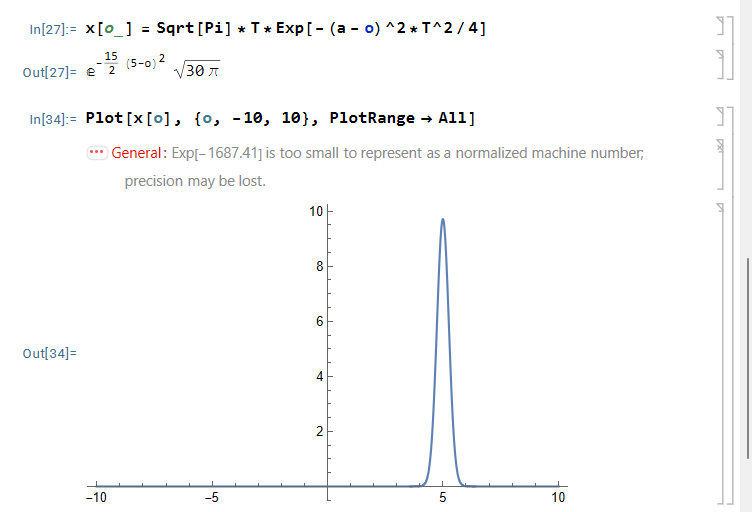
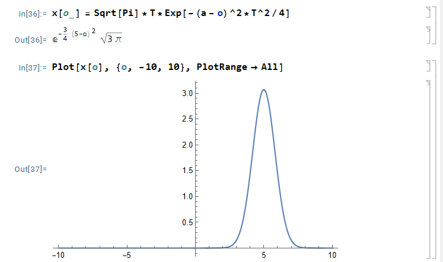

$$
\phantom {derivatives}
\newcommand\d{\text{d}}
\def\ffrac(#1/#2){\frac{#1}{#2}}
\def\hfrac #1(#2/#3){\ffrac (#1#2/#1#3)}
\def\deri#1/#2;{\hfrac \d(#1/#2)}
\def\dderi#1/#2;{\nderi #1/#2^2; }
\def\nderi#1/#2^#3;{\ffrac (\d^#3 #1/\d #2^#3)}
\def\derin1/#1{\ffrac (1/#1) }
\def\pderi#1/#2;{\hfrac \part(#1/#2) }
\def\ppderi#1/#2;{\npderi #1/#2^2;}
\def\npderi#1/#2^#3;{\ffrac (\part^#3 #1/\part #2^#3)}
\def\pderin1/#1;{\ffrac (\part / \part #1)}
\def\fac #1/#2;{\frac{#1}{#2}}

\phantom {fraction}
\def\inv#1{\ffrac (1/#1)}
\newcommand\invsqrt[1]{\frac{1}{\sqrt{#1}}}
\newcommand\half{\frac{1}{2}}
\newcommand\tri{\frac{1}{3}}
\newcommand\quar{\frac{1}{4}}
\phantom {vectors}
\newcommand\vfunc[2]{}

\phantom {common vectors}
\def\vfn #1(#2){\vec #1(\vec #2)}
\def\v #1{\vec #1}
\newcommand\vf{\v f}
\newcommand\vx{\v x}
\newcommand\vy{\v y}
\newcommand\vz{\v z}
\newcommand\vr{\v r}
\newcommand\vv{\v v}
\newcommand\va{\v a}
\newcommand\vtheta{\v \theta}
\newcommand\vphi{\v \phi}
\newcommand\vs{\v s}

\phantom {randomstaff}
\def\tsub#1;{_{\text {#1}}}
\def\sub#1;{_{#1}}
\def\(#1);{\left(#1\right)}
\def\intl#1;{\int_{#1}}
\def\intlh#1;#2;{\int_{#1}^{#2}}
\def\sup#1;{^{#1}}
\def\tsup#1;{^{\text{#1}}}
\def\align[[#1]]{\begin{align*}#1\end{align*}}
\def\note#1!{\fbox{$#1$}}
\def\.#1|;{\left.#1\right|}
\def\ssqrt/#1/;{\sqrt{#1}}
\def\noteeq#1!#2!{\begin{equation} \label{eq:#2} \fbox{$#1$}\end{equation}}
\def\raf#1;{\ref{#1}}
\def\eqraf#1;{\eqref{#1}}
\def\dfac#1/#2;{\dfrac{#1}{#2}}
\def\sqt#1/;{\sqrt{#1}}
\def\sgrt#1/>{\sqrt{#1}}
\def\txt#1;{\text{#1}}
\def\const{\text{const}}
\def\eq#1!#2!{\begin{equation} \label{eq:#2} #1 \end{equation}}
\def\kg{\txt kg;}
\def\s{\txt s;}
\def\m{\txt m;}
\def\stwo{\txt s;^2}
\def\iv#1;{\inv{#1}}
\def\sumninfin{\sum\sub n=1;\sup\infin;}
\def\sumninfinz{\sum\sub n = 0;\sup\infin;}
\def\intinfin{\int\sub-\infin;\sup\infin;}
\def\cases[[#1]]{\begin{cases}#1\end{cases}}
$$

##### Question 1: Delta Distribution

>Evaluate the following integrals

###### (a)

>$$
>\int_0^\infin \delta(2t^{1/3} - 54)e\sup 2t; \d t
>$$
>
>Hint: Make a variable substitution $u = 2t\sup 1/3;$ to bring the Delta function into a standard form.

Let $u = 2t\sup 1/3;$ and thus $t = \inv 8 u^3$, and thus
$$
\d t = \fac 3/8;u^2\d u
$$
and thus
$$
\int_0^\infin \delta(u - 54)e\sup \inv 4u^3;\fac 3/8;u^2\d u = \fac 2187/2;e\sup 39366;
$$

###### (b)

>$$
>\int\sub -\infin;\sup \infin; \(\dderi /t;\delta(t - 4));\sin(\fac t^2/4;)\d t
>$$
>
>Hint: you may integrate by parts

We could actually find a more general rule, notice that $\delta\sup (n);(\pm \infin) = 0$, and that means
$$
\int\sub -\infin;\sup \infin; f(x) \delta\sup (n);(x) \d x = f(x)\delta\sup (n);(x)|\sup \infin;\sub -\infin; -\int\sub -\infin;\sup\infin; \deri /x; f(x) \delta\sup (n - 1);\d x = -\int\sub-\infin;\sup\infin; \deri /x; f(x) \delta\sup (n - 1);\d x
$$
and thus
$$
\int\sub -\infin;\sup \infin; f(x) \delta\sup (n);(x) \d x = (-1)^n\int\sub-\infin;\sup\infin; \nderi /t^n; f(x) \delta(x)\d x
$$
and thus
$$
\int\sub -\infin;\sup \infin; \(\dderi /t;\delta(t - 4));\sin(\fac t^2/4;)\d t \\
= \intinfin \delta(t - 4) \dderi /t; \sin(\fac t^2/4;) \d t \\
= \intinfin \delta(t - 4) \(\half\cos(\fac t^2/4;) - \inv 4 t^2\sin(\fac t^2/4;));\d t \\
= \half \cos(4) - 4\sin(4)
$$

##### Question 2: Impulse response

>Consider a damped oscillator with impulse response, i.e., Green's function, given by
>$$
>G(t) = \cases[[
>2e\sup -t;\sin(4t) \quad & t > 0\\
>0 \quad & t < 0
>]]
>$$
>and subjected to a force
>$$
>F(t) = \cases[[
>0 \quad & t < 1 \\
>8 \quad & 1 < t < 2\\
>0 \quad & 2 < t < 3\\
>6(t - 3) \quad & t > 3
>]]
>$$

###### (a)

>Sketch the force

By Mathematica

###### (b)

> Construct an integral convolution expression for the response that is valid at all times. You do not need to evaluate the integrals, but they should be of a form that one could look up in a table of integrals.

the convolution have the form of
$$
x(t) = \int\sub-\infin;\sup t;F(\tau)G(t-\tau) \d\tau
$$
for $t < 1$, the $F(\tau) = 0$ in above expression, and thus
$$
x(t) = \int\sub-\infin;\sup t;F(\tau)G(t-\tau) \d\tau = 0
$$
for $1 < t < 2$,
$$
x(t) = \int\sub-\infin;\sup t;F(\tau)G(t-\tau) \d\tau = \int_1^t F(\tau)G(t - \tau)\d\tau  =\int_1^t 8\cdot 2e\sup -(t-\tau);\sin(4(t-\tau))\d\tau
$$
for $2 < t < 3$, the $F(\tau) = 0$ for $2 < \tau < 3$
$$
x(t) = \int\sub-\infin;\sup t;F(\tau)G(t-\tau) \d\tau = \int_1^2 8\cdot 2e\sup -(t-\tau);\sin(4(t-\tau))\d\tau
$$
for $t > 3$,
$$
x(t) = \int\sub-\infin;\sup t;F(\tau)G(t-\tau) \d\tau = \int_1^2 8\cdot 2e\sup -(t-\tau);\sin(4(t-\tau))\d\tau + \int_3^t 6(\tau - 3) 2e\sup -(t-\tau);\sin(4(t-\tau))\d \tau
$$
and the integral could be evaluated.

##### Question 3: Piecewise driving force

>A force acts on an initial quiescent ($x_0 = x(t = 0) = 0, v_0 = v(t = 0) = 0$), undamped mass-spring system described by the equation of motion
>$$
>m\dderi x/t; + kx = F(t)
>$$
>where the driving force $F(t)$ is piece-wise analytic
>$$
>F(t) = \cases[[
>0 \quad & t < 0\\
>F_0\fac t^2/T^2; \quad & 0 < t < T \\
>F_0 \quad & T < t
>]]
>$$
>Like $F(t)$, the response $x(t)$ will be piece-wise analytic, i.e., it has different analytic form depending on whether $t$ is smaller or larger than $T$.
>
>In both cases, you do not need to evaluate the integral, but you should conclude with an expression that one could look up in a table of integrals. 

From $(41)$ of Lecture 16, we know that since the equation is undamped
$$
G(t) = \cases[[
\fac \sin (\omega_d t) /m\omega_d; \quad & t > 0\\
0 \quad & t < 0
]]
$$

 ###### (a)

>Use the convolution to compose an expression for the response $x(t)$ at times $0 < t < T$.

$$
\align[[
x(t) &= \int\sub -\infin;\sup t; F(\tau)G(t - \tau) \d \tau \\
&=  \int\sub 0;\sup t; F(\tau)G(t - \tau) \d \tau \\
&= \int\sub 0;\sup t; F_0\fac t^2/T^2; \fac\sin(\omega_d (t- \tau ))/m\omega_d; \d \tau \\
&= \fac F_0/m\omega_d ;\fac t^2/T^2;\int\sub 0;\sup t; \sin(\omega_d (t- \tau )) \d \tau 
]]
$$

###### (b)

>Use the convolution to compose an expression for the response $x(t)$ valid at times $t > T$

$$
\align[[
x(t) &= \int\sub -\infin;\sup t; F(\tau)G(t - \tau) \d \tau \\
&=  \int\sub 0;\sup T; F(\tau)G(t - \tau) \d \tau + \int_T^t F(\tau)G(t- \tau)\d\tau \\
&= \int\sub 0;\sup T; F_0\fac t^2/T^2; \fac\sin(\omega_d (t- \tau ))/m\omega_d; \d \tau + F_0\int_T^t \fac\sin(\omega_d (t- \tau ))/m\omega_d;\d \tau \\
&= \fac F_0/m\omega_d; \(\int\sub 0;\sup T; \fac t^2/T^2; \sin(\omega_d (t- \tau )) \d \tau + \int_T^t \sin(\omega_d (t- \tau ))\d \tau); \\
]]
$$

##### Question 4: Gaussian tone burst

>The complex Gaussian tone burst
>$$
>x(t) = e\sup i\alpha t;\exp(-\fac (t - t_0)^2/T^2;)
>$$
>is oscillatory with nominal frequency $\alpha$, under a Gaussian envelop of width $T$ and centered on time $t_0$. The figure plots its real part for the case $\alpha = 5, T = \sqrt {30}$ and $t_0 = 15$. If this was a plot of pressure on your ear versus time, you would hear a short beep, assuming that the frequency $f = \fac \alpha/2\pi;$ is within the hearing range.
>
>****

###### (a)

>Show that
>$$
>|\tilde x(\omega)| = \sqrt \pi T \exp(-\alpha \fac (\alpha - \omega)^2T^2/4;)
>$$
>Hint: you may use
>$$
>\intinfin \exp(i\beta x)\exp(-x^2)\d x = \sqrt \pi \exp(-\fac \beta^2/4;)
>$$

$$
\align[[
\tilde x(\omega ) &= \intinfin x(t)\exp(-i\omega t)\d t = \intinfin e\sup i\alpha t;\exp(-\fac (t-t_0)^2/T^2;)\exp(-i\omega t) \d t \\
&= \intinfin \exp(i(\alpha - \omega)t) \exp (-\(\fac t - t_0/T;);^2)\d t \\
&= \intinfin \exp(i(\alpha - \omega)(T\tau +t_0))\exp(-\tau^2)T\d\tau \\
&= T\exp(i(\alpha - \omega)t_0)\intinfin \exp(i(\alpha - \omega)T\tau)\exp(-\tau^2)\d \tau \\
&= T\exp (i(\alpha - \omega)t_0)\sqrt \pi \exp(-\fac (\alpha - \omega)^2T^2/4;)
]]
$$

$$
\note |\tilde x(\omega)| = T\sqrt \pi\exp(-\fac (\alpha - \omega)^2T^2/4;)!
$$

###### (b)

>Plot the absolute value $|\tilde x(\omega)|$ for two cases (i) $T = 30, \alpha =5, t_0 = 15$, and (ii) $T = \sqrt 3, \alpha = 5, t_0 = 15$

when $T = \sqrt{30}, \alpha = 5, t_0 = 15$

when $T = \sqrt 3, \alpha = 5, t_0 = 15$,

###### (c)

>Show that $|\tilde x(\omega)|$ peaks at the nominal frequency $\omega = \alpha$. Discuss how your result illustrates that large $T$ (i.e., being well spread out in time) corresponds to a Fourier transform that is highly compact in frequency.

From the graph, we could indeed see that it peek at $\alpha = 5$. The reason is simply because $(a-\omega)^2 $ has its minimum value at $\alpha = \omega$, and thus $\exp(-\fac (\alpha - \omega)^2T^2/4;)$ has maximum value and thus $|\tilde x(\omega)|$. 

The graph illustrate that larger $T$ result in a more compact peak. This is expected since with higher $T$, $-\fac (\alpha - \omega)^2T^2/4;$ decrease more rapidly when away from the $\omega = \alpha$, and thus the $|\tilde x(\omega)|$. A more intuitive explanation comes from signal processing. If you have a sound at certain frequency for a longer period of time, you are more certain about the frequency of that sound (which, when illustrate on the plot of $|\tilde x(\omega)|$, is a more compact peak).

