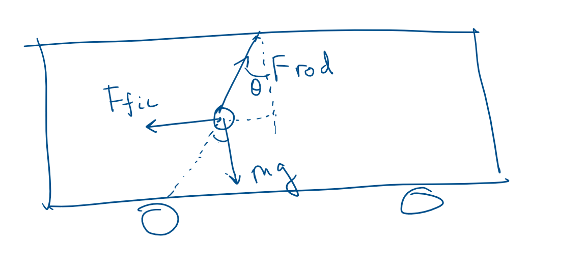
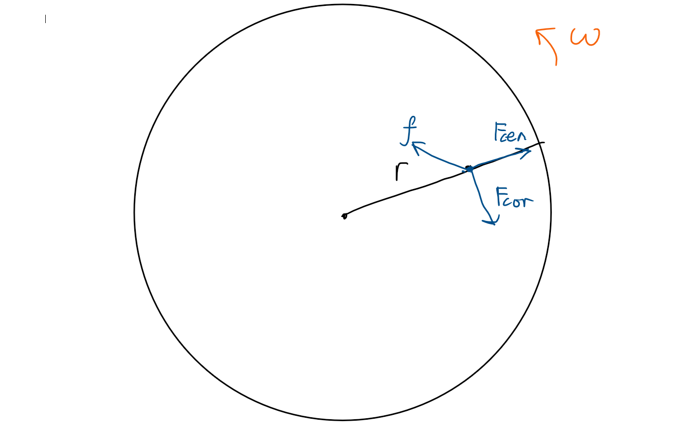
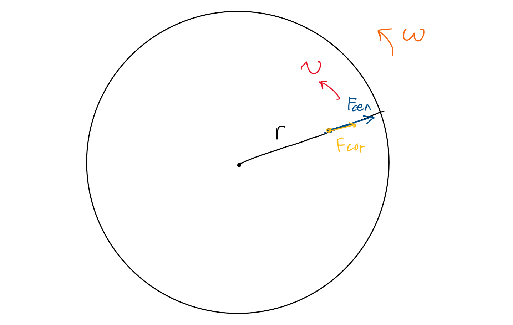
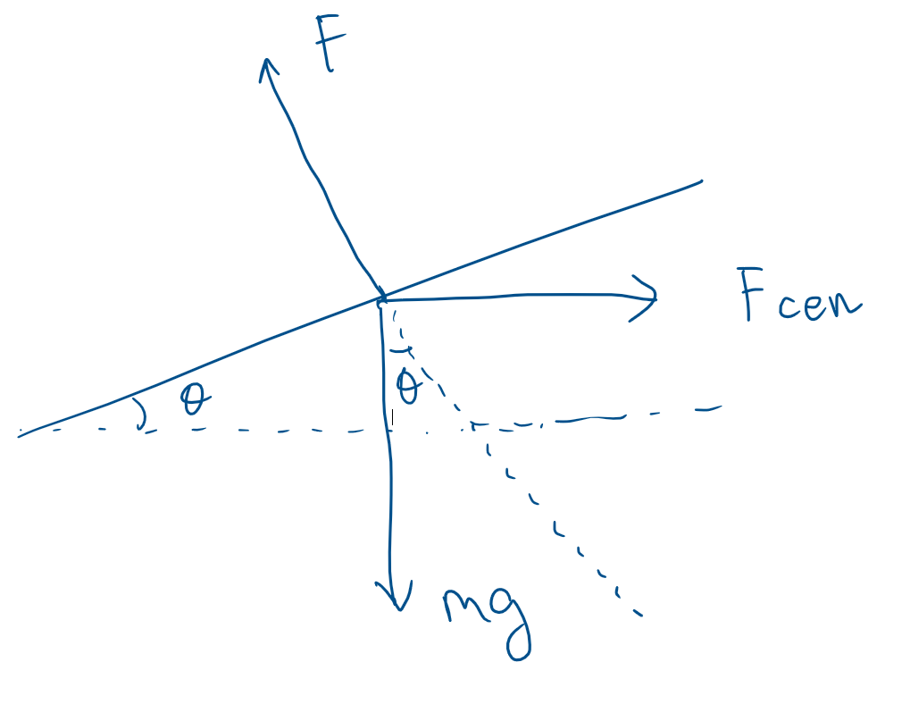

$$
\phantom {derivatives}
\newcommand\d{\text{d}}
\def\ffrac(#1/#2){\frac{#1}{#2}}
\def\hfrac #1(#2/#3){\ffrac (#1#2/#1#3)}
\def\deri#1/#2;{\hfrac \d(#1/#2)}
\def\dderi#1/#2;{\nderi #1/#2^2; }
\def\nderi#1/#2^#3;{\ffrac (\d^#3 #1/\d #2^#3)}
\def\derin1/#1{\ffrac (1/#1) }
\def\pderi#1/#2;{\hfrac \part(#1/#2) }
\def\ppderi#1/#2;{\npderi #1/#2^2;}
\def\npderi#1/#2^#3;{\ffrac (\part^#3 #1/\part #2^#3)}
\def\pderin1/#1;{\ffrac (\part / \part #1)}
\def\fac #1/#2;{\frac{#1}{#2}}

\phantom {fraction}
\def\inv#1{\ffrac (1/#1)}
\newcommand\invsqrt[1]{\frac{1}{\sqrt{#1}}}
\newcommand\half{\frac{1}{2}}
\newcommand\tri{\frac{1}{3}}
\newcommand\quar{\frac{1}{4}}
\phantom {vectors}
\newcommand\vfunc[2]{}

\phantom {common vectors}
\def\vfn #1(#2){\vec #1(\vec #2)}
\def\v #1{\vec #1}
\newcommand\vf{\v f}
\newcommand\vx{\v x}
\newcommand\vy{\v y}
\newcommand\vz{\v z}
\newcommand\vr{\v r}
\newcommand\vv{\v v}
\newcommand\va{\v a}
\newcommand\vtheta{\v \theta}
\newcommand\vphi{\v \phi}
\newcommand\vs{\v s}

\phantom {randomstaff}
\def\tsub#1;{_{\text {#1}}}
\def\sub#1;{_{#1}}
\def\(#1);{\left(#1\right)}
\def\intl#1;{\int_{#1}}
\def\intlh#1;#2;{\int_{#1}^{#2}}
\def\sup#1;{^{#1}}
\def\tsup#1;{^{\text{#1}}}
\def\align[[#1]]{\begin{align*}#1\end{align*}}
\def\note#1!{\fbox{$#1$}}
\def\.#1|;{\left.#1\right|}
\def\ssqrt/#1/;{\sqrt{#1}}
\def\noteeq#1!#2!{\begin{equation} \label{eq:#2} \fbox{$#1$}\end{equation}}
\def\raf#1;{\ref{#1}}
\def\eqraf#1;{\eqref{#1}}
\def\dfac#1/#2;{\dfrac{#1}{#2}}
\def\sqt#1/;{\sqrt{#1}}
\def\sgrt#1/>{\sqrt{#1}}
\def\txt#1;{\text{#1}}
\def\const{\text{const}}
\def\eq#1!#2!{\begin{equation} \label{eq:#2} #1 \end{equation}}
\def\kg{\txt kg;}
\def\s{\txt s;}
\def\m{\txt m;}
\def\stwo{\txt s;^2}
\def\iv#1;{\inv{#1}}
\def\sumninfin{\sum\sub n=1;\sup\infin;}
\def\sumninfinz{\sum\sub n = 0;\sup\infin;}
\def\intinfin{\int\sub-\infin;\sup\infin;}
\def\cases[[#1]]{\begin{cases}#1\end{cases}}
$$

##### Problem 1

>A simple pendulum with a point mass $m$ on the end of a massless rod of length $L$ is suspended from the roof of a truck that is smoothly accelerating at a rate $a$ in $x$-direction. Ignore the rotation of the Earth.

###### (a)

>Construct a free-body diagram showing the (true and fictitious) forces acting on the mass. At what angle $\theta$ away from the vertical will the pendulum hang when it is at equilibrium.

From the free-body diagram, we know that
$$
F\tsub rod;\sin \theta = F\tsub fic; = ma\\
F\tsub rod;\cos \theta = mg
$$
and thus
$$
\theta = \arctan \(\fac ma/mg;); = \arctan \(\fac a/g;);
$$

###### (b)

>What is the tension in the rod as it is in equilibrium?

From the free-body diagram, we could see that
$$
F\tsub rod; = m\sqrt {a^2 + g^2} = m (a\sin \theta  + g\cos \theta)
$$

###### (c)

>What is the normal frequency $w_n$ of free oscillations of the pendulum around that equilibrium.

From the free-body diagram, we could see that the torque is
$$
I\ddot \theta = F\tsub fic;L\cos \theta  - mg L \sin \theta \\
mL^2 \ddot\theta = ma L \cos\theta - mg L \sin \theta \\
L \ddot \theta = a\cos\theta  - g\sin\theta \\
L\Delta\ddot \theta = a\cos(\theta\tsub eq; + \Delta \theta) - g\sin (\theta\tsub eq; + \Delta \theta) \\
L\Delta\ddot\theta = a (\cos \theta\tsub eq; \cos \Delta\theta  - \sin \theta \tsub eq; \sin \Delta\theta ) - g (\sin \theta \tsub eq;\cos \Delta \theta + \cos \theta \tsub eq; \sin \Delta \theta) \\
$$
We know that
$$
a\cos \theta\tsub eq; - g\sin \theta\tsub eq; = 0
$$
and thus
$$
L\Delta\ddot \theta = -a\sin \theta\tsub eq; \sin \Delta\theta - g\cos \theta\tsub eq;\sin\Delta\theta \\
L\Delta\ddot \theta  + (a\sin \theta\tsub eq; + g\cos \theta \tsub eq;)\sin \Delta \theta = 0
$$
using small angle approximation $\sin\Delta\theta \approx \Delta\theta$.
$$
L\Delta \ddot \theta + (a \sin \theta \tsub eq; + g\cos \theta \tsub eq;) \Delta \theta = 0
$$
and thus the $\omega_n$ is
$$
\omega_n = \sqrt {\fac a\sin \theta \tsub eq; + g \cos \theta \tsub eq; / L;} = \sqrt { \fac F\tsub rod;/mL;}
$$

##### Problem 2

The graph should roughly look like above. Using the cylindrical coordinate
$$
\vec \omega = \omega \hat z \\
\vec v\tsub rel; = v_r \hat r \\
\vec r\sub O'A; = r\hat r \\
$$
and thus
$$
\vec F\tsub centrifugal; = -m\vec \omega \times (\vec \omega \times \vec r\sub O'A;) = -m \omega \hat z \times (\omega \hat z \times r \hat r) = -m\omega^2r (-\hat r) = m\omega^2r \hat r \\
\vec F\tsub Coriolis; = -2m\vec \omega \times \vec v \tsub rel; = -2m\omega \hat z \times v_r \hat r= -2m\omega v_r \hat \theta
$$
and thus when the bug slips, 
$$
f = \mu mg < \sqrt {(m\omega^2r)^2+(-2m\omega v_r)^2} = \sqrt {m^2 \omega^4 r^2 + 4m^2\omega^2 v_r^2} = m\omega \sqrt {\omega^2r^2 + 4v_r^2}
$$
which means
$$
\mu g < \omega \sqrt {\omega^2 r^2  + 4v_r^2} \\
r > \sqrt {\(\fac \mu g/\omega^2;);^2 - 4\(\fac v_r/\omega;);^2}
$$

###### (b)

>The bug crawls with a constant speed $v_r$ relative to the turntable in a *circular* path with a radius $b$. The circular path is concentric with the center of the turntable. For what value of $v_r$ (expressed in terms of $\omega$, $\mu$, $b$, and $g$) will the bug start to slip if it crawls

###### (i)

>In the direction of rotation?

the motion roughly looks like above. Again, using cylindrical coordinate, we get
$$
\vec \omega = \omega \hat z \\
\vec v\tsub rel; = v_r \hat \theta \\
\vec r\sub O'A; = b\hat r \\
$$
and thus
$$
\vec F\tsub centrifugal; = -m\vec \omega \times (\vec \omega \times \vec r\sub O'A;) = -m \omega \hat z \times (\omega \hat z \times b \hat r) = -m\omega^2r (-\hat r) = m\omega^2b \hat r \\
\vec F\tsub Coriolis; = -2m\vec \omega \times \vec v \tsub rel; = -2m\omega \hat z \times v_r \hat \theta = 2m\omega v_r \hat r
$$
both centrifugal and Coriolis force are pointing outward from the origin. Thus, when bug begin to slip,
$$
f = \mu m g < m\omega^2 b + 2m\omega v_r
$$

and thus
$$
\mu g < \omega^2 b + 2\omega v_r  \\
v_r > \half \(\fac \mu g/\omega; - \omega b);
$$

###### (ii)

The opposite is quite similar, we have the Coriolis force pointing inward to the origin now (it's in the opposite direction of centrifugal direction).

There are two situations, one is that the centrifugal force is stronger, and the Coriolis force is weaker. In this case, the static friction force is in the same direction of Coriolis force, and thus when the bugs begin to slip
$$
f = \mu mg < m\omega^2 b - 2m\omega v_r
$$

$$
\mu g < \omega^2 b - 2\omega v_r \\
v_r < \half \(\omega b - \fac \mu g/\omega;);
$$

another case is that the Coriolis force is stronger, and centrifugal force is weaker. In this case, the static friction force is in the same direction of centrifugal force, and thus when the bugs begin to slip.
$$
f = \mu mg < 2m\omega v_r - m\omega^2 b    \\
\mu g < 2\omega v_r - \omega^2 b \\
v_r > \half \(\fac \mu g/\omega; + \omega b); 
$$

##### Question 3: Space Ship

There is a better way to think about it. It's the same that there is acceleration pointing backward as that there is gravity on earth. Then

###### (a)

>What happens to the balloon?

The balloon just flies toward the front of the ship, just like a helium balloon flies upward in earth

###### (b)

>What happens instead if the balloon is filled with air?

The balloon will just stay where it is (if we don't consider the mass of the plastic that forms the balloon, otherwise it will slowly move back to the bottom of the ship). It's just like the balloon filled with air will stay where it is (again, if we ignore the mass of the plastic that forms the balloon, otherwise it will just fall on the ground).

###### (c)

>Is the answer for the helium balloon any different if there was no air inside the ship?

Realistically, if there is no air, the pressure difference will just cause the balloon to explode. So, suppose the balloon is tight enough to just hold helium gas in it, then the helium balloon will just fall towards the back of the ship just like a helium balloon (if it's tight enough) will fall into the ground if it's in a vacuum chamber on earth.

##### Question 4: Water bucket

Consider the surface of the water. When it's at static equilibrium in the rotating frame, the Coriolis force is zero, and there should only be gravity, centrifugal force and normal force provided to the surface of the water. Then
$$
F\tsub cen; = m\omega ^2 r
$$

$$
mg\sin \theta = m\omega^2 r \cos\theta \\
\tan\theta = \fac \omega^2 r /g;
$$

and from hint, we know that $\tan \theta = \deri z/r;$, thus
$$
\deri z/r; = \fac \omega^2 r/g; \\
z = \fac \omega^2/2g;r^2 + z_0
$$
where $z_0$ is the lowest water level at the center of the bucket.

##### Question 5: Coriolis force

###### (a)

We know that
$$
\va (t) = \ddot x \hat e + \ddot y \hat n + \ddot z \hat u \\
\v \omega = u\sin \theta \hat u + \omega \cos \theta \hat n \\
$$
and thus
$$
m\v a(t) = -mg\hat u - 2m \vec \omega \cross \v v\tsub rel;\\ 
m (\ddot x \hat e + \ddot y \hat n + \ddot z \hat u) = -mg\hat u - 2m (\omega \sin \theta \hat u + \omega \cos \theta \hat n) \cross (\dot x \hat e + \dot y \hat n + \dot z \hat u) \\
$$

and thus
$$
m (\ddot x \hat e + \ddot y \hat n + \ddot z \hat u) = -mg\hat u - 2m (\omega \sin \theta \hat u + \omega \cos \theta \hat n) \cross (\dot x \hat e + \dot y \hat n + \dot z \hat u) \\

(\ddot x \hat e + \ddot y \hat n + \ddot z \hat u) = -g\hat u + 2\omega (- \sin\theta \dot x \hat n + \sin \theta \dot y \hat e + \cos\theta \dot x \hat u  - \cos\theta \dot z \hat e)
$$
and thus
$$
\ddot x = -2\omega\dot z \cos\theta + 2\omega\dot y \sin\theta \\
\ddot y = -2\omega\dot x \sin\theta  \\
\ddot z = -g + 2\omega \dot x \cos \theta
$$

###### (b)

At zero order, we have
$$
\ddot x_0(t) = 0 \\
\ddot y_0(t) = 0 \\
\ddot z_0(t) = -g \\
$$
Applying initial condition
$$
\align[[
\dot x_0(t) &= 0 &x_0(t) =\phantom{}& 0 \\
\dot y_0(t) &= 0 &y_0(t) =\phantom{}& 0 \\
\dot z_0(t) &= v - gt &z_0(t) =\phantom{} & vt - \half gt^2 \\
]]
$$
putting the result into first order differential equation
$$
\ddot x_1 = -2\omega \dot z_0 \cos \theta + 2\omega \dot y_0 \sin \theta = -2\omega(v - gt)\cos \theta \\
\ddot y_1 = -2\omega \dot x_0 \sin \theta = 0 \\
\ddot z_1 = 2\omega \dot x_0 \cos \theta = 0
$$
and thus
$$
x_1 = -2\omega(\half vt^2 - \inv 6 g t^3 )\cos \theta  \\
y_1 = 0 \\
z_1 = 0\\
$$
and thus
$$
x = x_0 + x_1 = -2\omega(\half vt^2 - \inv 6 g t^3 )\cos \theta \\
y = y_0 + y_1 = 0 \\
z = z_0 + z_1 = vt - \half gt^2
$$
when ball lands ($t = \fac 2v/g;$), the ball lands on
$$
x(t) = -2\omega(\half v \fac 4v^2/g^2; - \inv 6 g \fac 8v^3/g^3;)\cos \theta = -\fac 4/3;\fac \omega v^3/g^2; \cos \theta \\
y(t) = 0 \\
z(t) = 0
$$
that is, a bit west to where it starts.

