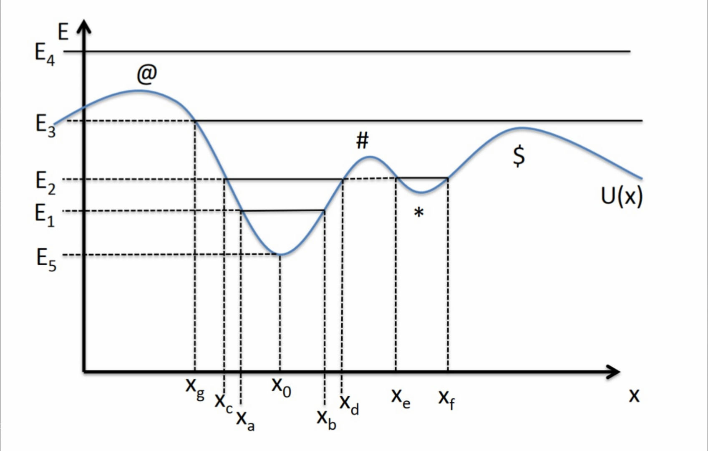

$$
\phantom {derivatives}
\newcommand\d{\text{d}}
\def\ffrac(#1/#2){\frac{#1}{#2}}
\def\hfrac #1(#2/#3){\ffrac (#1#2/#1#3)}
\def\deri#1/#2;{\hfrac \d(#1/#2)}
\def\dderi#1/#2;{\nderi #1/#2^2; }
\def\nderi#1/#2^#3;{\ffrac (\d^#3 #1/\d #2^#3)}
\def\derin1/#1{\ffrac (1/#1) }
\def\pderi#1/#2;{\hfrac \part(#1/#2) }
\def\ppderi#1/#2;{\npderi #1/#2^2;}
\def\npderi#1/#2^#3;{\ffrac (\part^#3 #1/\part #2^#3)}
\def\pderin1/#1;{\ffrac (\part / \part #1)}
\def\fac #1/#2;{\frac{#1}{#2}}

\phantom {fraction}
\def\inv#1{\ffrac (1/#1)}
\newcommand\invsqrt[1]{\frac{1}{\sqrt{#1}}}
\newcommand\half{\frac{1}{2}}
\newcommand\tri{\frac{1}{3}}
\newcommand\quar{\frac{1}{4}}
\phantom {vectors}
\newcommand\vfunc[2]{}

\phantom {common vectors}
\def\vfn #1(#2){\vec #1(\vec #2)}
\def\v #1{\vec #1}
\newcommand\vf{\v f}
\newcommand\vx{\v x}
\newcommand\vy{\v y}
\newcommand\vz{\v z}
\newcommand\vr{\v r}
\newcommand\vv{\v v}
\newcommand\va{\v a}
\newcommand\vtheta{\v \theta}
\newcommand\vphi{\v \phi}
\newcommand\vs{\v s}

\phantom {randomstaff}
\def\tsub#1;{_{\text {#1}}}
\def\sub#1;{_{#1}}
\def\(#1);{\left(#1\right)}
\def\intl#1;{\int_{#1}}
\def\intlh#1;#2;{\int_{#1}^{#2}}
\def\sup#1;{^{#1}}
\def\tsup#1;{^{\text{#1}}}
\def\align[[#1]]{\begin{align*}#1\end{align*}}
\def\note#1!{\fbox{$#1$}}
\def\.#1|;{\left.#1\right|}
\def\ssqrt/#1/;{\sqrt{#1}}
\def\noteeq#1!#2!{\begin{equation} \label{eq:#2} \fbox{$#1$}\end{equation}}
\def\raf#1;{\ref{#1}}
\def\eqraf#1;{\eqref{#1}}
\def\dfac#1/#2;{\dfrac{#1}{#2}}
$$

## Classical Mechanics

Particles: insignificant in size, no internal change.

##### Newton's laws

1. the relation between the **Force** $\v F$  and momentum $\v p = m\v v$ is simply
   $$
   \v F = \deri \vec p / t; = \deri m / t; \v v + \deri \vec v / t; m
   $$
   which consider the situation $m$ is varying.
   
2. for particle $i, j$, the force $\v F\sub i \to j;$ from $i$ to $j$ and $\v F\sub j \to i;$ from $j$ to $i$ occurs in pairs.
   $$
   \v F\sub i\to j; = -\v F\sub j\to i;
   $$

##### Conservation of momentum

If an system is isolated, i.e., no particle interact with the outside system:
$$
\deri \v p\tsub total; / t; = \sum\sub i,j; \deri \vec p \sub ij; / t; = \sum\sub i,j; F\sub j\to i; = \sum\tsub pairs $i,j$; (\vec F\sub j\to i; + \vec F\sub i \to j;) = 0
$$

Notice the proof require $\v F \sub i \to i; = 0$ (particle has no force on itself), which make sense.

##### Inertial reference frame

This is the frame where Newton's law holds. The frame $S'$ relative to inertial frame $S$ will be inertial if the Newton's law also holds, that is $a_S = a\sub S';$:
$$
\dderi \v T(\v r, t)/t; = \dderi \v r /t;
$$
where the $\v T(\v r, t)$ is the transformation from $S$ to $S'$. It could also be rewritten as
$$
\dderi \(\v T(\v r, t) - \v r);/ t; = \dderi \v r\sub SS'; / t;
$$
that is, one frame doesn't accelerate with respect to other frame.

##### Force in Different Cases

We assume no mass $m$ change here.

1. No force
   $$
   \v F = 0 = m\deri \v v/t;
   $$

   $$
   \v a = 0 \quad \vec v = \vec v_0 \quad \v r = \v r_0 + \v r_0t
   $$

2. Constant force
   $$
   \vec F = \vec F_0 = m\v a 
   $$

   $$
   \v a = \fac F_0 / m; \quad \v v = \v v_0 + \fac F_0/m;t \quad \v r = \v r_0 + \v v_0t + \fac F_0/2m;t^2
   $$

3. Time-varying force (include 1 and 2)
   $$
   \v F(t) = m\v a
   $$
   
   $$
   \v a = \fac \v F/m;
   $$
   
   $$
   \v v = \int \fac \v F / m; \d t = \fac I \sub \v F;(t) / m; +\v C_1
   $$
   
   $$
   \v r =  \int \(\fac I_\v F(t) / m; + \v C_1); \d t = \fac I^2_\v F(t) / m; + \v C_1t + \v C_2
   $$
   
   where $I^n_\v F$ signify the $n$th integration of $\v F$

4. Position-varying force (1D)
   $$
   \vfn F(r) = m\v a = m\deri \v v/t;
   $$

   $$
   m\d \v v = \vfn F(r)\d t \\
   m\v v \cdot \d \v v = \vfn F(r)\d t \cdot \deri \v r/t; \\
   m\intlh v(0);v(t); \v v \cdot \d \v v = \intlh r(0);r(t); \vfn F(r) \cdot  \d \v r \\
   \half m(v^2 - v_0^2) = \intlh r(0);r(t); \vfn F(r) \cdot  \d \v r \\
   $$

   Using the definition of $T$ and $U$:
   $$
   T - T_0 = U_0 - U \\
   T = E - U \\
   \half mv^2 = E-U \\
   \noteeq v = \ssqrt/2\fac E-U/m ;/; !vEU!
   $$
   
   and thus, the instantaneous displacement $s$ could be calculated: 
   $$
   \deri s/t; = \pm \sqrt{\fac 2/m; (E - U)} \\
   \noteeq \int \fac \d s/\sqrt{\fac 2/m; (E - U)}; = \int \d t = t - t_0!tEU!
   $$
   
   this may not solve analytically. But we could do some qualitative analysis, for example in 1D:
   
   
   
   Since the total energy $E$ is conserved, so if we have energy $E_i$, the $U(x)$ could never reach higher then $E_i$, otherwise the $T$ will be negative. We could see that if we have total energy $E_3$, then **#** is a unstable equilibrium point, while ***** is a stable equilibrium point. 

5. Velocity dependent force
   $$
   \vec F = \vfn F(v)
   $$
   restrict it to 1D:
   $$
   F(v) = m \deri v/t; \\
   \int \d t = \int \fac m/F(v);\d v
   $$
   we might not solve it analytically.

##### Simple Harmonic Oscillator

###### From Estimation

Suppose that for the position-dependent force equation: 
$$
m\dderi x/t; = F(x)
$$
Say, $x = 0$ is an stable equilibrium point. (We could always shift coordinate if we wanted) Then, in the close vicinity of $x_0$, we expand $F(x)$ into Tyler series:
$$
m \dderi x/t; = F(x(t)) = F(0) + \.\deri F/t;|;_0 x(t) + \half\.\dderi F/t;|;_0x^2(t) \cdots
$$
since we close to $x(t) = 0$, the $x^n(t), n \ge 2$ could be ignored. Since at $x = 0$, it's an equilibrium point and $\dderi x/t; = 0$. Thus, $F(0) = 0$, and we leave with
$$
m\dderi x/t; = \.\deri F/t;|;_0 x(t) = -\.\dderi U/t;|;_0 x(t) = -kx(t)
$$
We define a variable $\note k = U''(x_0)!$.

We could thus write the force as
$$
\note F = -kx(t)!
$$
and we could see that the potential energy is
$$
U(x) = U(0) + \.\deri U/t;|;_0 x(t) + \half \. \dderi U/t;|;_0 x^2(t) + \cdots
$$
We could take away the arbitrary constant $U(0)$ here, and notice that
$$
\.\deri U/t;|;_0 = -F(0) = 0
$$
and thus
$$
\note U(x) = \half kx^2(t)!
$$
just like a spring.

###### Solving SHM

So, now we get the equation that
$$
m\dderi x/t; = -kx(t)
$$
We could certainly try plug in $e^x$ and find out the solution, but we want to find more rigid way. Using the general equation $\eqraf eq:vEU;$ for any position-dependent force:
$$
\deri x/t; = \ssqrt/\fac 2/m; (E-U)/; = \ssqrt /\fac 2/m; (E - \half kx^2) /; = \ssqrt /\fac 2E/m; - \inv m kx^2/;
$$

and if we define
$$
\noteeq \omega = \ssqrt/\fac k/m;/; \qquad A = \ssqrt /\fac 2E/k;/; !A+omega!
$$

so,
$$
\deri x/t; = \omega \ssqrt /A^2 - x^2/; \\
\int \inv {\sqrt{ A^2 - x^2 }} \d x = \int \omega \d t  + C = \omega t+C \\
\noteeq x = A\sin(\omega t - C)!wave!
$$

##### Energy

Define kinetic energy ($T$) and potential energy ($U$)
$$
T = \half mv^2 \\
U = -\int\sub \infin;\sup r; \vfn F(r) \cdot \d \v r
$$

##### Energy Conservation

**Conservative force** $\vfn F(r)$ is a force depends on only $\vec r$ and follow
$$
\vfn F(r) = -\grad U(\v r, t)
$$
If the $U(\v r, t)$ also has property that $\pderi U(\v r, t)/t; =0$, then there exist a global property $E = T + U$, where $T = \half m\v v^2$, doesn't change with time.
$$
\align[[
	\deri E/t; &= \deri T/t; + \deri U/t; \\
    &= m\v a \cdot \v v  + \pderi U/t; + \v v \cdot \grad U \\
    &= \v F\cdot\v v + 0 + \grad U \cdot \v v \\
    &= (\vec F + \grad U) \cdot \v v = 0
]]
$$

$$
\note E = T + U = \text{const}!
$$

##### Linear Drag

###### Simple Linear Drag

The force $F$ is
$$
F = -cv = m\deri v/t;
$$

$$
\int -\fac c/m; \d t = \int \inv v\d v \\
\ln(\fac v/v_0;) = -\fac c/m;t \\
\noteeq v = v_0 e\sup -\fac c/m; t; !drag!
$$

$$
x = \int v\d t = -\fac mv_0/c; \.\exp(-\fac c/m; t)|;_{0}^{t} \\
\noteeq x = \fac mv_0/c; \(1 - \exp (-\fac c/m; t));!dragx!
$$

###### Linear Drag With Gravity

##### Rocket Motion

###### (a) Horizontal without Gravity

Suppose there is no gravity, the rocket throws fuel residue behind when flying. The residue have a constant speed $u$ relative to rocket.

In the isolated system, the momentum is conserved:
$$
\align[[ 
p_f - p_i &= (M - \d m)(v +\d v) + \d m(v - u) - Mv \\
0&= Mv + M\d v- v\d m - \d m \d v + v\d m - u \d m -Mv \\
0&= M\d v -u\d m \\
M\d v &= u\d m
]]
$$
notice $\d m\d v$ go because they are high order differentials.

> Question: could we find more mathematical rigid proofs?

Notice, the $\d M = -\d m$, since the fuel in the rocket decrease as it becomes residue.
$$
\align[[
M\d v &= -u\d M \\
\int \d v &= -u\intlh M_0;M(t); \inv M  \d M \\
v &= v_0 -u \ln M\vline\sub M_0;\sup M(t); 
]]
$$

$$
\note v = v_0 -u\ln(\fac M(t)/M_0;)!
$$

###### (b) Vertical with Gravity

##### Gauss Law

$$
\oint\sub A; \v g \cdot \hat n \d A = -4\pi GM
$$

###### Potential of a hollow shell

$$
\oint\sub A; \v g \d A = -4\pi GM\tsub enclosed; \\
4\pi r^2 g(r) = -4\pi GM\tsub enclosed; \\
g(r) = -\fac GM\tsub enclosed;/r^2;
$$
Inside the shell:
$$
g = 0
$$
Outside the shell:
$$
g = -\fac GM/r^2;
$$
Potential inside the shell:
$$
\align[[
\Phi &= -\int\sub R;\sup r; g\tsub inside; \d r -\int\sub \infin;\sup R; g\tsub outside;\d r \\
&= 0 - \int\sup R;\sub \infin; -\fac GM/r^2;\d r \\ &= - \left.\fac GM/r;\right|_\infin^R \\ &= -\(\fac GM/R; - \fac GM/\infin;); \\ &= -\fac GM/R;
]]
$$
Potential outside the shell:
$$
\align[[
\Phi &= -\int\sup r;\sub \infin; g \tsub outside; \d r \\
&= \int\sub\infin;\sup r; \fac GM/r^2;\d r \\
&= -\.\fac GM/r;|;_\infin^r \\
&= -\(\fac GM/r; - \fac GM/\infin;); \\
&= -\fac GM/r;
]]
$$

###### Potential of sphere

Inside the sphere:
$$
g = -\fac GM\tsub enclosed;/r^2; = -\fac G/r^2; \fac r^3 /R^3; M = -\fac GM/R^3; r
$$
Inside of the sphere:
$$
\align[[
\Phi &= -\int\sub R;\sup r; g\tsub inside; \d r -\int\sub \infin;\sup R; g\tsub outside;\d r \\
&= -\int\sub R;\sup r; - \fac GM / R^3; r  - \int\sup R;\sub \infin; -\fac GM/r^2;\d r \\ 
&= \fac GM / 2R^3;\(r^2 - R^2); - \fac GM/R; \\
&= -\fac GM / 2R;\(1 - \fac r^2/R^2;); - \fac GM/R;
]]
$$
Outside the sphere:
$$
\align[[
\Phi &= -\int\sup r;\sub \infin; g \tsub outside; \d r \\
&= \int\sub\infin;\sup r; \fac GM/r^2;\d r \\
&= -\.\fac GM/r;|;_\infin^r \\
&= -\(\fac GM/r; - \fac GM/\infin;); \\
&= -\fac GM/r;
]]
$$

##### Central Force

Central force looks like
$$
\v F = f(r, \phi, \theta)\hat r
$$
There is a global property called angular momentum $L = \v r \times (m\v v)$ is conserved.
$$
\deri L/t; = \deri \v r/t; \times m\v v  + \v r \times m\deri \v v/t; = \v v \times(m\v v) + \v r \times m\v a = 0 + \v r \times \v F = \v r \cross f\hat r = 0
$$

##### Orbit

###### Energy

Define kinetic energy per mass $t$
$$
t = \fac T/m;
$$
Define energy per mass $e$
$$
e = t + \Phi = \fac T + U/m;  = \fac E/m;
$$

###### Circular Orbit

Circular orbit satisfy
$$
a = \fac v^2/r; = \fac GM/r^2;
$$
and thus the speed of the orbit
$$
v = \(\fac GM/r;);\sup 1/2;
$$
and the period of the orbit
$$
P = \fac 2\pi r/v; = 2\pi \(\fac r^3/GM;);\sup 1/2;
$$
and the energy of the orbit is
$$
e = \fac T + U/m; = \half v^2 - (\fac GM/r;) = \half v^2 - v^2 = -\half v^2
$$
the energy of circular orbit is always negative, the potential energy is $-2$ times of kinetic energy.

the angular momentum is
$$
L = \v r \times (m \v v) = mrv \hat k
$$
and the escape velocity is
$$
e = 0 \\
\half v\tsub escape; ^2 = \fac GM/r; \\
v\tsub escape; = \ssqrt/\fac 2GM/r;/;
$$

###### Special case

 1. $e = 0$, the orbit is a parabola

    ​    njm   

 mjn  

