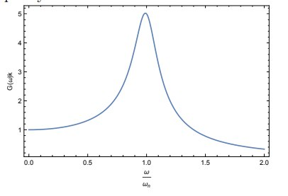
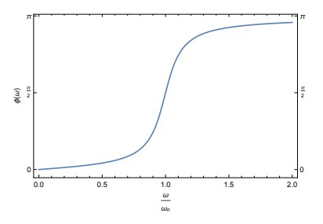

$$
\phantom {derivatives}
\newcommand\d{\text{d}}
\def\ffrac(#1/#2){\frac{#1}{#2}}
\def\hfrac #1(#2/#3){\ffrac (#1#2/#1#3)}
\def\deri#1/#2;{\hfrac \d(#1/#2)}
\def\dderi#1/#2;{\nderi #1/#2^2; }
\def\nderi#1/#2^#3;{\ffrac (\d^#3 #1/\d #2^#3)}
\def\derin1/#1{\ffrac (1/#1) }
\def\pderi#1/#2;{\hfrac \part(#1/#2) }
\def\ppderi#1/#2;{\npderi #1/#2^2;}
\def\npderi#1/#2^#3;{\ffrac (\part^#3 #1/\part #2^#3)}
\def\pderin1/#1;{\ffrac (\part / \part #1)}
\def\fac #1/#2;{\frac{#1}{#2}}

\phantom {fraction}
\def\inv#1{\ffrac (1/#1)}
\newcommand\invsqrt[1]{\frac{1}{\sqrt{#1}}}
\newcommand\half{\frac{1}{2}}
\newcommand\tri{\frac{1}{3}}
\newcommand\quar{\frac{1}{4}}
\phantom {vectors}
\newcommand\vfunc[2]{}

\phantom {common vectors}
\def\vfn #1(#2){\vec #1(\vec #2)}
\def\v #1{\vec #1}
\newcommand\vf{\v f}
\newcommand\vx{\v x}
\newcommand\vy{\v y}
\newcommand\vz{\v z}
\newcommand\vr{\v r}
\newcommand\vv{\v v}
\newcommand\va{\v a}
\newcommand\vtheta{\v \theta}
\newcommand\vphi{\v \phi}
\newcommand\vs{\v s}

\phantom {randomstaff}
\def\tsub#1;{_{\text {#1}}}
\def\sub#1;{_{#1}}
\def\(#1);{\left(#1\right)}
\def\intl#1;{\int_{#1}}
\def\intlh#1;#2;{\int_{#1}^{#2}}
\def\sup#1;{^{#1}}
\def\tsup#1;{^{\text{#1}}}
\def\align[[#1]]{\begin{align*}#1\end{align*}}
\def\note#1!{\fbox{$#1$}}
\def\.#1|;{\left.#1\right|}
\def\ssqrt/#1/;{\sqrt{#1}}
\def\noteeq#1!#2!{\begin{equation} \label{eq:#2} \fbox{$#1$}\end{equation}}
\def\raf#1;{\ref{#1}}
\def\eqraf#1;{\eqref{#1}}
\def\dfac#1/#2;{\dfrac{#1}{#2}}
$$

##### Simple Harmonic Oscillator

$$
m\ddot x + c\dot x + kx = 0
$$

$$
\zeta = \fac c/2m\omega_n;
$$

$$
\ddot x + 2\zeta \omega_n \dot x + \omega_n^2 x = 0
$$

Assume
$$
x(t) = \exp(\lambda t)
$$

$$
\lambda^2 \exp(\lambda t) + 2\zeta \omega_n \lambda \exp(\lambda t) + \omega_n^2 \exp(\lambda t) = 0
$$

$$
\lambda^2 + 2\zeta\omega_n \lambda +\omega_n^2 = 0
$$

$$
\lambda = \fac -2\zeta \omega_n \pm \sqrt {4\zeta^2\omega_n^2 - 4\omega_n^2}/2; = -\zeta \omega_n \pm \sqrt {\zeta^2 \omega_n^2 - \omega_n^2} = -\zeta \omega_n \pm \omega_n \sqrt {\zeta^2 - 1}
$$

$$
\lambda = -\omega_n (\zeta \mp \sqrt {\zeta^2 - 1})
$$

If $\zeta = 0$, undamped (**cosine wave**)
$$
\lambda = \pm  i \omega_n
$$

$$
\align [[
x(t) &= C_1\exp(i\omega_n t) + C_2\exp (i \omega_n t) \\
&= A\sin(\omega t) + B\cos(\omega t) \\
&= C\cos(\omega t - \phi)
]]
$$

If $\zeta > 1$, overdamped

If $0 < \zeta < 1$, underdamped (**gradually decay cosine wave**)

In this case, we define the **damping frequency** $\omega_d = \omega_n \sqrt {1 - \zeta^2}$, and thus
$$
\lambda = -\omega_n\zeta \pm i\omega_d
$$
and thus the solution is
$$
\align[[
x(t) &= \exp(-\zeta\omega_n t)(A\cos(\omega_d t) + B\sin(\omega_dt)) \\
&= \exp(-\zeta \omega_nt)(C\cos(\omega_t - \phi))
]]
$$
so, two changes

* the frequency is the **damping frequency** instead of **natural frequency**. (However they doesn't differ too much)
* the oscillation diminishes exponentially

##### Forced single-degree of freedom oscillators

###### Solution

It has the form of
$$
m\ddot x + c\dot x  + kx = F(t)
$$
For $F(t)$ of the form of

* Power series forcing. $F(t) = a + bt + ct^2 \cdots$, the solution is $x(t) = \alpha + \beta t + \gamma t^2$

* Exponential forcing. $F(t) = F_0\exp(st) \cdots$, the solution is $x = x_0\exp(st)$ 

* Harmonic forcing. $F(t) = F_0\cos(\omega t - \theta)\cdots$, the solution is
  $$
  x_p(t) = F_0G(\omega)\cos(\omega t - \theta - \phi(\omega))
  $$
  where
  $$
  \tilde G(\omega) = \inv k \cdot \fac 1/1 - {\(\fac \omega/\omega_n;);}^2 + 2i\zeta{\(\fac \omega/\omega_n;);};
  $$

  $$
  G(\omega) = \inv k \fac 1/\sqrt {\(1 - \(\fac \omega / \omega_n;);^2);^2 + \(2\zeta \fac \omega/\omega_n;);^2};
  $$

  $$
  \phi(\omega) = -\arg(G(\omega)) = \arctan\(\fac 2\zeta \omega\omega_n/\omega_n^2 - \omega^2;);
  $$

  we know that

  * the frequency is the same as the $F(t)$
  * It's multiply by a factor $G(\omega)$
  * It's shifted by a phase $\phi(\omega)$

###### Resonance

the above is the $\dfac G(\omega)/k;$ and $\phi(\omega)$ versus $\dfac \omega/\omega_n;$. They could be divided into few regions

* **Resonance region**

  The resonance happens at $\omega = \omega_n$ (but it's actually $\omega = \omega_n\sqrt {1 - 2\zeta^2}$, this is usually negligible). At the resonance the $G = \dfac 1/2k\zeta;$. When there is no damping, the peak reach to infinity. When there is damping, the motion eventually dominate by the particular solution (since the homogeneous solution dies away)

* **Stiffness controlled region**

  The left of the chart is the 

  

##### Periodic Forcing

Periodic forcing has the form of
$$
m\ddot x + c\dot x + kx = F(t)
$$
where $F(t) = F(T + t)$

###### Fourier Series

Any periodic function $f(t) = f(T + t) $ could be represent as
$$
F(t) = \fac a_0/2; + \sum\sub n = 1;\sup \infin; a_n\cos(n\omega t) + \sum\sub n =1;^\infin b_n\sin(n\omega t)
$$
 where $\omega = \dfac 2\pi/T;$. The parameter $a_n$, $b_n$ could be calculated
$$
a_n = \fac 2/T; \int_T F(t)\cos (n\omega t) \d t \\
b_n = \fac 2/T; \int_T F(t)\sin (n\omega t) \d t
$$
Hint: the $\cos$ part is the even part, and the $\sin$ part is the odd part, $\dfac a_0/2;$ is the average of the function. Usually, we could use the property of the function graph to quickly eliminate some of the coefficients.

###### Solution

We could then leverage on the formula of the harmonic forcing, then
$$
x_p(t) = \fac a_0/2k; + \sum\sub n = 1;\sup \infin; a_n G(n\omega)\cos(n\omega t - \phi(n\omega)) + \sum\sub n =1;^\infin b_n G(n\omega)\sin(n\omega t - \phi(n\omega))
$$
We notice

* Still periodic with $F(t)$
* Each term amplified by $G(n\omega)$ and delayed by $\phi(n\omega)$

The resonance happens when $n\omega = \omega_n$, that means when $\omega = \inv n \omega_n (n = 1, 2, 3\cdots)$. Since the $a_n$ and $b_n$ typically become smaller with $n$ increasing. (Higher frequency term is typically smaller), the $G(\omega)$ versus $f  = 2\pi \omega$ is typically looks like

!graph!

##### Impulse Force

**Dirac Delta Function** is defined to be
$$
f(a) = \int\sub-\infin;\sup \infin; f(t) \delta(t - a)\d t
$$
A useful relation is
$$
\int\sub-\infin;\sup \infin; f(t)\nderi /t^n; \delta(t - a)\d t = (-1)^n f\sup (n);(t)
$$
The impulse force $F(t) = \delta(t)$ apply at $t = 0$ could be consider an homogeneous solution 

$$
\half x^3 \fac 2x / x^2 - 4; \\
= \half x^3 (\inv {x+2} + \inv {x-2})
$$

$$
\inv{x + 2} + \inv {x - 2}\\
= \fac x - 2/(x + 2)(x - 2); + \fac x+2/(x + 2)(x - 2);
$$

