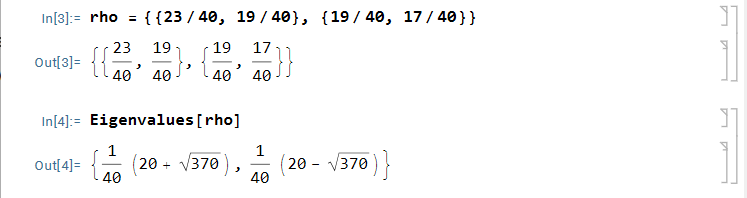
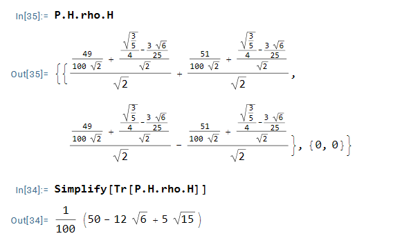

$$
\phantom {derivatives}
\newcommand\d{\text{d}}
\def\ffrac(#1/#2){\frac{#1}{#2}}
\def\hfrac #1(#2/#3){\ffrac (#1#2/#1#3)}
\def\deri#1/#2;{\hfrac \d(#1/#2)}
\def\dderi#1/#2;{\nderi #1/#2^2; }
\def\nderi#1/#2^#3;{\ffrac (\d^#3 #1/\d #2^#3)}
\def\derin1/#1{\ffrac (1/#1) }
\def\pderi#1/#2;{\hfrac \part(#1/#2) }
\def\ppderi#1/#2;{\npderi #1/#2^2;}
\def\npderi#1/#2^#3;{\ffrac (\part^#3 #1/\part #2^#3)}
\def\pderin1/#1;{\ffrac (\part / \part #1)}
\def\fac #1/#2;{\frac{#1}{#2}}

\phantom {fraction}
\def\inv#1{\ffrac (1/#1)}
\newcommand\invsqrt[1]{\frac{1}{\sqrt{#1}}}
\newcommand\half{\frac{1}{2}}
\newcommand\tri{\frac{1}{3}}
\newcommand\quar{\frac{1}{4}}
\phantom {vectors}
\newcommand\vfunc[2]{}

\phantom {common vectors}
\def\vfn #1(#2){\vec #1(\vec #2)}
\def\v #1{\vec #1}
\newcommand\vf{\v f}
\newcommand\vx{\v x}
\newcommand\vy{\v y}
\newcommand\vz{\v z}
\newcommand\vr{\v r}
\newcommand\vv{\v v}
\newcommand\va{\v a}
\newcommand\vtheta{\v \theta}
\newcommand\vphi{\v \phi}
\newcommand\vs{\v s}

\phantom {randomstaff}
\def\tsub#1;{_{\text {#1}}}
\def\sub#1;{_{#1}}
\def\(#1);{\left(#1\right)}
\def\intl#1;{\int_{#1}}
\def\intlh#1;#2;{\int_{#1}^{#2}}
\def\sup#1;{^{#1}}
\def\tsup#1;{^{\text{#1}}}
\def\align[[#1]]{\begin{align*}#1\end{align*}}
\def\note#1!{\fbox{$#1$}}
\def\.#1|;{\left.#1\right|}
\def\ssqrt/#1/;{\sqrt{#1}}
\def\noteeq#1!#2!{\begin{equation} \label{eq:#2} \fbox{$#1$}\end{equation}}
\def\raf#1;{\ref{#1}}
\def\eqraf#1;{\eqref{#1}}
\def\dfac#1/#2;{\dfrac{#1}{#2}}
\def\twotwo#1;#2;#3;#4;{\(\matrix{#1 & #2\\#3 & #4});}
\def\expect#1;{\left\langle#1\right\rangle}
\def\txt#1;{\text{#1}}
\def\ketbra#1#2{|#1\rangle\langle#2|}
\def\bk#1#2{\langle #1|#2\rangle}
\def\two#1;#2;{\(\matrix{#1 \\ #2});}
\def\ketkron#1*#2;{\ket #1 \otimes \ket #2}
\def\brakron#1*#2;{\bra #1 \otimes \bra #2}
\def\infac#1;{\fac 1/#1;}
\def\four#1;#2;#3;#4;{\(\matrix{#1 \\ #2 \\ #3 \\ #4});}
\def\kket#1#2;{\ket #1 \ket #2}
\def\bbra#1#2;{\bra #1 \bra #2}
\def\[[#1]]{\{#1\}}
\def\sgrt#1/>{\sqrt{#1}}
\def\Pr#1;{\txt Pr;_{#1}}
\def\braket #1;#2;{\langle #1|#2\rangle}
\def\ko{\ket 0}
\def\ki{\ket 1}
$$

##### Question 1

>Consider an ensemble in which 25% of the systems are known to be prepared in the state
>$$
>\ket \phi = \fac 2/\sqrt 5; \ko + \invsqrt 5 \ki
>$$
>and 75% of the systems are prepared in the state
>$$
>\ket \phi = \invsqrt 2\ko + \invsqrt 2 \ki
>$$
>

###### (a)

>Find the density operator for each of these state, and show they are pure states, If measurements are made on systems in each of these states, what are the probabilities they are found to be in state $\ket 0$, $\ket 1$, respectively?

$$
\rho_1 = \twotwo 4/5;2/5;2/5;1/5; \quad \text{and}  \quad \rho_2 = \twotwo 1/2;1/2;1/2;1/2;
$$

and we could find that
$$
\Tr(\rho_1^2) = \Tr\twotwo 4/5;2/5;2/5;1/5; = 1 \\
\Tr(\rho_2^2) = \Tr\twotwo 1/2;1/2;1/2;1/2; = 1
$$
which means they are pure state. The probablity they found is
$$
\Pr 0, \ket 0; = \Tr(P_0\rho_0) = \Tr\twotwo 4/5;2/5;0;0; = 4/5 \\
\Pr 0, \ket 1; = \Tr(P_1\rho_0) = \Tr\twotwo 0;0;2/5;1/5; = 1/5 \\
\Pr 1, \ket 0; = \Tr(P_0\rho_0) = \Tr\twotwo 1/2;1/2;0;0; = 1/2 \\
\Pr 1, \ket 1; = \Tr(P_0\rho_0) = \Tr\twotwo 0;0;1/2;1/2; = 1/2
$$

###### (b)

>Determine the density operator of the ensamble.

$$
\rho = \inv 4\rho_1 + \inv 3\rho_2 = \twotwo 23/40;19/40;19/40;17/40;
$$

###### (c)

> Show that $\Tr(\rho) = 1$

$$
\Tr(\rho) = 23/40 + 17/40 = 1
$$

###### (d)

>A measurement of $Z$ is made on a memeber drawn from the ensemble. What are the probabilities it is found to be in state $\ket 0$ and $\ket 1$, respectively

$$
\Pr 0; = \Tr(P_0\rho) = \Tr \twotwo 23/40;19/40;0;0; = 23/40 \\
\Pr 1; = \Tr(P_1\rho) = \Tr \twotwo 0;0;19/40;17/40; = 17/40
$$

##### Problem 2

>Consider the ensemble described in McMahon 5.7. Show that the density matrix for the ensemble is Hermitian and that its eigenvalues are all positive.

$$
\rho^\dagger = \twotwo 23/40;19/40;19/40;17/40; = \rho
$$

the eigenvalues are

they are positive

##### Problem 3

>Again considering the ensemble from McMahon 5.7, and using McMahon Equations $(5.9)$ and $(5.11)$, determine the probability of measuring the $\ket 0$ state (i.e., using the appropriate projection operator) for the ensemble. Determine the density matrix for the ensemble following the measurement.

$$
\Pr 0; = \Tr(P_0\rho) = \Tr \twotwo 23/40;19/40;0;0; = 23/40 \\
$$

$$
\rho = \fac P_0\rho P_0/\Tr(P_0\rho); = \fac 40/23; \twotwo 23/40;0;0;0; = \twotwo 1;0;0;0; = \ketbra 00
$$

 ##### Question 4

>Suppose that we have an ensemble with 60% of the states prepared as
>$$
>\ket a = \fac \sqrt 2/\sqrt 5; \ket + - \fac \sqrt 3/\sqrt 5;\ket -
>$$
>and 40% of the states are prepared as
>$$
>\ket b = \fac \sqrt 5/\sqrt 8; \ket + + \fac \sqrt 3/\sqrt 8;\ket -
>$$
>A member is drawn from the ensemble. What is the probability that measurement finds it in the $\ket  0$ state?

$$
\rho_{\pm} = \fac 3/5;\twotwo 2/5;-\sqrt 6/5;-\sqrt 6/5;3/5; + \fac 2/5;\twotwo 5/8;\sqrt{15}/8;\sqrt{15}/8;3/8; = \twotwo 49/100;{\fac 
\sqrt{15}/20;}- {\fac 3\sqrt 6/25;};{\fac 
\sqrt{15}/20;}- {\fac 3\sqrt 6/25;};51/100;
$$

Using mathematica, we could calculate the:

$$
\Pr0;=\Tr(P_0 H\rho_\pm H) = \half + \fac 
\sqrt{15}/20;- {\fac 3\sqrt 6/25;}
$$

##### Problem 5

>Consider a simple ensemble of two-state system $(\braket a;b; = \delta\sub ab;)$
>$$
>\ket A = \invsqrt2 (\ket a +\ket b) \quad \txt and; \quad \ket B = \invsqrt 2(\ket a - \ket b)
>$$
>each contributing 50% to the whole. Calculate the density matrix $\rho$ for this ensemble. What is $\Tr(\rho)$? What is special about this density matrix

$$
\align[[
\rho &= \half\ketbra AA+\half \ketbra BB \\
&= \inv 4(\ketbra aa + \ketbra ab + \ketbra ba + \ketbra bb) + \inv 4({\ketbra aa - \ketbra ab -\ketbra ba + \ketbra bb}) \\ 
&= \half \ketbra aa + \ketbra bb
]]
$$

$$
\Tr(\rho) = 1
$$

We could actually find that
$$
\rho = \half I
$$
which means the ensemble is a completely mixed state.
