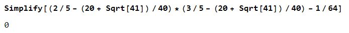
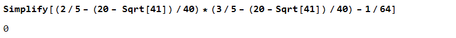
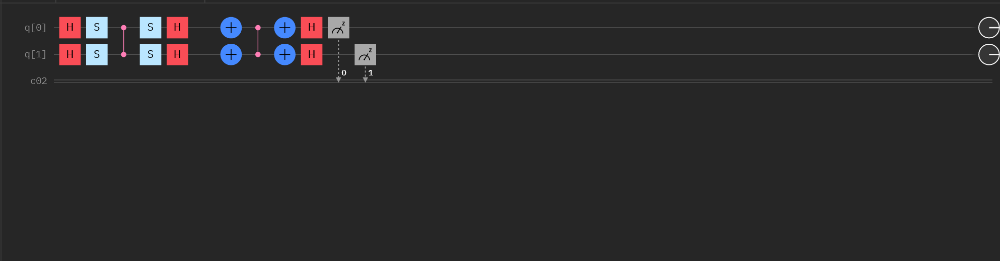

$$
\phantom {derivatives}
\newcommand\d{\text{d}}
\def\ffrac(#1/#2){\frac{#1}{#2}}
\def\hfrac #1(#2/#3){\ffrac (#1#2/#1#3)}
\def\deri#1/#2;{\hfrac \d(#1/#2)}
\def\dderi#1/#2;{\nderi #1/#2^2; }
\def\nderi#1/#2^#3;{\ffrac (\d^#3 #1/\d #2^#3)}
\def\derin1/#1{\ffrac (1/#1) }
\def\pderi#1/#2;{\hfrac \part(#1/#2) }
\def\ppderi#1/#2;{\npderi #1/#2^2;}
\def\npderi#1/#2^#3;{\ffrac (\part^#3 #1/\part #2^#3)}
\def\pderin1/#1;{\ffrac (\part / \part #1)}
\def\fac #1/#2;{\frac{#1}{#2}}

\phantom {fraction}
\def\inv#1{\ffrac (1/#1)}
\newcommand\invsqrt[1]{\frac{1}{\sqrt{#1}}}
\newcommand\half{\frac{1}{2}}
\newcommand\tri{\frac{1}{3}}
\newcommand\quar{\frac{1}{4}}
\phantom {vectors}
\newcommand\vfunc[2]{}

\phantom {common vectors}
\def\vfn #1(#2){\vec #1(\vec #2)}
\def\v #1{\vec #1}
\newcommand\vf{\v f}
\newcommand\vx{\v x}
\newcommand\vy{\v y}
\newcommand\vz{\v z}
\newcommand\vr{\v r}
\newcommand\vv{\v v}
\newcommand\va{\v a}
\newcommand\vtheta{\v \theta}
\newcommand\vphi{\v \phi}
\newcommand\vs{\v s}

\phantom {randomstaff}
\def\tsub#1;{_{\text {#1}}}
\def\sub#1;{_{#1}}
\def\(#1);{\left(#1\right)}
\def\intl#1;{\int_{#1}}
\def\intlh#1;#2;{\int_{#1}^{#2}}
\def\sup#1;{^{#1}}
\def\tsup#1;{^{\text{#1}}}
\def\align[[#1]]{\begin{align*}#1\end{align*}}
\def\note#1!{\fbox{$#1$}}
\def\.#1|;{\left.#1\right|}
\def\ssqrt/#1/;{\sqrt{#1}}
\def\noteeq#1!#2!{\begin{equation} \label{eq:#2} \fbox{$#1$}\end{equation}}
\def\raf#1;{\ref{#1}}
\def\eqraf#1;{\eqref{#1}}
\def\dfac#1/#2;{\dfrac{#1}{#2}}
\def\twotwo#1;#2;#3;#4;{\(\matrix{#1 & #2\\#3 & #4});}
\def\expect#1;{\left\langle#1\right\rangle}
\def\txt#1;{\text{#1}}
\def\ketbra#1;#2;{|{#1}\rangle\langle{#2}|}
\def\bk#1#2{\langle #1|#2\rangle}
\def\two#1;#2;{\(\matrix{#1 \\ #2});}
\def\ketkron#1*#2;{\ket #1 \otimes \ket #2}
\def\brakron#1*#2;{\bra #1 \otimes \bra #2}
\def\infac#1;{\fac 1/#1;}
\def\four#1;#2;#3;#4;{\(\matrix{#1 \\ #2 \\ #3 \\ #4});}
\def\kket#1#2;{\ket #1 \ket #2}
\def\bbra#1#2;{\bra #1 \bra #2}
\def\[[#1]]{\{#1\}}
\def\sgrt#1/>{\sqrt{#1}}
\def\Pr#1;{\txt Pr;_{#1}}
\def\braket #1;#2;{\langle #1|#2\rangle}
\def\ko{\ket 0}
\def\ki{\ket 1}
\def\koo{\ket {00}}
\def\kii{\ket {11}}
\def\kt#1;{\ket {#1}}
\def\ba#1;{\bra {#1}}
$$

##### Problem 1

>Suppose that Alice and Bob share the entangled states
>$$
>\ket \psi = \fac \koo + \kii /\sqrt 2; = \fac \kt 0_A;\kt 0_B; + \kt 1_A;\kt 1_B; /\sqrt 2;
>$$

###### (a)

>Write down the density operator for this state

The density operator $\rho$ is
$$
\rho = \ketbra \psi;\psi; = \half (\ketbra 00;00; + \ketbra 00;11; + \ketbra 11;00; + \ketbra 11;11;)
$$

###### (b)

>Compute the density matrix. Verify that $\Tr(\rho) =1 $, and determine if this is a pure state.

Writing density operator in matrix form
$$
\rho = \half\(\matrix{
1 & 0 & 0 & 1 \\
0 & 0 & 0 & 0 \\
0 & 0 & 0 & 0 \\
1 & 0 & 0 & 1
});
$$

We could see that the $\Tr(\rho) = 1$, and that
$$
\Tr(\rho^2) = \inv 4\Tr\(\matrix{
2 & 0 & 0 & 2 \\
0 & 0 & 0 & 0 \\
0 & 0 & 0 & 0 \\
2 & 0 & 0 & 2
}); = 1
$$
which means that it's a pure state.

###### (c)

>Find the density matrix that represents the reduced operator as seen by Alice

$$
\rho_A = \Tr_B(\rho) = \ba 0_B;\rho \kt 0_B; + \ba 1_B;\rho \kt 1_B;
$$

$$
\align [[
\ba 0_A;\rho \kt 0_A; 
=& \half (\kt 0_A;\braket 0_B;0_B;\braket 0_B;0_B;\ba 0_A; \\
&+ \kt 1_A;\braket 0_B;1_B;\braket 0_B;0_B;\ba 0_A; \\
&+ \kt 0_A;\braket 0_B;0_B;\braket 1_B;0_B;\ba 1_A; \\
&+ \kt 1_A;\braket 0_B;1_B;\braket 1_B;0_B;\ba 1_A; \\
=& \half \ketbra 0_A;0_A;
]]
$$

$$
\align [[
\ba 1_B;\rho \kt 1_B; 
=& \half (\kt 0_A;\braket 1_B;0_B;\braket 0_B;1_B;\ba 0_A; \\
&+ \kt 1_A;\braket 1_B;1_B;\braket 0_B;1_B;\ba 0_A; \\
&+ \kt 0_A;\braket 1_B;0_B;\braket 1_B;1_B;\ba 1_A; \\
&+ \kt 1_A;\braket 1_B;1_B;\braket 1_B;1_B;\ba 1_A; \\
=& \half \ketbra 1_A;1_A;
]]
$$

$$
\rho_A = \half(\ketbra 0;0; + \ketbra 1;1;)
$$

###### (d)

>Show that the reduced density operator as seen by Alice is a completely mixed state

we see that $\rho = \half I$, and $\Tr(\rho^2) = \inv 4\Tr(I) = \half = \inv n$, which means the reduced density operator for Alice is a completely mixed state.

##### Problem 2

>Consider the following matrix
>$$
>\rho = \twotwo 2/5;-i/8;i/8;3/5;
>$$

###### (a)

>Show that this matrix is Hermitian

$$
\rho^\dagger = \twotwo 2/5; -i/8;-(-i/8);3/5; = \rho 
$$

###### (b)

>Verify that the eigenvalues are $\lambda\sub 1,2; = (20\pm \sqrt{41}) /40$

$$
\align[[
\det(\rho -\lambda I) &= \twotwo 2/5 - (20 \mp \sqrt{41})/40; -i/8;i/8;3/5 - (20 \mp \sqrt{41})/40; \\
&= (2/5 - (20 \mp \sqrt{41})/40)(3/5 - (20 \mp \sqrt{41})/40) - \inv {64} \\
&= 0
]]
$$

with some help from Mathematica

They are indeed eigenvalues.

###### (c)

>Does this matrix represent a valid density matrix?

we could find that $\Tr(\rho) = 1$, and $\rho$ is Hermitian stated in $(a)$, and $\rho$ is positive operator since its eigenvalue $\lambda\sub 1, 2; = (20 \pm \sqrt {41})/40$. Thus, $\rho$ is a valid density matrix.

###### (d)

>Show that the probability of finding the system in the $\ket 0$ state is $0.4$

$$
\Pr 0; = \bra 0 \rho \ket 0= (\matrix{1 & 0})\twotwo 2/5;-i/8;i/8;3/5;\two 1;0; = 2/5=0.4
$$

###### (e)

>Compute the components of the Bloch vector, and show that this is a mixed state

$$
\expect X; = \Tr(\rho X) = \Tr\twotwo -i/8;2/5;3/5;i/8; = 0 \\
\expect Y; = \Tr(\rho Y) = \Tr\twotwo 1/8;3i/5;-2i/5;1/8; = 2/8 \\
\expect Z; = \Tr(\rho Z) = \Tr\twotwo 2/5;i/8;i/8;-3/5; = -1/5
$$

the Bloch vector is
$$
\vec S = 0\hat x +2/8\hat y - 1/5\hat z
$$

$$
|\vec S| = \inv {16} + \inv {25} < 1
$$

thus this is a mixed states

##### Problem 3

This is the grover algorithm for finding $\koo$
