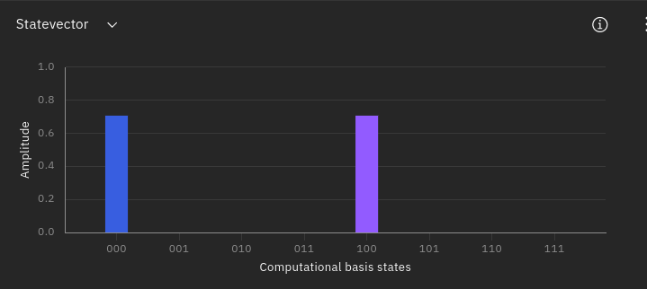
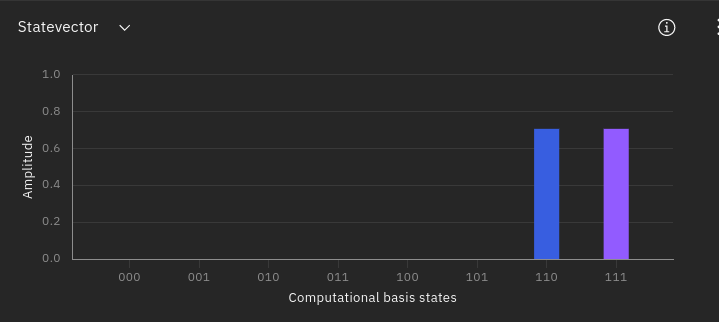
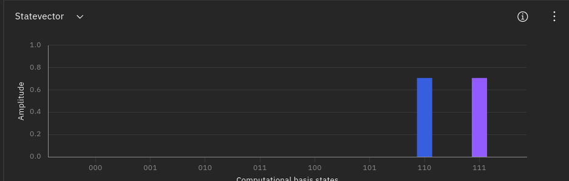

$$
\newcommand\conj[1]{#1^*}
\newcommand\colvec[1]{\left(\matrix{#1}\right)}
\newcommand\hermi[1]{#1^\dagger}
\newcommand\zerovec{\colvec{1 \\ 0}}
\newcommand\onevec{\colvec{0 \\ 1}}
\newcommand\ketbra[2]{\ket{#1}\bra{#2}}
$$

#### 1

Suppose we have an operator, where
$$
\hat{A} = \ketbra{0}{0} + \ketbra{1}{1}
$$
Operate $\hat{A}$ on an arbitrary qubit and show that this is the outer product version of the identity operator, $\hat I$.

Proof: Suppose an arbitrary qubit $\ket{\psi} = \alpha\ket 0 + \beta\ket 1$.
$$
\begin{align}
\hat A \ket \psi &= (\ketbra{0}{0} + \ketbra{1}{1})(\alpha\ket 0 + \beta\ket 1) \\
&= \alpha(\ketbra{0}{0}\ket0 + \ketbra{1}{1}\ket 0) + \beta(\ketbra{0}{0}\ket1 + \ketbra{1}{1}\ket1) \\
&= \alpha \ket 0 + \beta \ket 1
\end{align}
$$
This is the same definition of the $\hat I\ket \psi = \ket\psi$. That means $\hat A = \hat I$

#### 2

The Hubbard operators are given by
$$
\begin{align}
	X^{11} = \ketbra{0}{0} && X^{12} = \ketbra{0}{1}\\
	X^{21} = \ketbra{1}{0} && X^{22} = \ketbra{1}{1}
\end{align}
$$

##### (A)

Write down the matrix representations of the Hubbard operators in the computational basis.
$$
X^{11} = \ketbra{0}{0} = \colvec{1 & 0 \\ 0 & 0} \\
X^{12} = \ketbra{0}{1} = \colvec{0 & 1 \\ 0 & 0} \\
X^{21} = \ketbra{1}{0} = \colvec{0 & 0 \\ 1 & 0} \\
X^{22} = \ketbra{1}{1} = \colvec{0 & 0 \\ 0 & 1}
$$

##### (B)

Describe the action of the Hubbard operators on the Hadamard basis states.

Hadamard basis states are 
$$
\ket + = \frac{\ket{0} + \ket{1}}{\sqrt 2} \quad \ket - = \frac{\ket{0} - \ket{1}}{\sqrt 2}
$$
As Method used in Example 8.1
$$
X^{11}_{H} = HX^{11}H = \frac{1}{2}\colvec{1 & 1 \\ 1 & -1} \colvec{1 & 0 \\ 0 & 0} \colvec{1 & 1 \\ 1 & -1} = \frac{1}{2}\colvec{1 & 1 \\ 1 & -1}\colvec{1 & 1 \\ 0 & 0}
= \frac{1}{2}\colvec{1 & 1 \\ 1 & 1}
$$

$$
X^{12}_{H} = HX^{12}H = \frac{1}{2}\colvec{1 & 1 \\ 1 & -1} \colvec{0 & 1 \\ 0 & 0} \colvec{1 & 1 \\ 1 & -1} = \frac{1}{2}\colvec{1 & 1 \\ 1 & -1}\colvec{1 & -1 \\ 0 & 0}
= \frac{1}{2}\colvec{1 & -1 \\ 1 & -1}
$$

$$
X^{21}_{H} = HX^{21}H = \frac{1}{2}\colvec{1 & 1 \\ 1 & -1} \colvec{0 & 0 \\ 1 & 0} \colvec{1 & 1 \\ 1 & -1} = \frac{1}{2}\colvec{1 & 1 \\ 1 & -1}\colvec{0 & 0 \\ 1 & 1}
= \frac{1}{2}\colvec{1 & 1 \\ -1 & -1}
$$

$$
X^{22}_{H} = HX^{22}H = \frac{1}{2}\colvec{1 & 1 \\ 1 & -1} \colvec{0 & 0 \\ 0 & 1} \colvec{1 & 1 \\ 1 & -1} = \frac{1}{2}\colvec{1 & 1 \\ 1 & -1}\colvec{0 & 0 \\ 1 & -1}
= \frac{1}{2}\colvec{1 & -1 \\ -1 & 1}
$$

It's clear the Hubbard operators is not unitary.

#### 3

$$
CN = \colvec{
1 & 0 & 0 & 0 \\
0 & 1 & 0 & 0 \\
0 & 0 & 0 & 1 \\
0 & 0 & 1 & 0
}
$$

$CN$ is hermitian since
$$
CN^T = \colvec{
1 & 0 & 0 & 0 \\
0 & 1 & 0 & 0 \\
0 & 0 & 0 & 1 \\
0 & 0 & 1 & 0
} = CN
$$
$CN$ is also unitary since
$$
CN^TCN = \colvec{
1 & 0 & 0 & 0 \\
0 & 1 & 0 & 0 \\
0 & 0 & 0 & 1 \\
0 & 0 & 1 & 0
} \colvec{
1 & 0 & 0 & 0 \\
0 & 1 & 0 & 0 \\
0 & 0 & 0 & 1 \\
0 & 0 & 1 & 0
} = \colvec{
1 & 0 & 0 & 0 \\
0 & 1 & 0 & 0 \\
0 & 0 & 1 & 0 \\
0 & 0 & 0 & 1
} = I
$$

#### 4

Since
$$
CZ\ket{00} = \ket{00} \quad CZ\ket{01} = \ket{01} \quad CZ\ket{10} = CZ\ket{10} \quad CZ\ket{11} = -\ket{11}
$$
So
$$
CZ = \colvec{
1 & 0 & 0 & 0 \\
0 & 1 & 0 & 0 \\
0 & 0 & 1 & 0 \\
0 & 0 & 0 & -1
}
$$

and
$$
CZ = \ketbra{00}{00} + \ketbra{01}{01} + \ketbra{10}{10} - \ketbra{11}{11}
$$

#### 5

We do know that $X = \colvec{0 & 1 \\ 1 & 0}$ represent the 180 degree rotation along the positive $\hat{\bold{x}}$ axis. The transformation from $\hat{\bold{x}}$ axis to $e_x + e_z \over \sqrt 2$ should be 
$$
R_y(\frac{\pi}{4}) = e^{-i\frac{\pi}{4}Y/2} = \colvec{
\cos(\frac{\pi}{8}) & -\sin(\frac{\pi}{8}) \\
\sin(\frac{\pi}{8}) & \cos(\frac{\pi}{8})
}
$$
and its inverse is
$$
R_y^{-1}(\frac{\pi}{4}) = R_y(-\frac{\pi}{4}) = \colvec{
\cos(-\frac{\pi}{8}) & -\sin(-\frac{\pi}{8}) \\
\sin(-\frac{\pi}{8}) & \cos(-\frac{\pi}{8})
} = \colvec{
\cos(\frac{\pi}{8}) & \sin(\frac{\pi}{8}) \\
-\sin(\frac{\pi}{8}) & \cos(\frac{\pi}{8})
}
$$
so the 180 degree around the $e_x + e_z \over \sqrt 2$ axis could be re-expressed as:
$$
\begin{align}
R &= R^{-1}_y(\frac{\pi}{4})XR_y(\frac{\pi}{4}) \\ &= \colvec{
\cos(\frac{\pi}{8}) & \sin(\frac{\pi}{8}) \\
-\sin(\frac{\pi}{8}) & \cos(\frac{\pi}{8})
}\colvec{0 & 1 \\ 1 & 0}\colvec{
\cos(\frac{\pi}{8}) & -\sin(\frac{\pi}{8}) \\
\sin(\frac{\pi}{8}) & \cos(\frac{\pi}{8})
} \\
&= \colvec{
\cos(\frac{\pi}{8}) & \sin(\frac{\pi}{8}) \\
-\sin(\frac{\pi}{8}) & \cos(\frac{\pi}{8})
}\colvec{
\sin(\frac{\pi}{8}) & \cos(\frac{\pi}{8}) \\
\cos(\frac{\pi}{8}) & -\sin(\frac{\pi}{8}) 
} \\
&= \colvec{
2\cos({\frac{\pi}8})\sin(\frac{\pi}8) & \cos^2(\frac{\pi}8) - \sin^2(\frac{\pi}8) \\
\cos^2(\frac{\pi}8) - \sin^2(\frac{\pi}8) & -2\cos({\frac{\pi}8})\sin(\frac{\pi}8)
} \\
&= \colvec{
\sin({\pi \over 4}) & \cos({\pi \over 4}) \\
\cos({\pi \over 4}) & -\sin({\pi \over 4})
} \\
&= {1 \over \sqrt 2}\colvec{
	1 & 1 \\
	1 & -1
}
\end{align}
$$
and this matrix have the same matrix representation as Hadamard $H$, which in turn proved that $H$ is indeed a rotation around $e_x + e_z \over \sqrt 2$ axis

#### 6

Teleport the state $\ket \psi = {1\over \sqrt 2}(\ket 0 + e^{i\pi/4}\ket 1)$ in two different scenarios.

These state could be produce start with $\ket 0$, apply $H$ and $P_{\pi  / 4}$.
$$
P_{\pi / 4} H\ket 0 = P_{\pi / 4} \frac{\ket 0 + \ket 1}{\sqrt 2} = {1 \over \sqrt 2} (\ket 0 + e^{i\pi /4 } \ket 1)
$$

#####  A)

First suppose that Alice and Bob share the Bell state ${1 \over \sqrt 2}(\ket {00} + \ket {11})$

To produce the aforementioned bell state, one could start $\ket {00}$, apply a $H$ gate first, then $CN$ gate with first bit as the control bit.
$$
CN(H(\ket {00})) = CN(\frac{\ket{00} + \ket{01}}{\sqrt 2}) = {1 \over \sqrt 2}(\ket {00} + \ket {11})
$$
The following process is basically followed the textbook.

Circuit is down below:


```OPENQASM 2.0
OPENQASM 2.0;
include "qelib1.inc";
qreg q[3];
creg c0[2];

h q[2];
p(pi / 4) q[2];
barrier q[0];
barrier q[1];
barrier q[2];
h q[1];
cx q[1], q[0];
barrier q[0];
barrier q[1];
barrier q[2];
cx q[2], q[1];
h q[2];
measure q[2] -> c0[1];
measure q[1] -> c0[0];
if (c0 == 1) sx q[0];
if (c0 == 1) sx q[0];
if (c0 == 2) z q[0];
if (c0 == 3) sx q[0];
if (c0 == 3) sx q[0];
if (c0 == 3) z q[0];

// @columns [0,1,2,2,2,3,4,5,5,5,6,7,8,9,10,11,12,13,14,15]
```

Note: 

1. the IBM composer use the qubit on the bottom as the first qubit, which means the qubit will be $\ket {q[2]q[1]q[0]}$ in the composer, to make the qubit representation more aligned with the textbook, $q[2]$ is the qubit need to be teleported, $q[1]$ is Alice's qubit, $q[0]$ is the Bob's qubit.

2. There is no $X$ gate provided by composer directly, so two $\sqrt X$ are used to have the same effect.
3. The measurement operation seemed to always restore its qubit to $\ket 1$ after the measurement, instead of invalidate that qubit (which is confusing but acceptable)
4. All the qubit start with $\ket 0$, so it's necessary to transform it to desired state that later need to be teleported.

The initial state is



The state need to be teleported is on the first bit. (The second bar with purple color indicate a phase angle of $\pi / 4$)

The final state, the state is teleported to the third bit (which is the top bit in the circuit)



##### B)

The produce of $\frac{\ket{00} - \ket{11}}{\sqrt 2}$ could be achieved by applying $H$, $P_{\pi}$ and $CN$ on $\ket {00}$ 
$$
CN P_\pi H\ket {00} = CN P_\pi \frac{\ket {00} + \ket{10}}{\sqrt 2} = CN \frac{\ket {00} - {\ket{10}}}{\sqrt 2} = \frac{\ket{00} - \ket{11}}{\sqrt 2}
$$


The code is

```OPENQASM 2.0
OPENQASM 2.0;
include "qelib1.inc";

qreg q[3];
creg c0[2];

h q[2];
p(pi/4) q[2];
barrier q[0];
barrier q[1];
barrier q[2];
h q[1];
p(pi) q[1];
cx q[1], q[0];
barrier q[0];
barrier q[1];
barrier q[2];
cx q[2], q[1];
h q[2];
measure q[2] -> c0[1];
measure q[1] -> c0[0];
if (c0 == 0) z q[0];
if (c0 == 1) z q[0];
if (c0 == 1) sx q[0];
if (c0 == 1) sx q[0];
if (c0 == 3) z q[0];
if (c0 == 3) sx q[0];
if (c0 == 3) sx q[0];
if (c0 == 3) z q[0];

// @columns [0,1,2,2,2,3,4,5,6,6,6,7,8,9,10,11,12,13,14,15,16,17,18]
```

The process following is the same as the textbook, except the last step. Following the textbook
$$
\begin{align}
CN \colvec{\ket \psi \otimes \frac{\ket{00} - \ket{11}}{\sqrt 2}} &= CN\colvec{ (\alpha \ket 0 + \beta \ket 1)(\frac{\ket{00} - \ket{11}}{\sqrt 2})} \\ &= \frac{1}{\sqrt 2}CN(\alpha \ket {000} - \alpha \ket{011} + \beta \ket {100} - \beta \ket {111} ) \\
&= \frac{1}{\sqrt2}(\alpha \ket {000} - \alpha \ket{011} + \beta \ket {110} - \beta \ket {101})
\end{align}
$$
and also
$$
\begin{align}
&H\colvec{\frac{1}{\sqrt 2}(\alpha \ket {000} - \alpha \ket{011} + \beta \ket {110} - \beta \ket {101})} \\ &= \frac{1}{\sqrt 2}(\alpha H\ket 0(\ket {00} - \ket {11}) + \beta H \ket 1(\ket {10} - \ket {01})) \\
&= \frac{1}{\sqrt 2}(\alpha (\frac{\ket 0 + \ket 1}{\sqrt 2})(\ket {00} - \ket {11}) + \beta (\frac{\ket 0 - \ket 1}{\sqrt 2})(\ket {10} - \ket {01})) \\
&= \frac{1}{2}( \ket {00} (\alpha \ket 0 - \beta \ket 1) +  \ket {01} (-\alpha \ket 1 + \beta \ket 0) + \ket {10} (\alpha \ket 0 + \beta \ket 1) + \ket {11} (-\alpha \ket 1 - \beta \ket 0))
\end{align}
$$
There are four cases:

1. When Alice get $\ket {00}$, Bob needs to apply $Z$ gate on $\alpha \ket 0 - \beta \ket 1$
2. When Alice get $\ket {01}$, Bob needs to apply $XZ$ gate on $-\alpha\ket 1 +\beta \ket 0$
3. When Alice get $\ket {10}$, Bob doesn't need to apply anything.
4. When Alice get $\ket {11}$, Bob needs to apply $ZXZ$ gate on $-\alpha \ket 1- \beta \ket 0$.

So that Bob could get the original $\ket \psi$



Just as the previous one, Bob get the desired state (we only care the last bit of the state) as the original one.
