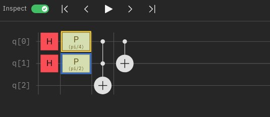
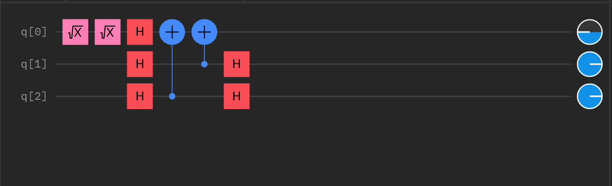
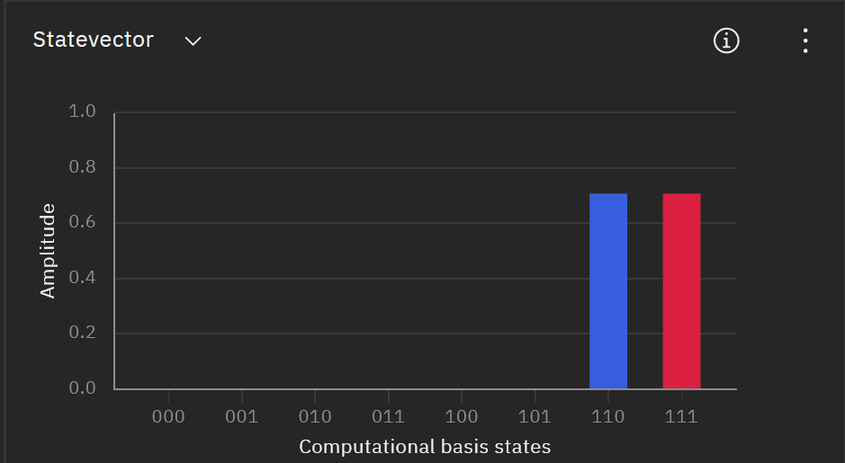

$$
\newcommand\conj[1]{#1^*}
\newcommand\colvec[1]{\left(\matrix{#1}\right)}
\newcommand\hermi[1]{#1^\dagger}
\newcommand\zerovec{\colvec{1 \\ 0}}
\newcommand\onevec{\colvec{0 \\ 1}}
\newcommand\ketbra[2]{\ket{#1}\bra{#2}}
\newcommand\norm[1]{|#1|}
\newcommand\half{\frac{1}{2}}
\newcommand\quarter{\frac{1}{4}}
\newcommand\sqhalf{\frac{1}{\sqrt 2}}
\newcommand\paren[1]{\left(#1\right)}
\newcommand\ohalf[1]{\frac{#1}{2}}
\newcommand\oihalf[1]{\frac{#1}{2i}}
\newcommand\ko{\ket 0}
\newcommand\ki{\ket 1}
\newcommand\koo{\ket {00}}
\newcommand\koi{\ket {01}}
\newcommand\kio{\ket {10}}
\newcommand\kii{\ket {11}}
\newcommand\invsqrt[1]{\frac{1}{\sqrt{#1}}}
$$

#### Question 1

>Consider a generalization of the qubit, a $d = 2^n$ dimensional system where the quantum states are called qudits. A qudit system is more complicated but might be considered because of the increased computing power. The computational basis for a qudit is $$
>$$
>\{\ket 0, \ket 1, \ket 2, \cdots, \ket {d - 1} \}
>$$
>The qudit Hadamard $H_d$ takes the states
>$$
>\ket {0_H} = H_d\ket 0 = \invsqrt{d}\paren{\ko + \ki + \cdots + \ket {d - 2} + \ket {d - 1}} = \invsqrt{d}\paren{\sum_{x = 0}^{d - 1}\ket x} \\
>\ket {1_H} = H_d\ket 1 = \invsqrt{d}\paren{\ko - \ki + \cdots + \ket {d - 2} - \ket {d - 1}} = 
>\invsqrt{d}\paren{\sum_{x = 0}^{d - 1}(-1)^{x}\ket x}
>$$

##### a)

>In $d = 4$ dimensions, the computational basis is $\{\ket 0 + \ket 1 + \ket 2 + \ket 3 \}$. Show that
>$$
>H_4\ket 0 = \half \paren{\ket 0 + \ket 1 + \ket 2 + \ket 3} \\
>H_4\ket 1 = \half (\ket 0 - \ket 1 + \ket 2 - \ket 3)
>$$
>and that $H_d^2\ko = \ko$, $H_d^2\ki = \ki$ if the matrix representation of the Hadamard gate is
>$$
>H_d = \half\colvec{1 & 1 & 1 & 1 \\ 1 & -1 & 1 & -1 \\ 1 & 1 & -1 & -1 \\ 1 & -1 & -1 & 1}
>$$

Follows the definition:
$$
\ket {0_H} = H_d\ket 0 = \invsqrt{4}\paren{\ko + \ki + \ket {4 - 2} + \ket {4 - 1}} = \half \paren{\ket 0 + \ket 1 + \ket 2 + \ket 3}\\
\ket {1_H} = H_d\ket 1 = \invsqrt{4}\paren{\ko - \ki + \ket {4 - 2} - \ket {4 - 1}} = \half \paren{\ket 0 - \ket 1 + \ket 2 - \ket 3} \\
$$
and that 
$$
H_d H_d \ket 0 = H_d \half \colvec{1 \\ 1\\ 1\\ 1} =  \quarter\colvec{1 + 1 + 1 + 1 \\ 1 -1 +1-1 \\ 1 + 1 -1 -1 \\ 1 -1 -1 +1} = \colvec{1 \\ 0 \\ 0 \\ 0} = \ko
$$

$$
H_d H_d \ket 1 = H_d \half \colvec{1 \\ -1\\ 1\\ -1} =  \quarter\colvec{1 - 1 + 1 - 1 \\ 1 +1 +1+1 \\ 1 - 1 -1 + 1 \\ 1 + 1 -1 -1} = \colvec{0 \\ 1 \\ 0 \\ 0} = \ki
$$

##### b)

>Apply the qudit Hadamard gate to $\ket \psi_{in} = \ket 0 \ket 1$ and show that
>$$
>\ket {\psi'} = H_d \otimes H_d \ket {\psi_{in}} = \frac{1} d \sum_{x, y = 0}^{d - 1}(-1)^y\ket x \ket y
>$$

$$
0 = \sum^{d - 1}_{i=0} 0\cdot2^i \quad 1 = \sum_{i = 0}^{d - 1}x_i\cdot 2_i, x_i = \begin{cases}1 \quad i = 0 \\ 0 \quad \text{otherwise} \end{cases}
$$

and thus
$$
x \cdot 0 = \sum_{i = 0}^{d - 1} x_i 0 = 0 \\
x \cdot 1 = \sum_{i = 1}^{d - 1} x_i 0 + x_0 = x_0
$$

$$
\begin{align}
\ket {\psi'} &= H_d \otimes H_d \ket {\psi_{in}} \\
&= (H_d \ket 0) \otimes (H_d \ket 1) \\
&= \invsqrt{d}\paren{\sum_{x = 0}^{d - 1}(-1)^{x \cdot 0}\ket x}\invsqrt{d}\paren{\sum_{x = 0}^{d - 1}(-1)^{x \cdot 1}\ket x} \\
&= \frac{1}{d}\paren{\sum_{x = 0}^{d - 1}\ket x}\paren{\sum_{x = 0}^{d - 1}(-1)^{x_0}\ket x} \\
&=\frac{1}{d}\paren{\sum_{x, y = 0}^{d - 1}(-1)^{y_0} \ket x \ket y}
\end{align}
$$

notice $(-1)^{y_0} = (-1)^{y}$, since $y \equiv y_0 \mod 2$.

Thus
$$
\ket {\psi'} = \frac{1} d \sum_{x, y = 0}^{d - 1}(-1)^y\ket x \ket y
$$

#### c)

>$U_f \ket {x, y} = \ket{x, y \oplus f(x)}$, show that
>$$
>U_f\ket{\psi'} = \frac{1}{d}\paren{\sum_{x = 0}^{d - 1} (-1)^{f(x)}\ket x}\ket {1_H}
>$$

$$
\begin{align}
U_f\ket {\psi'} &= \frac{1} d \sum_{x, y = 0}^{d - 1}(-1)^y\ket x \ket {y \oplus f(x)} \\
&= \frac{1}{d} \sum_{x = 0}^{d - 1}\ket x \sum_{y = 0}^{d - 1}(-1)^y\ket {y \oplus f(x)}
\end{align}
$$

We will find out that given that $d \equiv 0 \mod 2$, $(-1)^{d} = 0$
$$
\begin{align}
\sum_{x = 0}^{d - 1}(-1)^{x}\ket {x \oplus f(x)} &= \sum_{x = 0}^{d - 1 - f(x)}(-1)^x \ket{x + f(x)} + \sum_{x = d - f(x)}^{ d- 1}(-1)^{x}\ket{x + f(x) - d} \\
&= \sum_{x = 0}^{d - 1 - f(x)}(-1)^{x + f(x)}(-1)^{f(x)} \ket {x+f(x)} + \sum_{x = 0}^{d - 1} (-1)^{x + f(x)- d}(-1)^{f(x) - d}\ket {x +f(x) - d} \\
&= (-1)^{f(x)}\sum_{x = f(x)}^{d - 1}(-1)^{x}\ket{x} + (-1)^{f(x) - d}\sum_{x = 0}^{f(x) - 1}(-1)^{x}\ket x \\
&= (-1)^{f(x)}\sum_{x = 0}^{d - 1}(-1)^{x}\ket {x} = (-1)^{f(n)}\ket{1_H}
\end{align}
$$
and thus
$$
U_f\ket {\psi'} = \frac{1}{d} \sum_{x = 0}^{d - 1}\ket x (-1)^{f(x)}\ket{1_H}
$$

#### Question 2

Note: the actual adder only needs the **CNOT** gate and **CCNOT** gate, however, $H$ and $P$ gate is used to run the all the combination $\koo, \koi, \kio, \kii$ all at once.

We could see that
$$
CNOT(CCNOT({\ket x \ket y} \ko)) = CNOT(\ket x \ket y \ket {(xy) \oplus 0}) = CNOT\ket x \ket y \ket {xy} = \ket x \ket {x \oplus y} \ket{xy}
$$
achieved an function of adder as needed.

The state vector initially is: (different phase is applied for clarity)

and after that is:

Notice, the last two digit is the number needed to be added, and the first two digit is the result.

1. blue one: 0 + 0  = 00
2. purple one: 0 + 1 = 01
3. pink one: 1 + 0 = 01
4. magenta one: 1 + 1 = 10 

#### Question 3

I come up with my own function $f(x) = x_1 \oplus x_2$, so the oracle is $U_f\ket x\ket y = \ket x \ket {f(x) \oplus y} = \ket x \ket {x_1 \otimes x_2 \otimes y}$.

So basically the oracle is applying two CNOT gate.

As we could see, the $\ket{000}$ state is indeed 0, which means the function is a balanced function. 
