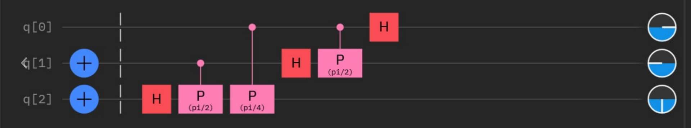
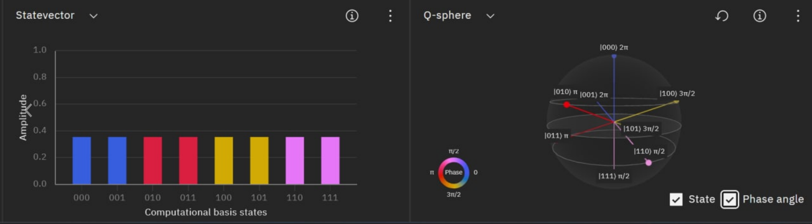

$$
\phantom {derivatives}
\newcommand\d{\text{d}}
\def\ffrac(#1/#2){\frac{#1}{#2}}
\def\hfrac #1(#2/#3){\ffrac (#1#2/#1#3)}
\def\deri#1/#2;{\hfrac \d(#1/#2)}
\def\dderi#1/#2;{\nderi #1/#2^2; }
\def\nderi#1/#2^#3;{\ffrac (\d^#3 #1/\d #2^#3)}
\def\derin1/#1{\ffrac (1/#1) }
\def\pderi#1/#2;{\hfrac \part(#1/#2) }
\def\ppderi#1/#2;{\npderi #1/#2^2;}
\def\npderi#1/#2^#3;{\ffrac (\part^#3 #1/\part #2^#3)}
\def\pderin1/#1;{\ffrac (\part / \part #1)}
\def\fac #1/#2;{\frac{#1}{#2}}

\phantom {fraction}
\def\inv#1{\ffrac (1/#1)}
\newcommand\invsqrt[1]{\frac{1}{\sqrt{#1}}}
\newcommand\half{\frac{1}{2}}
\newcommand\tri{\frac{1}{3}}
\newcommand\quar{\frac{1}{4}}
\phantom {vectors}
\newcommand\vfunc[2]{}

\phantom {common vectors}
\def\vfn #1(#2){\vec #1(\vec #2)}
\def\v #1{\vec #1}
\newcommand\vf{\v f}
\newcommand\vx{\v x}
\newcommand\vy{\v y}
\newcommand\vz{\v z}
\newcommand\vr{\v r}
\newcommand\vv{\v v}
\newcommand\va{\v a}
\newcommand\vtheta{\v \theta}
\newcommand\vphi{\v \phi}
\newcommand\vs{\v s}

\phantom {randomstaff}
\def\tsub#1;{_{\text {#1}}}
\def\sub#1;{_{#1}}
\def\(#1);{\left(#1\right)}
\def\intl#1;{\int_{#1}}
\def\intlh#1;#2;{\int_{#1}^{#2}}
\def\sup#1;{^{#1}}
\def\tsup#1;{^{\text{#1}}}
\def\align[[#1]]{\begin{align*}#1\end{align*}}
\def\note#1!{\fbox{$#1$}}
\def\.#1|;{\left.#1\right|}
\def\ssqrt/#1/;{\sqrt{#1}}
\def\noteeq#1!#2!{\begin{equation} \label{eq:#2} \fbox{$#1$}\end{equation}}
\def\raf#1;{\ref{#1}}
\def\eqraf#1;{\eqref{#1}}
\def\dfac#1/#2;{\dfrac{#1}{#2}}
\def\twotwo#1;#2;#3;#4;{\(\matrix{#1 & #2\\#3 & #4});}
\def\expect#1;{\left\langle#1\right\rangle}
\def\txt#1;{\text{#1}}
\def\ketbra#1#2{|#1\rangle\langle#2|}
\def\bk#1#2{\langle #1|#2\rangle}
\def\two#1;#2;{\(\matrix{#1 \\ #2});}
\def\ketkron#1*#2;{\ket #1 \otimes \ket #2}
\def\brakron#1*#2;{\bra #1 \otimes \bra #2}
\def\infac#1;{\fac 1/#1;}
\def\four#1;#2;#3;#4;{\(\matrix{#1 \\ #2 \\ #3 \\ #4});}
\def\kket#1#2;{\ket #1 \ket #2}
\def\bbra#1#2;{\bra #1 \bra #2}
\def\kt#1{|#1\rangle}
\def\ba#1{\langle#1|}
\def\[[#1]]{\{#1\}}
\def\ko{\kt 0}
\def\ki{\kt 1}
\def\kat#1;{\kt {#1}}
\def\bua#1;{\ba {#1}}
$$

##### Question 1

>Find $X \otimes Y\ket \psi $, where
>$$
>\ket \psi = \fac \ko\ki -\ki\ko/\sqrt 2;
>$$

We know that 
$$
X = \ketbra 01 + \ketbra 10 \\
Y = -i\ketbra 01 + i\ketbra 10
$$
thus
$$
X\otimes Y \ket \psi = \fac X\ko Y\ki - X\ki Y\ko /\sqrt 2; = \fac \ket 1 (-i\ket 0) - \ket 0 i \ket 1 /\sqrt 2; = \fac -i(\ket {10} + \ket {01}) / \sqrt 2;
$$

##### Question 2

>If
>$$
>\ket \psi = \fac \ket {00} + \ket {11} / \sqrt 2;
>$$
>find $I \otimes Y \ket \psi$

$$
I \otimes Y \ket\psi = \fac I\kt 0 Y\kt 0 + I\kt 1 Y\kt 1 /\sqrt2; = \fac \kt 0 i\kt 1 + \kt 1 (-i\kt 0) / \sqrt 2; = \fac i(\kat 01; - \kat 10;) /\sqrt 2;
$$

##### Question 3

>Calculate the matrix representation of $X \otimes Y$

we know that
$$
X = \twotwo 0;1;1;0; \qquad Y = \twotwo 0;-i; i;0;
$$
and thus
$$
X \otimes Y = \(\matrix{
 0 & 0 & 0 & -i \\
 0 & 0 & i & 0 \\
 0 & -i & 0 & 0 \\
 i & 0 & 0 & 0
});
$$

##### Question 4

Notice, the IBM compose use the bottom bit as the most significant bit (so the entire circuit is flipped upside down).  We first prepare $\kat 110;$ using the $X$ gate. Then we apply the Fourier Transform.

The state vector diagram is

which phase angle could be seen in the Q-sphere.

The result state is
$$
\inv {2\sqrt 2}(\kat 000; + 
\kat 001; + 
e\sup 2\pi i \cdot \fac 4/8;; \kat 010; +
e\sup 2\pi i \cdot \fac 4/8;; \kat 011; +
e\sup 2\pi i \cdot \fac 6/8;; \kat 100; + 
e\sup 2\pi i \cdot \fac 6/8;; \kat 101; + 
e\sup 2\pi i \cdot \fac 2/8;; \kat 110; + 
e\sup 2\pi i \cdot \fac 2/8;;\kat 111; )
$$
and it could be simplified as
$$
\invsqrt 2(\ko + e\sup 2\pi i \fac 3/4;;\ki) \otimes 
\invsqrt 2(\ko + e\sup 2\pi i \fac 1/2;;\ki) \otimes
\invsqrt 2(\ko + e\sup 2\pi i \cdot 0;\ki)
$$
According to the textbook, the Fourier transform would have the result of form
$$
\invsqrt 2(\ko + e\sup 2\pi i 0.x_2x_1x_0;\ki) \otimes 
\invsqrt 2(\ko + e\sup 2\pi i 0.x_1x_0;\ki) \otimes
\invsqrt 2(\ko + e\sup 2\pi i 0.x_0;\ki)
$$
In this case, $x_2 = 1, x_1 = 1, x_0 = 0$, and $0.x_2x_1x_0 = 0.110_2 = 0.75\sub 10;$, $0.x_1x_0 = 0.10_2 = 0.5\sub 10;$, and $0.x_0 = 0.0_2 = 0.0\sub 10;$, which is consistent with the result in the composer.

​            
