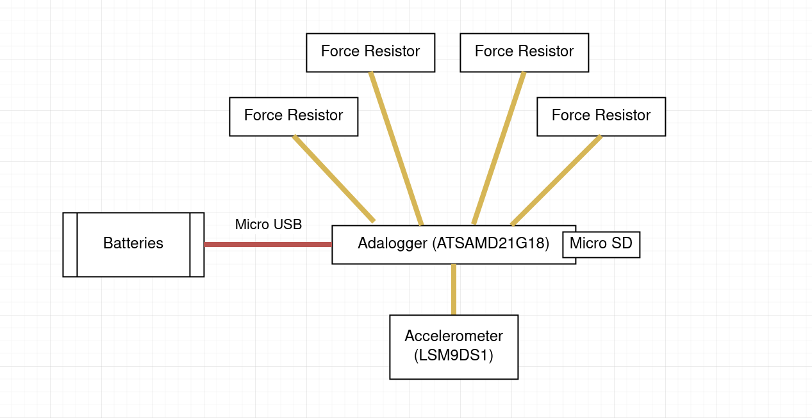
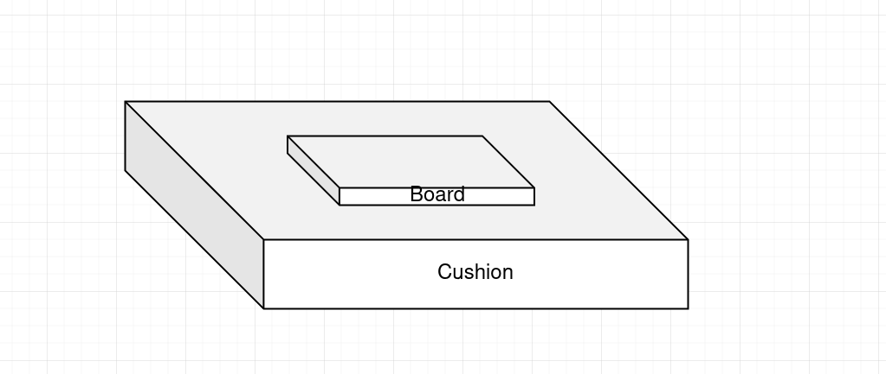

We want to build a device that measure the acceleration and force in different part when an object falls. 

In order to carry out the experiment, we need

* Micro Processors (Adalogger ATSAMD21G18)
* Accelerometer (LSM9DS1)
* Force Resistor (Adafruit ID 166)
* Batteries
* Materials for cushion (to be determined)
* SD cards

They are connected roughly as below.

-

Note, though not displayed on the graph, *the force resistor are actually scattered in board / cushion.*

Since the impact time of landing is relatively short, we need equipment with high frequency. Therefore, **SPI** protocol will be used. The **adalogger** instead of arduino board is used for smaller size and higher speed in processing information.

In the device above, acceleration and force in different parts will be collected by accelerometers and force sensors, respectively. The information will be collected by **SPI** protocol, and then stored in the Micro SD card for later analysis, entire board is powered by the battery attached to it.

Several links to provide example / tutorials for coding and wiring

https://learn.adafruit.com/adafruit-lsm9ds1-accelerometer-plus-gyro-plus-magnetometer-9-dof-breakout/arduino-code

https://learn.adafruit.com/force-sensitive-resistor-fsr

Possible Applications in three different scenarios: 

* When spaceships / probes land, cushion is need to minimize the landing impact.
* Elevators need reduction gear when it does not operate properly and falls.  
* Phone cases are usually used to protect phone from accidental falling.

Different Materials / Structure could be used to improve the current technology used in above scenarios. 