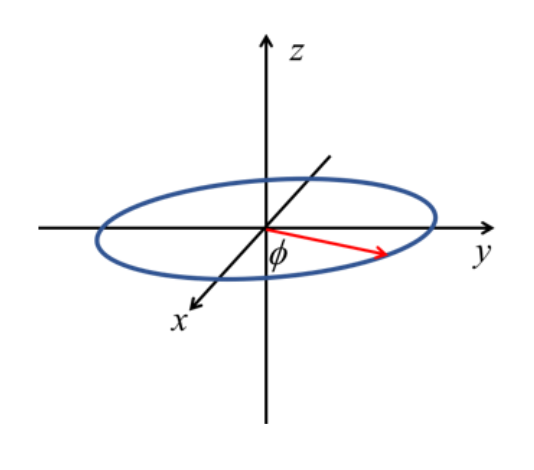
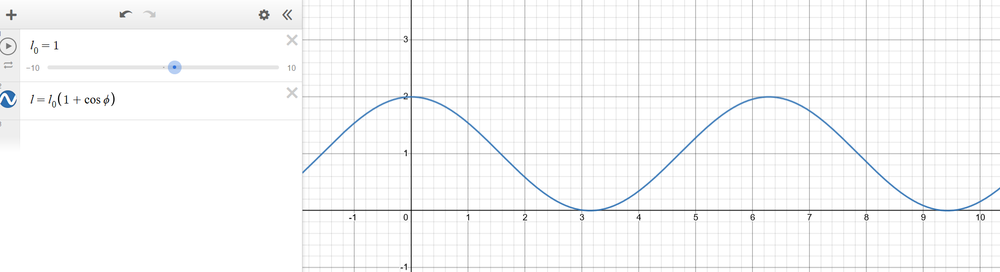
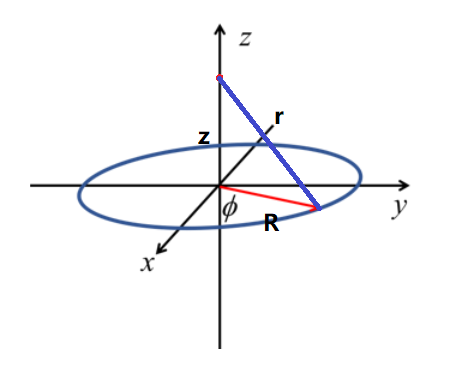

$$
\phantom {derivatives}
\newcommand\d{\text{d}}
\def\ffrac(#1/#2){\frac{#1}{#2}}
\def\hfrac #1(#2/#3){\ffrac (#1#2/#1#3)}
\def\deri#1/#2;{\hfrac \d(#1/#2)}
\def\dderi#1/#2;{\nderi #1/#2^2; }
\def\nderi#1/#2^#3;{\ffrac (\d^#3 #1/\d #2^#3)}
\def\derin1/#1{\ffrac (1/#1) }
\def\pderi#1/#2;{\hfrac \part(#1/#2) }
\def\ppderi#1/#2;{\npderi #1/#2^2;}
\def\npderi#1/#2^#3;{\ffrac (\part^#3 #1/\part #2^#3)}
\def\pderin1/#1;{\ffrac (\part / \part #1)}
\def\fac #1/#2;{\frac{#1}{#2}}

\phantom {fraction}
\def\inv#1{\ffrac (1/#1)}
\newcommand\invsqrt[1]{\frac{1}{\sqrt{#1}}}
\newcommand\half{\frac{1}{2}}
\newcommand\tri{\frac{1}{3}}
\newcommand\quar{\frac{1}{4}}
\phantom {vectors}
\newcommand\vfunc[2]{}

\phantom {common vectors}
\def\vfn #1(#2){\vec #1(\vec #2)}
\def\v #1{\vec #1}
\newcommand\vf{\v f}
\newcommand\vx{\v x}
\newcommand\vy{\v y}
\newcommand\vz{\v z}
\newcommand\vr{\v r}
\newcommand\vv{\v v}
\newcommand\va{\v a}
\newcommand\vtheta{\v \theta}
\newcommand\vphi{\v \phi}
\newcommand\vs{\v s}

\phantom {randomstaff}
\def\tsub#1;{_{\text {#1}}}
\def\sub#1;{_{#1}}
\def\(#1);{\left(#1\right)}
\def\intl#1;{\int_{#1}}
\def\intlh#1;#2;{\int_{#1}^{#2}}
\def\sup#1;{^{#1}}
\def\tsup#1;{^{\text{#1}}}
\def\align[[#1]]{\begin{align*}#1\end{align*}}
\def\note#1!{\fbox{$#1$}}
\def\.#1|;{\left.#1\right|}
\def\ssqrt/#1/;{\sqrt{#1}}
\def\noteeq#1!#2!{\begin{equation} \label{eq:#2} \fbox{$#1$}\end{equation}}
\def\raf#1;{\ref{#1}}
\def\eqraf#1;{\eqref{#1}}
\def\dfac#1/#2;{\dfrac{#1}{#2}}
$$

#### Problem 1

> A thin ring of charge of radius $R$ lies in the $x-y$ plane and is centered on the $z$-axis. The linear charge density, $\lambda$, of the loop depends on the in-plane angle with respect to the $x$-axis, $\phi$. It is given by $\lambda(\phi) = \lambda_0 (1 + \cos\phi)$.
>
> 

##### (a)

+

>What is the total charge contained in the ring, $Q_{TOT}$?

$$
Q_{TOT} = \int_0^{2\pi} \lambda(\phi)\d \phi = \int_0^{2\pi}\lambda_0(1+ \cos\phi)\d\phi = \lambda_0(2\pi +\sin\phi \vline _0^{2\pi}) = 2\pi \lambda _0
$$

##### (b)

>Sketch a graph of the function $\lambda(\phi) = \lambda_0(1 + \cos\phi)$.

##### (c)

>Find a formula for $\vec E (z)$ for points on the $z$-axis. Remember this is a vector quantity, and you must find a formula for each component. Hint: Based on the symmetry of $\lambda(\phi)$, $\vec E(x = 0, y = 0, z)$ will have non-zero components in both the $\hat x$ and $\hat z$ directions, but not in the $y$-direction.

According to the hint, we will only focus on the $x$ and $z$ direction. Each infinitesimal segment $\d l$ (has corresponding $\phi$ away from the $x$ axis) has a electric field at $(0, 0, z)$: $\d q = \lambda(\phi)\d l = \lambda(\phi)R\d\phi$
$$
|\d \vec E| = \inv {4\pi\varepsilon_0} \fac \lambda(\phi)/r^2; R\d\phi  = \inv {4\pi\varepsilon_0}\fac \lambda_0(1 + \cos\phi)/z^2 + R^2;R \d\phi
$$

the electric field on $z$ direction is just 
$$
\d\vec E_z = \cos \theta |\d \vec E|\hat z = \fac z/\sqrt {z^2 + R^2} ;\inv {4\pi\varepsilon_0}\fac \lambda_0(1 + \cos\phi)/z^2 + R^2;R \d\phi \hat z
$$
Integral with respect to $\phi$.
$$
\vec E_z = \inv {4\pi\varepsilon_0}\fac R\lambda_0\cdot z /(z^2 + R^2)^{\fac 3/2;}; \hat z \int_0^{2\pi} (1 +\cos\phi)\d \phi =  \inv {2\varepsilon_0}\fac R\lambda_0\cdot z /(z^2 + R^2)^{\fac 3/2;};\hat z
$$
and the electric field in $x$ direction is
$$
\d\vec E_x = \sin\theta\cos\phi|\d \vec E|\hat x = \cos\phi\fac R/\sqrt {z^2 + R^2} ;\inv {4\pi\varepsilon_0}\fac \lambda_0(1 + \cos\phi)/z^2 + R^2;R \d\phi \hat x
$$
Integral with respect to $\phi$
$$
\vec E_x = \inv {4\pi \varepsilon_0}\fac R^2\lambda_0 /(z^2 + R^2)^{\fac 3/2;};\hat x\int_0^{2\pi}\cos\phi (1+ \cos\phi) \d \phi = \inv {4 \varepsilon_0}\fac R^2\lambda_0 /(z^2 + R^2)^{\fac 3/2;};\hat x
$$

##### (d)

>Consider the $z$-component of your answer in part $c$ as $z$ becomes $\gg$ than R.

###### (i)

>Find an approximate expression for this that becomes exact at $z$ goes to infinity. Write this in terms of the $Q_{TOT}$ you derived in part a.

As $z \to \infin$, $z \gg R$. That means $(z^2  + R^2)^{\fac 3/2;} \approx z^3$. and the original expression becomes
$$
\vec E_z \approx \fac 1/4\pi\varepsilon_0; \cdot 2\pi \lambda_0 \cdot \fac z/z^3;\hat z = \fac 1/4\pi\varepsilon_0;\cdot \fac Q_{TOT}/z^2;\hat z
$$

###### (ii)

>Does your expression make sense? Explain coherently in words. This is a writing assignment. Summarize the physics in few sentences.

The expression make sense. As $z \to \infin$ ($z \gg R$), the formula could be approximate as a formula for point charge with $Q_{TOT}$ at origin. This agrees with the intuition, as the distance increase, the structure of the ring becomes less important, and could be considered as a point charge.

##### (e)

>By comparison, how does the $x$-component vary along the $z$-axis as $z$ goes to infinity?

###### (i)

>That is, what power of $z$ governs its amplitude as $z \to \infin$?

###### (ii)

>Does this make sense? Compare the asymptotic z-dependence as $z \to \infin$ of the $x$-component to the dependence of the $z$-component. Explain why this difference occurs coherently in words. This is also a writing assignment. Summarize the reason in a few sentences.
