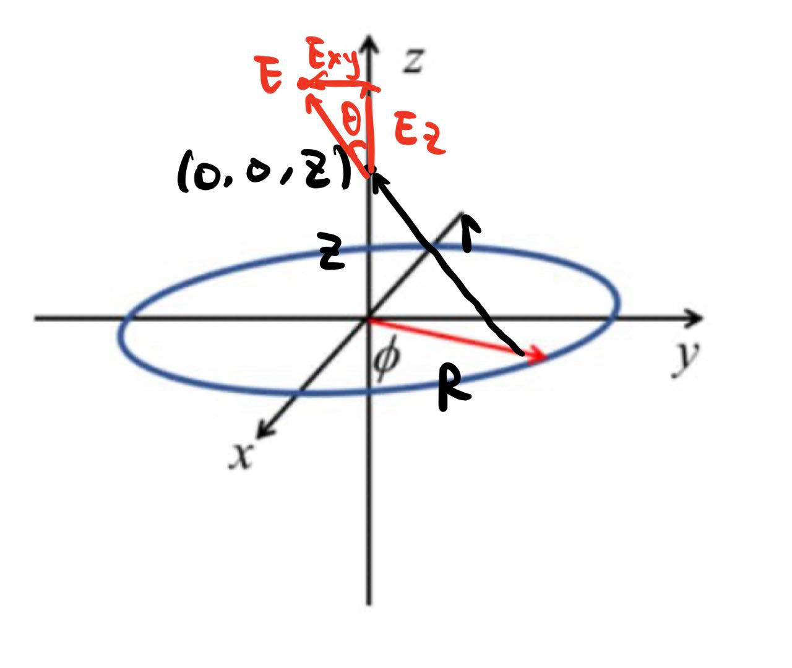
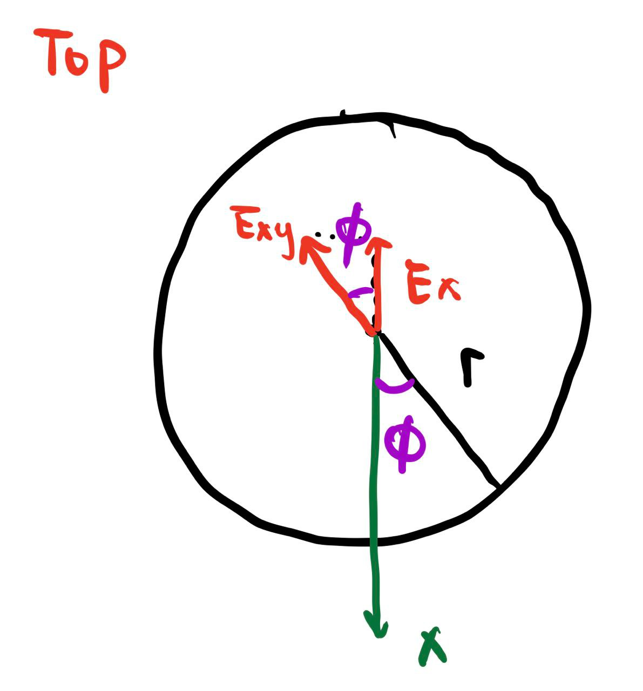
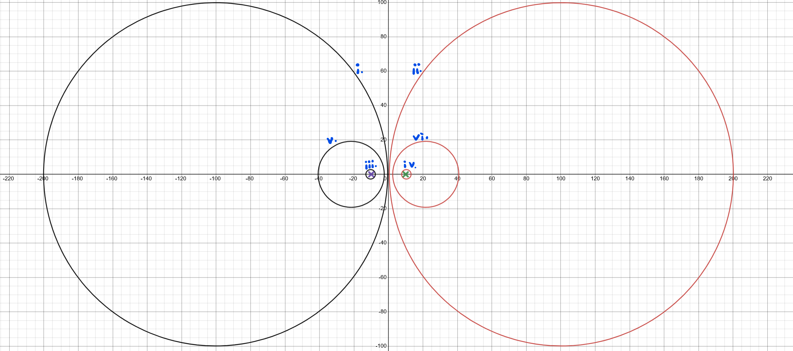

$$
\phantom {derivatives}
\newcommand\d{\text{d}}
\def\ffrac(#1/#2){\frac{#1}{#2}}
\def\hfrac #1(#2/#3){\ffrac (#1#2/#1#3)}
\def\deri#1/#2;{\hfrac \d(#1/#2)}
\def\dderi#1/#2;{\nderi #1/#2^2; }
\def\nderi#1/#2^#3;{\ffrac (\d^#3 #1/\d #2^#3)}
\def\derin1/#1{\ffrac (1/#1) }
\def\pderi#1/#2;{\hfrac \part(#1/#2) }
\def\ppderi#1/#2;{\npderi #1/#2^2;}
\def\npderi#1/#2^#3;{\ffrac (\part^#3 #1/\part #2^#3)}
\def\pderin1/#1;{\ffrac (\part / \part #1)}
\def\fac #1/#2;{\frac{#1}{#2}}

\phantom {fraction}
\def\inv#1{\ffrac (1/#1)}
\newcommand\invsqrt[1]{\frac{1}{\sqrt{#1}}}
\newcommand\half{\frac{1}{2}}
\newcommand\tri{\frac{1}{3}}
\newcommand\quar{\frac{1}{4}}
\phantom {vectors}
\newcommand\vfunc[2]{}

\phantom {common vectors}
\def\vfn #1(#2){\vec #1(\vec #2)}
\def\v #1{\vec #1}
\newcommand\vf{\v f}
\newcommand\vx{\v x}
\newcommand\vy{\v y}
\newcommand\vz{\v z}
\newcommand\vr{\v r}
\newcommand\vv{\v v}
\newcommand\va{\v a}
\newcommand\vtheta{\v \theta}
\newcommand\vphi{\v \phi}
\newcommand\vs{\v s}

\phantom {randomstaff}
\def\tsub#1;{_{\text {#1}}}
\def\sub#1;{_{#1}}
\def\(#1);{\left(#1\right)}
\def\intl#1;{\int_{#1}}
\def\intlh#1;#2;{\int_{#1}^{#2}}
\def\sup#1;{^{#1}}
\def\tsup#1;{^{\text{#1}}}
\def\align[[#1]]{\begin{align*}#1\end{align*}}
\def\note#1!{\fbox{$#1$}}
\def\.#1|;{\left.#1\right|}
\def\ssqrt/#1/;{\sqrt{#1}}
\def\noteeq#1!#2!{\begin{equation} \label{eq:#2} \fbox{$#1$}\end{equation}}
\def\raf#1;{\ref{#1}}
\def\eqraf#1;{\eqref{#1}}
\def\dfac#1/#2;{\dfrac{#1}{#2}}
$$

#### Problem 1

> A thin ring of charge of radius $R$ lies in the $x-y$ plane and is centered on the $z$-axis. The linear charge density, $\lambda$, of the loop depends on the in-plane angle with respect to the $x$-axis, $\phi$. It is given by $\lambda(\phi) = \lambda_0 (1 + \cos\phi)$.
>
> 

##### (a)

>What is the total charge contained in the ring, $Q_{TOT}$?

$$
Q_{TOT} = \int_0^{2\pi} \lambda(\phi)R\d \phi = \int_0^{2\pi}\lambda_0(1+ \cos\phi)R\d\phi = \lambda_0R(2\pi +\sin\phi \vline _0^{2\pi}) = 2\pi 
R\lambda _0
$$

##### (b)

>Sketch a graph of the function $\lambda(\phi) = \lambda_0(1 + \cos\phi)$.

##### (c)

>Find a formula for $\vec E (z)$ for points on the $z$-axis. Remember this is a vector quantity, and you must find a formula for each component. Hint: Based on the symmetry of $\lambda(\phi)$, $\vec E(x = 0, y = 0, z)$ will have non-zero components in both the $\hat x$ and $\hat z$ directions, but not in the $y$-direction.

According to the hint, we will only focus on the $x$ and $z$ direction. Each infinitesimal segment $\d l$ (has corresponding $\phi$ away from the $x$ axis) has a electric field at $(0, 0, z)$: $\d q = \lambda(\phi)\d l = \lambda(\phi)R\d\phi$
$$
|\d \vec E| = \inv {4\pi\varepsilon_0} \fac \lambda(\phi)/r^2; R\d\phi  = \inv {4\pi\varepsilon_0}\fac \lambda_0(1 + \cos\phi)/z^2 + R^2;R \d\phi
$$

the electric field on $z$ direction is just 
$$
\d\vec E_z = \cos \theta |\d \vec E|\hat z = \fac z/\sqrt {z^2 + R^2} ;\inv {4\pi\varepsilon_0}\fac \lambda_0(1 + \cos\phi)/z^2 + R^2;R \d\phi \hat z
$$
Integral with respect to $\phi$.
$$
\vec E_z = \inv {4\pi\varepsilon_0}\fac R\lambda_0\cdot z /(z^2 + R^2)^{\fac 3/2;}; \hat z \int_0^{2\pi} (1 +\cos\phi)\d \phi =  \inv {2\varepsilon_0}\fac R\lambda_0\cdot z /(z^2 + R^2)^{\fac 3/2;};\hat z
$$
and the electric field in $x$ direction is
$$
\d\vec E_x = -\sin\theta\cos\phi|\d \vec E|\hat x = -\cos\phi\fac R/\sqrt {z^2 + R^2} ;\inv {4\pi\varepsilon_0}\fac \lambda_0(1 + \cos\phi)/z^2 + R^2;R \d\phi \hat x
$$
Integral with respect to $\phi$
$$
\vec E_x = -\inv {4\pi \varepsilon_0}\fac R^2\lambda_0 /(z^2 + R^2)^{\fac 3/2;};\hat x\int_0^{2\pi}\cos\phi (1+ \cos\phi) \d \phi = -\inv {4 \varepsilon_0}\fac R^2\lambda_0 /(z^2 + R^2)^{\fac 3/2;};\hat x
$$

##### (d)

>Consider the $z$-component of your answer in part $c$ as $z$ becomes $\gg$ than R.

###### (i)

>Find an approximate expression for this that becomes exact at $z$ goes to infinity. Write this in terms of the $Q_{TOT}$ you derived in part a.

As $z \to \infin$, $z \gg R$. That means $(z^2  + R^2)^{\fac 3/2;} \approx z^3$. and the original expression becomes
$$
\vec E_z \approx \fac 1/4\pi\varepsilon_0; \cdot 2\pi R \lambda_0 \cdot \fac z/z^3;\hat z = \fac 1/4\pi\varepsilon_0;\cdot \fac Q_{TOT}/z^2;\hat z
$$

###### (ii)

>Does your expression make sense? Explain coherently in words. This is a writing assignment. Summarize the physics in few sentences.

The expression make sense. As $z \to \infin$ ($z \gg R$), the formula could be approximated as a formula for point charge with $Q_{TOT}$ at origin. This agrees with the intuition, as the distance increase, the structure of the ring becomes less important, and could be considered as a point charge.

##### (e)

>By comparison, how does the $x$-component vary along the $z$-axis as $z$ goes to infinity?

###### (i)

>That is, what power of $z$ governs its amplitude as $z \to \infin$?

As $z \to \infin$, $z \gg R$. That means $(z^2  + R^2)^{\fac 3/2;} \approx z^3$. and the original expression becomes
$$
\vec E_x \approx -\inv {8\pi\varepsilon_0}\cdot 2\pi R\lambda_0\cdot \fac R/z^3;\hat x = -\inv {4\pi\varepsilon_0}\cdot \fac 2R/z^3;\hat x
$$
the cubic power of $z$ governs its amplitude.

###### (ii)

>Does this make sense? Compare the asymptotic z-dependence as $z \to \infin$ of the $x$-component to the dependence of the $z$-component. Explain why this difference occurs coherently in words. This is also a writing assignment. Summarize the reason in a few sentences.

This makes sense. When consider its $z$ direction electric field, the ring behaves more like a single point charge when from far away, and thus it's depend on the square power of $z$ ($z^2$). But when consider its $x$ direction electric field, the ring behaves more like a dipole when from far away, since its the segments on positive $x$ direction has more charge and the segment on negative $x$ direction has less charge, which could be considered as a two point charge system with charge difference, i.e. a dipole. The dipole formula, which is
$$
\vec E\tsub dipole; = -\fac 1/4\pi\varepsilon_0;\fac \vec p/z^3;
$$
has close resemblance with the approximated $\vec E_x$ (with $\vec p$ replaced by $2R\hat x$). Therefore, since it's similar to a dipole when far away, it's reasonable that $\v E_x$ approximated formula depends on cubic $z$ ($z^3$) just like dipole does.

#### Problem 2

>Two infinitely long line charges running parallel to the $y$-axis carry uniform charge densities $+\lambda$ and $-\lambda$. They are separated by a distance $2a$ and they lie in the $x-y$ plane. The positive wire is located at $x = +a$, and the negative wire is located at $x = -a$

##### (a)

>Here's a question for your common sense: In this problem, can the potential, $V(\vec r)$, depend on the coordinate $y$? Refer to the picture. Why or why not?

The $V(\vec r)$ does not depend on the coordinate $y$. As we could see in the picture, translating of the wires in $y$ direction (or changing our coordinate system in $y$ direction) does not change the setup at all. With the same setup, it's expected to have same $V(\vec r)$. Therefore, $V(\vec r)$ does not depend on the coordinate $y$.

##### (b)

>Before solving for the potential from both wires in part $c$ of this problem, let's first solve for the potential from a single wire, say the one at $x = +a$. Fix the potential at the origin to be zero. Hint: You can use Gauss's law to show that the *electric field* from a single infinitely long line charge drops off as $1/(\text{closet distance to the wire})$. For the wire located at $x = +a$, what is the potential as a function of space coordinates? Recall that the potential at the origin is zero. 

Imagine a cylinder surrounding the wire as shown above. The radius of the cylinder is $r$. By symmetry, the magnitude of electric field on the surface of the cylinder should be the same. Applying gauss law, suppose we only select length $h$ of the cylinder, then
$$
\Phi = 2\pi r h E = \fac q/\varepsilon_0; = \fac \lambda h/\varepsilon_0; \\
E = \fac \lambda/2\pi \varepsilon_0 \cdot r ;
$$
At reference point (origin), the $r = a$.
$$
V(\vec r) = -\int_a^r \fac \lambda/2\pi\varepsilon_0\cdot s; \d s  = -\fac \lambda/2\pi\varepsilon_0;\ln s\vline^r_a = \fac \lambda/2\pi\varepsilon_0;\ln\fac a/r;
$$
where $r = \sqrt{(x - a)^2 + z^2}$.

##### (c)

>Find the potential at any point in space with both wires present as shown in the figure using the origin as your reference. That is, the potential at the origin is zero. Hint: Make use of superposition to find a formula for the potential from both wires by adding the potential of one to the potential of the other. Be careful about the position of the wires and make sure both single wire solutions have the potential at the origin to be zero.

The same analysis could be done on the $x = -a$ wire too, and its potential will be
$$
V_-(\vec r) = -\fac \lambda/2\pi\varepsilon_0;\ln\fac a/\sqrt{(x +a)^2 + z^2};
$$
and the potential from the $x = +a$ is
$$
V_+(\vec r) = \fac \lambda/2\pi\varepsilon_0;\ln\fac a/\sqrt{(x - a)^2 + z^2};
$$
because of the principle of superposition
$$
V(\vec r) = V_+(\vec r) + V_-(\vec r) = \fac \lambda/2\pi\varepsilon_0;\ln\fac \sqrt{(x +a)^2 + z^2}/\sqrt{(x-a)^2 + z^2};
$$

##### (d)

>Show that the *equipotential* surfaces are circular cylinders and locate the axis and radius of the cylinder corresponding to a given potential $V_0$. These equipotential cylinders are *not* centered on the wires. For different $V_0$ the axis and radius differ. Use the functions $\coth$ and $\sinh$ to write your answer for location of the cylinder's axis and the radius of the cylinder. Wire an equation for the $x$ and $z$ coordinates of the equipotential cylinders with $V_0$ as a parameter.

Do some algebraic manipulation:
$$
\sqrt {\fac (x+a)^2 +z^2/(x-a)^2 + z^2;} = e^\fac 2\pi\varepsilon_0 V/\lambda;
$$
Let's define $C = e^\fac 2\pi\varepsilon_0 V/\lambda;$, $D = \fac 2\pi\varepsilon_0 V/\lambda;$
$$
\align[[
(x+a)^2 + z^2 &= C^2((x-a)^2 +z^2) \\
x^2 + a^2 +2ax +z^2 &= C^2x^2 + C^2 a^2  - C^2\cdot 2 ax + C^2z^2 \\
(1 - C^2)x^2 + (1-C^2)a^2 +(1 +C^2)2ax + (1 - C^2)z^2 &= 0 \\
x^2 + a^2 +2a\(\fac 1+C^2/1-C^2;);x + z^2 &= 0 \\
x^2 + 2a\(\fac 1+C^2/1-C^2;);x + \(\fac 1+C^2/1-C^2;);^2 a^2 +z^2 &= \(\(\fac 1+C^2/1-C^2;);^2 - 1);a^2 \\
\(x 
+ \(\fac 1+C^2/1-C^2;);a);^2+z^2 &= \(\(\fac 1+C^2/1-C^2;);^2 - 1);a^2 
]]
$$
focus on the expression $\fac 1+C^2/1-C^2;$, it is
$$
\fac 1+C^2/1-C^2; = \fac 1+e^{2D}/1-e^{2D}; = -\coth D
$$
thus
$$
(x - \coth D \cdot a)^2 +z^2 = (\coth^2 D -1)a^2
$$
use hyperbolic function rules:
$$
\DeclareMathOperator{\csch}{csch}
\csch^2 = \coth^2x - 1
$$
and thus
$$
(x - \coth D \cdot a)^2 +z^2 = \csch^2 D \cdot a^2
$$
therefore, $x$ and $z$ must satisfy the above equation ($y \in R$). This equation actually has the form of a circle, and we could find that:
$$
\text {center} = (\coth \fac 2\pi\varepsilon_0 V/\lambda;, 0) \\
\text {radius} = \left|\csch \fac 2\pi\varepsilon_0 V/\lambda;\right|\cdot a = \left|\inv {\sinh \fac 2\pi\varepsilon_0 V/\lambda;}\right|\cdot a
$$
Do notice, this does not work for $V = 0$, in that case, $\coth \fac 2\pi\varepsilon_0 V/\lambda;$ is undefined. For $V = 0$,
$$
\ln\fac \sqrt{(x +a)^2 + z^2}/\sqrt{(x-a)^2 + z^2}; = 0\\
\fac (x + a)^2 + z^2/(x-a)^2 +z^2; = 1 \\
(x + a)^2 =(x-a)^2 \\
x = 0 \quad (z \in R)
$$
That is, when $V = 0$, the equipotential is the $z$ axis itself.

##### (e)

>On a graph showing the potential function in the $x$-$z$ plane, sketch the locations of the cylinders for the following six cases that should be representative of the solution. You are sketching the circular cross section of the cylinders as they intercept the $x$-$z$ plane. Be sure to show the location of the central axis of the cylinder for each voltage. The symbols in part $i$ and $ii$ mean less than but almost equal to and greater than but almost equal to. Think about what the set of all cylinders must look like. Can they cross?
>
>* $i.$  $V\le 0$
>* $ii.$ $V \ge 0$
>* $iii.$ $V \ll 0$
>* $iv.$ $V \gg 0$
>* $v.$ $V$ between the potentials in $i.$ and $iii.$
>* $vi.$ $V$ between the potentials in $ii.$ and $iv.$  

the general trends is that as $|V|$ increase, the radius becomes smaller, the circle is closer (smaller) to the wire. As the $|V| \to 0$, the radius as the circle increase (in fact, the circle will become the vertical line $x = 0$ when $V = 0$). The equipotential cylinder is symmetrical with respect to $z$ axis for the situation that $V > 0$ and $V < 0$. 

The could not cross, because it makes no sense that one point could have two different electric potential.

