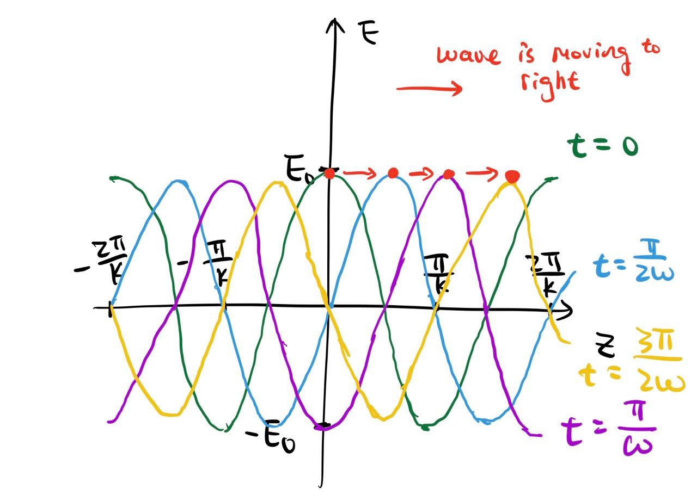

$$
\def\V{\text{V}}
\def\A{\text{A}}
\def\mA{\text{mA}}
\phantom {derivatives}
\newcommand\d{\text{d}}
\def\ffrac(#1/#2){\frac{#1}{#2}}
\def\hfrac #1(#2/#3){\ffrac (#1#2/#1#3)}
\def\deri#1/#2;{\hfrac \d(#1/#2)}
\def\dderi#1/#2;{\nderi #1/#2^2; }
\def\nderi#1/#2^#3;{\ffrac (\d^#3 #1/\d #2^#3)}
\def\derin #1;{\deri /#1;}
\def\pderi#1/#2;{\hfrac \part(#1/#2) }
\def\ppderi#1/#2;{\npderi #1/#2^2;}
\def\npderi#1/#2^#3;{\ffrac (\part^#3 #1/\part #2^#3)}
\def\pderin1/#1;{\ffrac (\part / \part #1)}
\def\fac #1/#2;{\frac{#1}{#2}}

\phantom {fraction}
\def\inv#1{\ffrac (1/#1)}
\newcommand\invsqrt[1]{\frac{1}{\sqrt{#1}}}
\newcommand\half{\frac{1}{2}}
\newcommand\tri{\frac{1}{3}}
\newcommand\quar{\frac{1}{4}}
\phantom {vectors}
\newcommand\vfunc[2]{}

\phantom {common vectors}
\def\vfn #1(#2){\vec #1(\vec #2)}
\def\v #1{\vec #1}
\newcommand\vf{\v f}
\newcommand\vx{\v x}
\newcommand\vy{\v y}
\newcommand\vz{\v z}
\newcommand\vr{\v r}
\newcommand\vv{\v v}
\newcommand\va{\v a}
\newcommand\vtheta{\v \theta}
\newcommand\vphi{\v \phi}
\newcommand\vs{\v s}

\phantom {randomstaff}
\def\tsub#1;{_{\text {#1}}}
\def\sub#1;{_{#1}}
\def\(#1);{\left(#1\right)}
\def\intl#1;{\int_{#1}}
\def\intlh#1;#2;{\int_{#1}^{#2}}
\def\sup#1;{^{#1}}
\def\tsup#1;{^{\text{#1}}}
\def\align[[#1]]{\begin{align*}#1\end{align*}}
\def\note#1!{\fbox{$#1$}}
\def\.#1|;{\left.#1\right|}
\def\ssqrt/#1/;{\sqrt{#1}}
\def\noteeq#1!#2!{\begin{equation} \label{eq:#2} \fbox{$#1$}\end{equation}}
\def\raf#1;{\ref{#1}}
\def\eqraf#1;{\eqref{#1}}
\def\dfac#1/#2;{\dfrac{#1}{#2}}
\def\sqt#1/;{\sqrt{#1}}
\def\sgrt#1/>{\sqrt{#1}}
\def\txt#1;{\text{#1}}
\def\const{\text{const}}
\def\eq#1!#2!{\begin{equation} \label{eq:#2} #1 \end{equation}}
\def\kg{\txt kg;}
\def\s{\txt s;}
\def\m{\txt m;}
\def\stwo{\txt s;^2}
\def\iv#1;{\inv{#1}}
\def\sumninfin{\sum\sub n=1;\sup\infin;}
\def\sumninfinz{\sum\sub n = 0;\sup\infin;}
\def\intinfin{\int\sub-\infin;\sup\infin;}
\def\cases[[#1]]{\begin{cases}#1\end{cases}}
\def\arcsinh{\text{arcsinh}}
\def\eo{\varepsilon_{0}}
$$

#### Problem 1

##### (a)

We know that the capacitance is
$$
C = \varepsilon_0\fac A/d; = \eo \fac \pi R^2/d;
$$

##### (b)

We know that
$$
\deri Q/t; = I = C \deri V/t; \\
$$
and it's true that
$$
\d V = \inv C I\d t  \\
$$
therefore
$$
V = \inv C \int I \d t 
= \fac I_0 /\eo \pi R^2; d \int e\sup i\omega t; \d t 
= -\fac 1 /\eo \pi R^2; \fac i/\omega; I_0 e\sup i\omega t; d
$$

##### (c)

Since there is no current $\vec J$ between the plates, we have
$$
\oint \vec B \cdot \d \vec l = \mu_0 \eo \iint  \pderi \vec E/t; \cdot  \d \vec A
$$
and therefore we see that
$$
E = \fac V/d; = \fac I_0 /\eo \pi R^2; \fac e\sup i\omega t;/ i \omega;
$$
and that
$$
\pderi E/t; = \fac I_0 /\eo \pi R^2; e\sup i\omega t;
$$
and use ampere loop between the plates:
$$
B \cdot 2 \pi s = \mu_0 \eo \cdot  \fac I_0 /\eo \pi R^2; e\sup i\omega t; \cdot \pi s^2
$$
and therefore
$$
B = \fac \mu_0/2\pi; I_0 e^{i\omega t} \cdot \fac s/R^2;
$$

##### (d)

we see that total magnetic flux is
$$
\Phi = \int_0^R B(s) \cdot \d A  
= \int_0^R  \fac \mu_0/2\pi; I_0 e^{i\omega t} \cdot \fac s/R^2; \cdot d \d s \\
= \fac \mu_0/2\pi; I_0 e^{i\omega t} \cdot \fac d/R^2; \int_0^R s\d s \\
= \fac \mu_0/2\pi; I_0 e^{i\omega t} \cdot \fac d/R^2; \fac R^2/2; \\
= \fac \mu_0/4\pi; I_0 e^{i\omega t}d
$$
and therefore
$$
\mathcal{E} = -\pderi \Phi/t; = -\fac \mu_0/4\pi; \fac I_0 e^{i\omega t}/i\omega ;d = \fac \mu_0/4\pi;  \fac i/\omega; \cdot  I_0 e^{i\omega t} d
$$
we see that the factor for $\mathcal E$ is $\fac \mu_0/4\pi;  \fac i/\omega;$, and the factor for $V$ is $-\fac 1 /\eo \pi R^2; \fac i/\omega;$, and we see that they have a $\pi$ phase difference.

#### Problem 2

##### (a)

From lecture, we know that $k = \fac \omega/c;$, where $\omega$ is the angular frequency of the wave and $c$  is the speed of light. The explicit formula for such plane wave is:
$$
\vec E = \hat x  E_0 \cos(kz - \omega t)
$$

##### (b)

See that red dot moves in four different timestamp.

##### (c)

we see that
$$
\vec B = \inv c \hat k \cross \vec E = \inv c (\hat z \cross \hat x)  E_0 \cos(kz - \omega t) = \fac E_0/c; \hat y \cos(kz - \omega t)
$$

##### (d)

we see that
$$
\vec S = \fac 1/\mu_0; \vec E \cross \vec B =  \fac E_0^2/c\mu_0; \cos
^2(kz - \omega t)\hat z \\
$$
and we find that
$$
\langle \vec S \rangle = \fac E_0^2/c\mu_0;\langle \cos
^2(kz - \omega t)\rangle \hat z = \fac E_0^2/2c\mu_0;\hat z
$$

##### (e)

we see that
$$
u_E = \half \eo E^2 = \half \eo E_0^2 \cos^2(kz - \omega t)
$$
and peak value is
$$
u_E = \half \eo E_0^2
$$
and therefore
$$
\langle u_E \rangle = \half \eo E_0^2 \langle \cos^2(kz - \omega t) \rangle = \quar \eo E_0^2
$$
It's half of the peak value.

##### (f)

Notice that $\mu_0 c^2 = \mu_0 \cdot \fac 1/\eo \mu_0; = 1/\eo$

we see that
$$
u_B = \fac 1/2\mu_0; B^2 = \half \fac E_0^2/\mu_0 c^2; \cos^2(kz - \omega t) = \half \eo E_0^2 \cos^2(kz - \omega t)
$$
 and then
$$
\langle u_B \rangle = \half \fac E_0^2/\mu_0 c^2; \langle \cos^2(kz - \omega t) \rangle = \fac E_0^2/4\mu_0 c^2; = \quar \eo E_0^2
$$
we see that the $u_B = u_E$ at all time and space. 

##### (g)

we see that
$$
\langle u \rangle = \langle u_B\rangle + \langle u_E \rangle = \half \eo E_0^2 = \fac E_0^2/2c^2 \mu_0 ;
$$
and that
$$
|\langle \vec S \rangle| =  \fac E_0^2/2c\mu_0;
$$
we see that they are not equal. However, they looks similar, only by a $1/c$ factor off from each other. ($|\langle \vec S \rangle| = c\langle u \rangle$  )