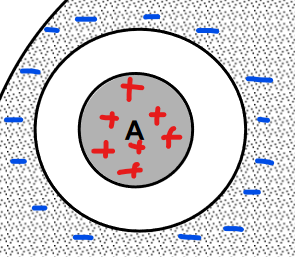
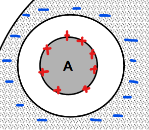
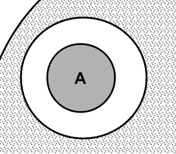

$$
\def\V{\text{V}}
\def\A{\text{A}}
\def\mA{\text{mA}}
\phantom {derivatives}
\newcommand\d{\text{d}}
\def\ffrac(#1/#2){\frac{#1}{#2}}
\def\hfrac #1(#2/#3){\ffrac (#1#2/#1#3)}
\def\deri#1/#2;{\hfrac \d(#1/#2)}
\def\dderi#1/#2;{\nderi #1/#2^2; }
\def\nderi#1/#2^#3;{\ffrac (\d^#3 #1/\d #2^#3)}
\def\derin #1;{\deri /#1;}
\def\pderi#1/#2;{\hfrac \part(#1/#2) }
\def\ppderi#1/#2;{\npderi #1/#2^2;}
\def\npderi#1/#2^#3;{\ffrac (\part^#3 #1/\part #2^#3)}
\def\pderin1/#1;{\ffrac (\part / \part #1)}
\def\fac #1/#2;{\frac{#1}{#2}}

\phantom {fraction}
\def\inv#1{\ffrac (1/#1)}
\newcommand\invsqrt[1]{\frac{1}{\sqrt{#1}}}
\newcommand\half{\frac{1}{2}}
\newcommand\tri{\frac{1}{3}}
\newcommand\quar{\frac{1}{4}}
\phantom {vectors}
\newcommand\vfunc[2]{}

\phantom {common vectors}
\def\vfn #1(#2){\vec #1(\vec #2)}
\def\v #1{\vec #1}
\newcommand\vf{\v f}
\newcommand\vx{\v x}
\newcommand\vy{\v y}
\newcommand\vz{\v z}
\newcommand\vr{\v r}
\newcommand\vv{\v v}
\newcommand\va{\v a}
\newcommand\vtheta{\v \theta}
\newcommand\vphi{\v \phi}
\newcommand\vs{\v s}

\phantom {randomstaff}
\def\tsub#1;{_{\text {#1}}}
\def\sub#1;{_{#1}}
\def\(#1);{\left(#1\right)}
\def\intl#1;{\int_{#1}}
\def\intlh#1;#2;{\int_{#1}^{#2}}
\def\sup#1;{^{#1}}
\def\tsup#1;{^{\text{#1}}}
\def\align[[#1]]{\begin{align*}#1\end{align*}}
\def\note#1!{\fbox{$#1$}}
\def\.#1|;{\left.#1\right|}
\def\ssqrt/#1/;{\sqrt{#1}}
\def\noteeq#1!#2!{\begin{equation} \label{eq:#2} \fbox{$#1$}\end{equation}}
\def\raf#1;{\ref{#1}}
\def\eqraf#1;{\eqref{#1}}
\def\dfac#1/#2;{\dfrac{#1}{#2}}
\def\sqt#1/;{\sqrt{#1}}
\def\sgrt#1/>{\sqrt{#1}}
\def\txt#1;{\text{#1}}
\def\const{\text{const}}
\def\eq#1!#2!{\begin{equation} \label{eq:#2} #1 \end{equation}}
\def\kg{\txt kg;}
\def\s{\txt s;}
\def\m{\txt m;}
\def\stwo{\txt s;^2}
\def\iv#1;{\inv{#1}}
\def\sumninfin{\sum\sub n=1;\sup\infin;}
\def\sumninfinz{\sum\sub n = 0;\sup\infin;}
\def\intinfin{\int\sub-\infin;\sup\infin;}
\def\cases[[#1]]{\begin{cases}#1\end{cases}}
$$

#### Question 1

##### (a)

The charge distribution near $A$ roughly looks like this. Outside the cavity, the electric field is $0$, since the charge enclosed is $0$. In the cavity, according to the gauss law, the electric field is always
$$
4\pi s^2 E = \fac q\tsub enc;/\varepsilon_0; \\
E = \fac Q/4\pi\varepsilon_0; \fac 1/s^2;
$$
and inside the charged spheres $A$, the proportion of total charge of the charged sphere is
$$
\txt proportion; = \fac s^3/r^3;
$$
where $s$ is the distance to the center of the sphere, and thus, the $E$  inside the sphere should be
$$
E = \fac Q/4\pi\varepsilon_0; \fac s/r^3;
$$
thus,
$$
V(A) = \fac Q/4\pi\varepsilon_0;(-\int_R^r  \fac 1/s^2; \d s -\int_r^0 \fac s/r^3; \d s) \\
= \fac Q/4\pi\varepsilon_0; (\fac 1/s;\vline_R^r + \fac 1/r^3;\half s^2\vline_0^r) = \fac Q/4\pi \varepsilon _0; (\fac 3/2r; - \fac 1/R;)
$$
where the $Q = \fac 4/3;\pi r^2 \rho $. So
$$
V(A) = \fac r^2 \rho/3\varepsilon_0;(\fac 3/2r; -\fac 1/R;)
$$

##### (b)

because the "smiling face" is a conductor, the point $C$ will not be affected by the charged sphere $A$ and $B$. Therefore, $V(C) = 0$

##### (c)

Since the "smiling face" is a conductor, the point $A$, $B$, and $C$ is considered to be separated. Therefore, changing the charge density will only affect $V(B)$. $V(A)$ and $V(C)$ will keep the same. Suppose the potential at point $B$ after the sphere $B$'s charge density get doubled is $V(B)'$. Before the charge get doubled, $V(B) =  \fac r^2 \rho/3\varepsilon_0;(\fac 3/2r; -\fac 1/R;)$ (just as the $V(A)$ calculated above). From the formula, since the $\rho$ get doubled, we could see that $V(B)$ just get doubled (that is, $V(B)' = V(B)$).

##### (d)

If they are changed to conducting spheres. Then for $A$, its charge distribution is shown below

Therefore, the electric field outside the charged sphere is
$$
E = \fac Q/4\pi\varepsilon_0; \fac 1/s^2;
$$
and the $E = 0$ inside the charge sphere. Therefore, 
$$
V(A) =  \fac Q/4\pi\varepsilon_0;(-\int_R^r  \fac 1/s^2; \d s) = \fac Q/4\pi\varepsilon_0; (\fac 1/s;\vline_R^r) = \fac Q/4\pi\varepsilon_0;(\fac 1/r; -\fac 1/R;)
$$
and for sphere $B$, it is
$$
V(B) = -\fac Q/4\pi\varepsilon_0;(\fac 1/r; -\fac 1/R;)
$$
The potential difference is
$$
V(A) - V(B) = \fac 2Q/4\pi\varepsilon_0;(\fac 1/r; -\fac 1/R;)
$$
However, using what we learned about capacitance and potential matrices. Suppose connect $B$ to the ground, the $V(A)$ will not result in a $Q_B$ in sphere $B$ because they are shielded by the bigger "smiling face". That means the $C_{12}$ and $C_{21}$ is zero and there are no mutual capacitance, i.e., their capacitance between them is always $0$.

##### (e)

This system could just be seen as a concentric sphere, and there are existing formula for the capacitance (either in book / wiki). It's
$$
C = \fac 4\pi \varepsilon/{\fac 1/r; -\fac 1/R;};
$$

#### Question 2

##### (a)

Since the potential does not depend on the $\theta$ and $\phi$, the electric field is only in the radial direction (pointing outwards from the origin, since the potential is decreasing as $r$ increase)

##### (b)

We know that $E(r) = \nabla V(r)$, thus
$$
E(r) = -\nabla V(r) = -\pderi V(r)/r; \hat r = \fac qe^{-2r/a_0} (a_0^2 +2r^2 + 2a_0 r)/4\pi \varepsilon_0 r^2 a_0^2;\hat r
$$

##### (c)

We know that $-\nabla^2 V(r) = \nabla \cdot E(r) = \fac \rho/\varepsilon_0;$, thus
$$
\nabla \cdot E(r) = \inv{r^2}\pderi r^2 E_r/r; = -\inv{r^2}\fac qr^2/\pi \varepsilon_0 a_0^3;e^{-2r/a_0} = -\fac q/\pi \varepsilon_0 a_0^3;e^{-2r/a_0} = \fac \rho/\varepsilon_0;
$$
and thus
$$
\rho_e = -\fac q/\pi a_0^3;e^{-2r/a_0}
$$
This is, however, only the charge density of the electron cloud of the hydrogen atom. The actual charge density needs include the positive charge of the proton at the origin, therefore
$$
\rho = -\fac q/\pi a_0^3;e^{-2r/a_0} + q\delta(r)
$$

##### (d)

Do serial expansion of $e^{-2r/a_0}$:
$$
\begin{align}
V(r) &= \fac q/4\pi \varepsilon_0 r; (1 + \fac r/a_0;)(1 - 2\fac r/a_0;+ 2\fac r^2/a_0^2; + \cdots ) \\ 
&= \fac q/4\pi \varepsilon_0;(\fac 1/r; + \fac 1/a_0;)(1 - 2\fac r/a_0;+ 2\fac r^2/a_0^2; + \cdots ) \\ 
&= \fac q/4\pi\varepsilon_0;(\fac 1/r; + \fac 1/a_0; - 2 \fac 1/a_0; - 2\fac r/a_0^2;+\cdots) \\ 
&= \fac q/4\pi\varepsilon_0;(\fac 1/r; - \fac 1/a_0;) \quad \text{(higher order are omitted)}
\end{align}
$$
Indeed resemble a point charge.

The point charge located at origin has the charge distribution of
$$
\rho = q\delta(r)
$$
that means the density is $q$ at origin, and $0$ elsewhere, and thus using Gauss law
$$
\begin{align}
\nabla^2 V(r) &= -\fac \rho/\varepsilon_0; \\
\fac q/4\pi\varepsilon_0; \nabla^2 \fac 1/r; &= -\fac q\delta(r)/\varepsilon_0; \\
\nabla^2 \fac 1/r; &= -4\pi\delta(r)
\end{align}
$$
similarly, we could derive that
$$
\nabla^2 \fac 1/|\vec r - \vec r_0|; = -4\pi\delta(|\vec r - \vec r_0|)
$$

##### (e)

The electrostatic field at this distance is
$$
E(a_0) = \fac qe^{-2a_0/a_0} (a_0^2 +2a_0^2 + 2a_0^2)/4\pi \varepsilon_0 a_0^4;\hat r = \fac 5qe^{-2}/4\pi \varepsilon_0 a_0^2;
$$
and using Gauss's law, we get
$$
4\pi a_0^2 E(a_0) = \fac q\tsub enc;/\varepsilon_0; \\
\note q\tsub enc; = 5qe^{-2}!
$$
