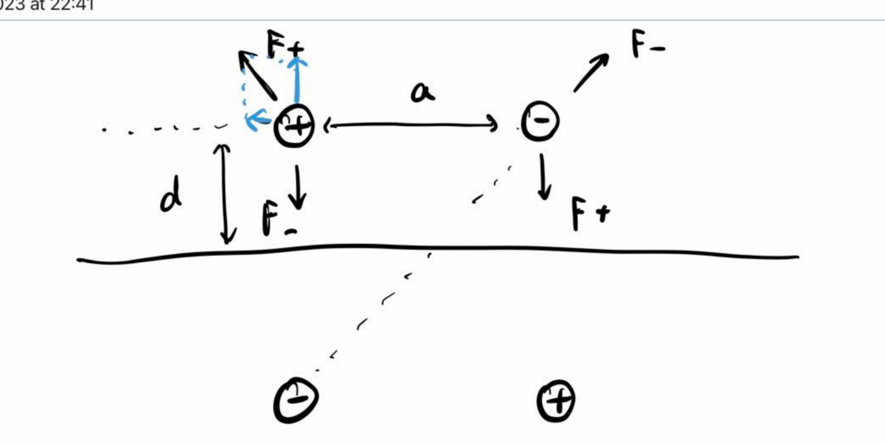
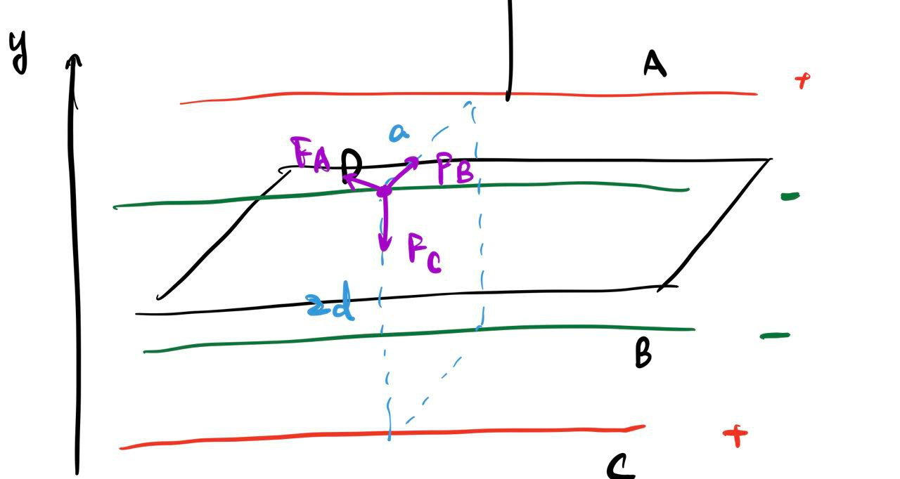
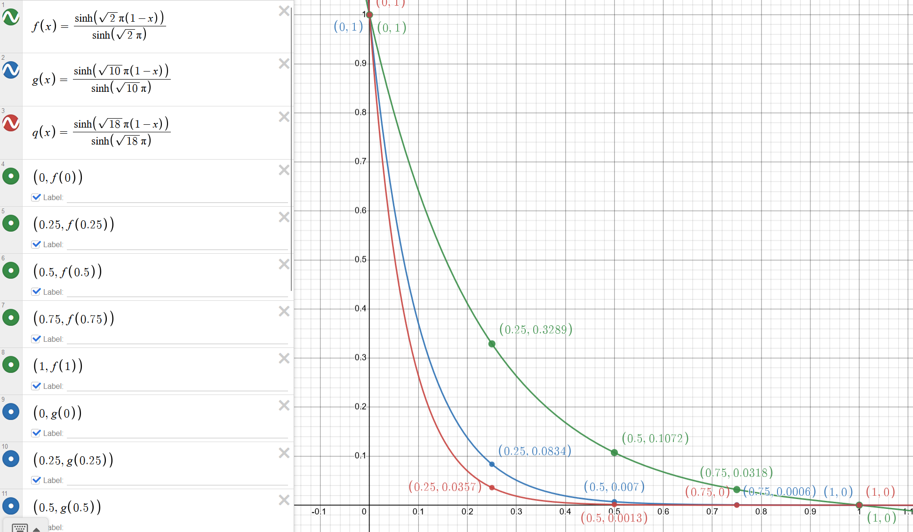

We use the image method, and we need to have a image dipole shown as below:

We could then find the force on one ion (we don't consider the force between the $Na$ and $Cl$ since we are consider the force between the plane and the molecule as a whole)
$$
F_{Na, y} = \fac 1/4\pi\varepsilon_0; (-\fac Q^2/(2d)^2; + \fac Q^2/(2d)^2 + a^ 2; \cdot \fac 2d/\sqrt{(2d)^2 + a^2};) \\
= \fac Q^2/4\pi\varepsilon_0;(\fac 2d/(4d^2 + a^2)^{3/2}; - \fac 1/4d^2;)\hat y
$$
we only consider the $y$ direction force since the $x$ direction will cancel out when consider the molecule as a whole, and therefore (we double the force)
$$
F\tsub total; = \fac Q^2/2\pi\varepsilon_0; (\fac 2d/(4d^2 + a^2)^{3/2}; - \fac 1/4d^2;)\hat y
$$
The dependence on $d$ is somewhat related to $\fac 1/d^2;$. This is similar to case of a single charge.

We could just do an integral to the infinity, to see how much work done
$$
W = \fac Q^2/2\pi\varepsilon_0; \int_\infin^d \fac 2y/(4y^2 + a^2)^{3/2}; - \inv {4y^2}\d y \\
= \fac Q^2/2\pi\varepsilon_0;(\fac 1/4d; -\fac 1/2\sqrt{4d^2 + a^2};)
$$

we could do an image wires just as image dipole, shown below:

and we thus know that the force per unit length (I use symbol $f$ to represent it) in the $y$ direction is
$$
f_y = \fac \lambda^2/2\pi \varepsilon_0; (-\fac 1/2d; +\fac 2d/4d^2 + a^2;)
$$
and in the direction pointing out from other wire is
$$
f = \fac \lambda^2/ 2\pi\varepsilon_0;(-\fac 1/2a; + \fac a/4d^2 + a^2;)
$$
when calculating the total potential energy for both wires (since $a$ is fixed), we only care about the force in $y$ direction.

and thus
$$
W = \fac \lambda^2/2\pi\varepsilon_0;\int_\infin^d \fac 2y/4y^2 + a^2; - \fac 1/2y; \d y = \fac \lambda^2/2\pi\varepsilon_0;\quar (\ln (4d^2 + a^2) - 2\ln d - \ln 4)
$$

#### Problem 2

$$
\def\pxa{{\fac \pi x/a;}}
\def\pyb{{\fac \pi y/b;}}
\def\spxa{\sin(\pxa)}
\def\cpxa{\cos(\pxa)}
\def\spyb{\sin(\pyb)}
\def\cpyb{\cos(\pyb)}
\def\coss{\cos^2}
$$

We know that
$$
V(x, y, z= 0) = V_0 \spxa \cos^2 (\pxa) \spyb \coss (\pyb) \\
= V_0 \spxa \cpxa \spyb \cpyb \cpxa \cpyb \\
= \quar V_0 \sin(2\pxa) \sin (2\pyb) \cpxa \cpyb \\
= \inv {16} V_0 (\sin (3\pxa) + \spxa)(\sin (3\pyb) + \spyb) \\
= \inv {16} V_0 \(\sin (3\pxa)\sin (3\pyb) + \sin(3\pxa) \spyb + \spxa \sin (3\pyb) + \spxa \spyb);
$$
Since we already know that
$$
V(x, y, z) = \sum_{m= 1}^{\infin} \sum_{n= 1}^{\infin}A_{mn} \sin(\fac m\pi x/b;) \sin(\fac n \pi y/b;)\fac \sinh(\Gamma_{mn} (c-z))/\sinh (\Gamma_{mn} c);
$$
and thus
$$
V(x, y, z = 0) = \sum_{m= 1}^{\infin} \sum_{n= 1}^{\infin}A_{mn} \sin(\fac m\pi x/b;) \sin(\fac n \pi y/b;)
$$
that means
$$
\sum_{m= 1}^{\infin} \sum_{n= 1}^{\infin}A_{mn} \sin(\fac m\pi x/b;) \sin(\fac n \pi y/b;) = \inv {16} V_0 \(\sin (3\pxa)\sin (3\pyb) + \sin(3\pxa) \spyb + \spxa \sin (3\pyb) + \spxa \spyb);
$$
which indicates that $A_{mn}$ should only be nonzero coefficients when
$$
(m, n) = (1, 1), \ (1, 3), \ (3, 1), \ (3, 3)
$$

we could easily identify the value of $A_{mn}$, there are
$$
A_{11} = A_{13} = A_{31} = A_{33} = \inv {16} V_0
$$

we know that
$$
\int_0^ a \sin(\fac n\pi x/a;) \sin(\fac n'\pi x/a;) \d x = \begin{cases}
0 \quad &n' \neq n \\
\fac a/2; \quad &n' = n
\end{cases}
$$

now we do the integral explicitly
$$
A_{mn} = \fac 4/ab; \int_0^a \d x \int_0^b \d y \sin(\fac m\pi x/a;)\sin(\fac n \pi y/b;)V(x, y) \\
= \fac 4/ab; \inv {16}V_0 (\int_0^a \sin (3\pxa)\sin(\fac m\pi x/a;) \d x \int_0^b  \sin (3\pyb) \sin(\fac n \pi y/b;) \d y\\ 
 + \int_0^a  \sin(3\pxa)\sin(\fac m\pi x/a;) \d x\int_0^b  \spyb  \sin(\fac n \pi y/b;) \d y  \\ 
 + \int_0^a   \spxa   \sin(\fac m\pi x/a;) \d x \int_0^b \sin (3\pyb)\sin(\fac n \pi y/b;)\d y\\
 + \int_0^a \spxa  \sin(\fac m\pi x/a;)\d x \int_0^b \spyb\sin(\fac n \pi y/b;)) \d y  \\
 = \fac V_0 /4ab; \cdot \begin{cases}
 \fac ab/4; \quad &(m, n) = (1, 1), \ (1, 3), \ (3, 1), \ (3, 3) \\
0 \quad & \txt otherwise; \\
\end{cases}
$$

and therefore
$$
A_{mn} = \begin{cases}
 \inv{16} V_0 \quad &(m, n) = (1, 1), \ (1, 3), \ (3, 1), \ (3, 3) \\
0 \quad & \txt otherwise; \\
\end{cases}
$$
which agrees with **(a)**

Let $x = y = \fac a/4;$ and $a = b$, thus
$$
\Gamma_{mn} = \fac \pi/a; \sqrt {m^2 + n^2}
$$

and thus we have

|                                                         | $z = 0$ | $z = 0.25 c$                                                 | $z = 0.5c$                                                   | $z = 0.75c$                                                  | $z = c$ |
| ------------------------------------------------------- | ------- | ------------------------------------------------------------ | ------------------------------------------------------------ | ------------------------------------------------------------ | ------- |
| $\fac \sinh(\Gamma_{mn}(c - z)) /\sinh(\Gamma_{mn}c) ;$ | $1$     | $\fac \sinh({\fac 3/4;} \Gamma_{mn} c) /\sinh(\Gamma_{mn}c) ;$ | $\fac \sinh({\fac 2/4;} \Gamma_{mn} c) /\sinh(\Gamma_{mn}c) ;$ | $\fac \sinh({\fac 1/4;} \Gamma_{mn} c) /\sinh(\Gamma_{mn}c) ;$ | $0$     |

we could not further simply the $\sinh$ chunk. We could just assume $c = a$, this won't change the overall behavior that we want to observe later.

and then
$$
\sin \fac m \pi x/a; \sin \fac n\pi y/b; = \sin \fac m\pi/4;\sin \fac n\pi/4; = \half \quad \text{ for } (m, n) = (1, 1), \ (1, 3), \ (3, 1), \ (3, 3)
$$

| Each term   | $(1, 1)$                      | $(1, 3)$                        | $(3, 1)$                        | $(3,3)$                          |
| ----------- | ----------------------------- | ------------------------------- | ------------------------------- | -------------------------------- |
| $z = 0$     | $\fac 1/32; V_0$              | $\fac 1/32; V_0$                | $\fac 1/32; V_0$                | $\fac 1/32; V_0$                 |
| $z = 0.25c$ | $\fac 1/32; V_0 \cdot 0.329$  | $\fac 1/32; V_0 \cdot 0.0834$   | $\fac 1/32; V_0 \cdot 0.0834$   | $\fac 1/32; V_0 \cdot 0.0357$    |
| $z = 0.5c$  | $\fac 1/32; V_0 \cdot 0.107$  | $\fac 1/32; V_0 \cdot 0.00696$  | $\fac 1/32; V_0 \cdot 0.00696$  | $\fac 1/32; V_0 \cdot 0.00128$   |
| $z = 0.75c$ | $\fac 1/32; V_0 \cdot 0.0318$ | $\fac 1/32; V_0 \cdot 0.000577$ | $\fac 1/32; V_0 \cdot 0.000577$ | $\fac 1/32; V_0 \cdot 0.0000455$ |
| $z = c$     | $0$                           | $0$                             | $0$                             | $0$                              |

As $z$ become higher, the difference between $\sinh(\Gamma_{mn}(c-z))$ and $\sinh(\Gamma_{mn}c)$ becomes bigger for same index, and that is the reason why the higher index contributes fall off quicker, as shown in the table. The table shows the trends that the potential decreases as index becomes higher for different $z$. (except $ z= 0$ and $z = c$, which are edge cases).

You could also see via **https://www.desmos.com/calculator/izjlirwqlu**

Notice only three curves are drawn, that is because the curve for $(m, n) = (1, 3)$ is the same as $(m, n) = (3, 1)$, and for simplicity, only of of two is drawn.

 It indeed shows that the higher indices have more rapid attenuation as $z$ increases from $0$

The term $(m, n) = (3, 3)$ attenuate most rapidly as $z$ increases from $0$ to $c$. If $\sqrt{m^2 + n^2}$ is bigger ($m$ and $n$ both becomes bigger), the curve will more curve towards the origin (that is, decrease more rapidly as $z$ increases).

