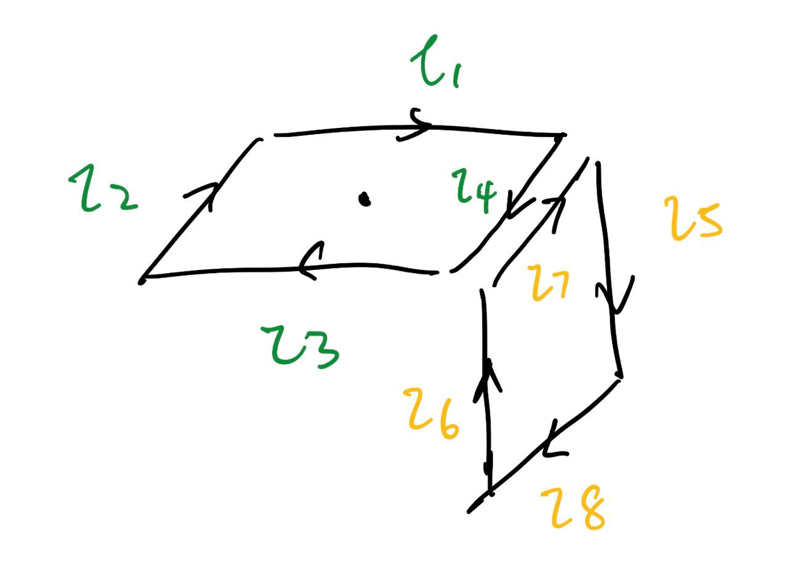

$$
\def\V{\text{V}}
\def\A{\text{A}}
\def\mA{\text{mA}}
\phantom {derivatives}
\newcommand\d{\text{d}}
\def\ffrac(#1/#2){\frac{#1}{#2}}
\def\hfrac #1(#2/#3){\ffrac (#1#2/#1#3)}
\def\deri#1/#2;{\hfrac \d(#1/#2)}
\def\dderi#1/#2;{\nderi #1/#2^2; }
\def\nderi#1/#2^#3;{\ffrac (\d^#3 #1/\d #2^#3)}
\def\derin #1;{\deri /#1;}
\def\pderi#1/#2;{\hfrac \part(#1/#2) }
\def\ppderi#1/#2;{\npderi #1/#2^2;}
\def\npderi#1/#2^#3;{\ffrac (\part^#3 #1/\part #2^#3)}
\def\pderin1/#1;{\ffrac (\part / \part #1)}
\def\fac #1/#2;{\frac{#1}{#2}}

\phantom {fraction}
\def\inv#1{\ffrac (1/#1)}
\newcommand\invsqrt[1]{\frac{1}{\sqrt{#1}}}
\newcommand\half{\frac{1}{2}}
\newcommand\tri{\frac{1}{3}}
\newcommand\quar{\frac{1}{4}}
\phantom {vectors}
\newcommand\vfunc[2]{}

\phantom {common vectors}
\def\vfn #1(#2){\vec #1(\vec #2)}
\def\v #1{\vec #1}
\newcommand\vf{\v f}
\newcommand\vx{\v x}
\newcommand\vy{\v y}
\newcommand\vz{\v z}
\newcommand\vr{\v r}
\newcommand\vv{\v v}
\newcommand\va{\v a}
\newcommand\vtheta{\v \theta}
\newcommand\vphi{\v \phi}
\newcommand\vs{\v s}

\phantom {randomstaff}
\def\tsub#1;{_{\text {#1}}}
\def\sub#1;{_{#1}}
\def\(#1);{\left(#1\right)}
\def\intl#1;{\int_{#1}}
\def\intlh#1;#2;{\int_{#1}^{#2}}
\def\sup#1;{^{#1}}
\def\tsup#1;{^{\text{#1}}}
\def\align[[#1]]{\begin{align*}#1\end{align*}}
\def\note#1!{\fbox{$#1$}}
\def\.#1|;{\left.#1\right|}
\def\ssqrt/#1/;{\sqrt{#1}}
\def\noteeq#1!#2!{\begin{equation} \label{eq:#2} \fbox{$#1$}\end{equation}}
\def\raf#1;{\ref{#1}}
\def\eqraf#1;{\eqref{#1}}
\def\dfac#1/#2;{\dfrac{#1}{#2}}
\def\sqt#1/;{\sqrt{#1}}
\def\sgrt#1/>{\sqrt{#1}}
\def\txt#1;{\text{#1}}
\def\const{\text{const}}
\def\eq#1!#2!{\begin{equation} \label{eq:#2} #1 \end{equation}}
\def\kg{\txt kg;}
\def\s{\txt s;}
\def\m{\txt m;}
\def\stwo{\txt s;^2}
\def\iv#1;{\inv{#1}}
\def\sumninfin{\sum\sub n=1;\sup\infin;}
\def\sumninfinz{\sum\sub n = 0;\sup\infin;}
\def\intinfin{\int\sub-\infin;\sup\infin;}
\def\cases[[#1]]{\begin{cases}#1\end{cases}}
\def\arcsinh{\text{arcsinh}}
$$

#### Problem 1

##### (a)

We could divide this current loop into two smaller loops as the **Example 5.13** in textbook does. Therefore, this two smaller loops gives the magnetic dipole moment of
$$
\vec m = -IL^2\hat y - IL^2 \hat z
$$

##### (b)

we know that 

$$
\vec A = \fac \mu_0 I/4\pi; \int \fac 1/|r - r'|;\d \vec l'
$$
At the point $a = (0, L/2, L)$, we see that if we split the current as shown above (we introduced $l_5$ and $l_7$ but they cancel each other so it's okay), the $l_1, l_2, l_3, l_4$ will cancel each other due to symmetry. Also, $l_6$ and $l_5$ will also cancel each other due to symmetry. We see that in this case only $l_7$ and $l_8$ contribute to the final $\vec A$. Therefore
$$
\vec A = \fac \mu_0 I/ 4\pi;(\int_{-L/2}^{L/2} \fac 1/\sqrt{\fac L^2/4; + L^2 + x^2}; -\fac 1/\sqrt{\fac L^2/4; + x^2}; \d x )\hat x \\
$$
We find that
$$
\vec A = \fac \mu_0 I/4\pi;\.\(\arcsinh(\fac 2x/\sqrt 5 L;) - \arcsinh (\fac 2x/L;) );|;^{L/2}_{-L/2}\hat x \\ 
= \fac \mu_0 I/2\pi;\(\arcsinh(\fac 1/\sqrt 5;) - \arcsinh(1)); \hat x
$$

##### (c)

Similar to $(b)$, except this time we find that all $l_1, l_2, l_3, l_4, l_5, l_6, l_7, l_8$ cancelled each other due to symmetry. So
$$
\vec A = \vec 0
$$

##### (d)

Point $c = (0, L, L/2)$. Similar to $(b)$, except this time only $l_2$ and $l_4$ contribute to final $\vec A$. We see that (it's almost identical to $(b)$ except the sign in the integral)
$$
\vec A = \fac \mu_0 I/ 4\pi;(\int_{-L/2}^{L/2} -\fac 1/\sqrt{\fac L^2/4; + L^2 + x^2}; + \fac 1/\sqrt{\fac L^2/4; + x^2}; \d x )\hat x \\
$$
and we get:
$$
\vec A = \fac \mu_0 I/4\pi;\.\(-\arcsinh(\fac 2x/\sqrt 5 L;) + \arcsinh (\fac 2x/L;) );|;^{L/2}_{-L/2}\hat x \\ 
= \fac \mu_0 I/2\pi;\(\arcsinh(1) - \arcsinh(\fac 1/\sqrt 5;)); \hat x
$$

##### (e)

We could therefore calculate the vector potential $\vec A$ (given $\vec r = x\hat x + y\hat y + z\hat z$ and $z \to \infin$, and $z \gg x, z\gg y$)
$$
\vec A = \fac \mu_0 /4\pi;\fac (-IL^2\hat y - IL^2 \hat z) \cross (x\hat x + y\hat y + z\hat z)/(x^2 +y^2 + z^2)^{3/2}; \\
= \fac \mu_0 I/4\pi; \fac L^2/(x^2 +y^2 + z^2)^{3/2};(x \hat z - x\hat y + (y  - z)\hat x)
$$
and since $z \gg x, z \gg y$, we could do the simplification of the $r^3 = z^3$ instead of $r^3 = (x^2 +y^2 + z^2)^{3/2}$, and it becomes
$$
\vec A = \fac \mu_0 I/4\pi; \fac L^2/z^3;(x \hat z - x\hat y + (y  - z)\hat x)
$$

##### (f)

We want to the magnetic field at the points along the z-axis, so
$$
\vec B = \vec \nabla \cross \vec A \\
=\fac \mu_0 I/4\pi; L^2 \cdot \vec \nabla \cross (
\fac y - z/z^3;\hat x - \fac x/z^3;\hat y +  \fac x/z^3; \hat z ) \\
= \fac \mu_0 I/4\pi; L^2 (-\fac 3x/z^4; \hat x + (\fac 2z-3y/z^4; - \fac 1/z^3;)\hat y  + (-\fac 1/z^3; - \fac 1/z^3;)\hat z)
$$
Now set $x = y = 0$, we get
$$
\vec B = \fac \mu_0 I/4\pi; L^2 (\fac 1/z^3;\hat y  -\fac 2/z^3;\hat z)
$$

#### Problem 2

##### (a)

From Wikipedia, the Bohr magneton is $\mu_B = 9.274 \cdot 10^{-24} J \cdot T^{-1}$, since the electron spin points to +z direction, the $m_s = +1/2$ and therefore
$$
\vec m = -2 \cdot  9.274 \cdot 10^{-24} \cdot \fac 1/2; \hat z \\
= -9.274 \cdot 10^{-24} \hat z = -\mu_B \hat z
$$

##### (b)

$$
\vec A = \fac \mu_0/4\pi; \fac \vec m \cross \vec r/r^3; = \fac \mu_0/4\pi; \fac -9.274 \cdot 10^{-24} \hat z \cross 0.1 \hat z  /r^3; = \vec 0
$$

##### (c)

It's similar to part $(b)$, vector potential at 0.2 nm and 0.5 nm is also $\vec 0$.

##### (d)

we want to find the vector potential near the z-axis, so $z\gg x, z\gg y$ and we could use $z^3$ to replace $r^3$. Then,
$$
\vec A = \fac \mu_0/4\pi; \fac -\mu_B \hat z \cross (x\hat x + y\hat y  + z \hat z) /z^3; = \fac \mu_0/4\pi; \fac -\mu_B x \hat y + \mu_By\hat x /z^3;
$$
Then,
$$
\vec B = \vec \nabla \cross \vec A \\ 
= \fac \mu_0/4\pi;\mu_B \cdot \vec \nabla \cross \(-\fac x/z^3; \hat y + \fac y/z^3;\hat x); \\
= \fac \mu_0/4\pi;\mu_B \cdot (-3\fac x/z^4; \hat x - 3\fac y/z^4;\hat y + (-\fac 1/z^3; - \fac 1/z^3;)\hat z) \\
$$
set $x = y = 0$ so we get the $B$ on z-axis
$$
\vec B = -\fac \mu_0/2\pi; \fac \mu_B/z^3; \hat z
$$
We see that
$$
\vec B\tsub 0.1; = -2\cdot 10^{-7} \fac 9.274 \cdot 10^{-24}/10^{-30}; \hat z  = -1.855 T\hat z \\
\vec B\tsub 0.2; = -2\cdot 10^{-7} \fac 9.274 \cdot 10^{-24}/4 \cdot 10^{-30}; \hat z  = 4.637 \cdot 10^{-1}T\hat z \\
\vec B\tsub 0.5; = -2\cdot 10^{-7} \fac 9.274 \cdot 10^{-24}/25 \cdot 10^{-30}; \hat z  = 7.419 \cdot 10^{-2}T\hat z \\
$$

##### (e)

Similarly, we have
$$
\vec A = \fac \mu_0/4\pi; \fac \vec m \cross \vec r/r^3; = \fac \mu_0/4\pi; \fac -\mu_B \hat z \cross x \hat x  /x^3; = \fac \mu_0/4\pi; \fac -\mu_B  \hat y /x^2;
$$
and therefore
$$
\vec A\tsub 0.1; = 10^{-7} \fac -9.274 \cdot 10^{-24}   \hat y /10^{-20}; =  -9.274 \cdot 10^{-11} Tm\hat y \\

\vec A\tsub 0.2; = 10^{-7} \fac -9.274 \cdot 10^{-24}   \hat y /4 \cdot 10^{-20}; = -2.319 \cdot 10^{-11}Tm\hat y \\

\vec A\tsub 0.5; = 10^{-7} \fac -9.274 \cdot 10^{-24}   \hat y /4 \cdot 10^{-20}; = -3.710 \cdot 10^{-12}Tm\hat y \\
$$

##### (f)

$$
\vec B = \fac \mu_0/4\pi; (\fac 3 x\hat x (-\mu_B \hat z \cdot x\hat x) / x^5; - \fac -\mu_B\hat z/x^3;) = \fac \mu_0/4\pi; \fac \mu_B/x^3; \hat z
$$

and we see that
$$
\vec B\tsub 0.1; = 10^{-7} \fac 9.274 \cdot 10^{-24}/10^{-30}; \hat z  = 9.274 \cdot 10^{-1}T \hat z \\
\vec B\tsub 0.2; = 10^{-7} \fac 9.274 \cdot 10^{-24}/4 \cdot 10^{-30}; \hat z  = 2.319 \cdot 10^{-1}T \hat z \\
\vec B\tsub 0.5; = 10^{-7} \fac 9.274 \cdot 10^{-24}/25 \cdot 10^{-30}; \hat z  = 3.710 \cdot 10^{-2}T \hat z \\
$$

##### (g)

When it's on the z-axis, we see that
$$
U = -\vec m \cdot \vec B = -(-\mu_B \hat z) \cdot -\fac \mu_0/2\pi; \fac \mu_B/z^3; \hat z = -\fac \mu_0/2\pi; \fac \mu_B^2 /z^3;
$$
Then we see
$$
U\tsub 0.1; = -2 \cdot 10^{-7} \fac (9.274 \cdot 10^{-24})^2/10^{-30}; \hat z = -1.720 \cdot 10^{-23}T\hat z \\
U\tsub 0.2; = -2 \cdot 10^{-7} \fac (9.274 \cdot 10^{-24})^2/4 \cdot 10^{-30}; \hat z = -4.300 \cdot 10^{-24}T\hat z \\
U\tsub 0.5; = -2 \cdot 10^{-7} \fac (9.274 \cdot 10^{-24})^2/25 \cdot 10^{-30}; \hat z = -6.881 \cdot 10^{-25}T\hat z \\
$$
and when we change the spin to -z-direction, we see that $\vec m = \mu_B \hat z$ now, and $\vec B = \fac \mu_0/2\pi; \fac \mu_B/z^3; \hat z$. Since they both change their sign, the potential energy doesn't change. 

When it's on the x-axis, we see that
$$
U = -\vec m \cdot \vec B = -(-\mu_B \hat z) \cdot \fac \mu_0/4\pi; \fac \mu_B/x^3; \hat z = \fac \mu_0/4\pi; \fac \mu_B^2 /x^3;
$$

$$
U\tsub 0.1; = 10^{-7} \fac (9.274 \cdot 10^{-24})^2/10^{-30}; \hat z = 8.601 \cdot 10^{-23}T\hat z \\
U\tsub 0.2; = 10^{-7} \fac (9.274 \cdot 10^{-24})^2/4 \cdot 10^{-30}; \hat z = 2.150 \cdot 10^{-24}T\hat z \\
U\tsub 0.5; = 10^{-7} \fac (9.274 \cdot 10^{-24})^2/25 \cdot 10^{-30}; \hat z = 3.440 \cdot 10^{-25}T\hat z \\
$$

and when we change the spin to -z-direction, we see that $\vec m = \mu_B \hat z$ now, and $\vec B = -\fac \mu_0/4\pi; \fac \mu_B/x^3; \hat z$. Since they both change their sign, the potential energy doesn't change. 

