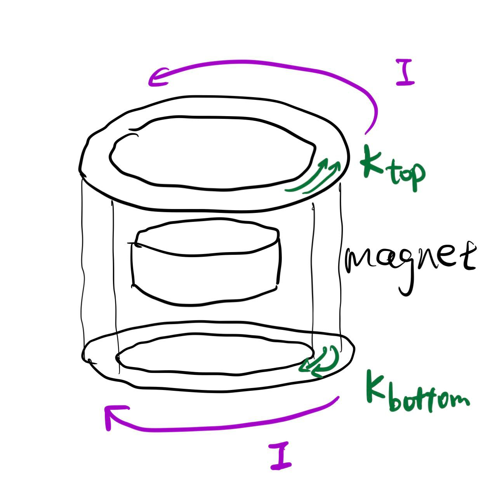

$$
\def\V{\text{V}}
\def\A{\text{A}}
\def\mA{\text{mA}}
\phantom {derivatives}
\newcommand\d{\text{d}}
\def\ffrac(#1/#2){\frac{#1}{#2}}
\def\hfrac #1(#2/#3){\ffrac (#1#2/#1#3)}
\def\deri#1/#2;{\hfrac \d(#1/#2)}
\def\dderi#1/#2;{\nderi #1/#2^2; }
\def\nderi#1/#2^#3;{\ffrac (\d^#3 #1/\d #2^#3)}
\def\derin #1;{\deri /#1;}
\def\pderi#1/#2;{\hfrac \part(#1/#2) }
\def\ppderi#1/#2;{\npderi #1/#2^2;}
\def\npderi#1/#2^#3;{\ffrac (\part^#3 #1/\part #2^#3)}
\def\pderin1/#1;{\ffrac (\part / \part #1)}
\def\fac #1/#2;{\frac{#1}{#2}}

\phantom {fraction}
\def\inv#1{\ffrac (1/#1)}
\newcommand\invsqrt[1]{\frac{1}{\sqrt{#1}}}
\newcommand\half{\frac{1}{2}}
\newcommand\tri{\frac{1}{3}}
\newcommand\quar{\frac{1}{4}}
\phantom {vectors}
\newcommand\vfunc[2]{}

\phantom {common vectors}
\def\vfn #1(#2){\vec #1(\vec #2)}
\def\v #1{\vec #1}
\newcommand\vf{\v f}
\newcommand\vx{\v x}
\newcommand\vy{\v y}
\newcommand\vz{\v z}
\newcommand\vr{\v r}
\newcommand\vv{\v v}
\newcommand\va{\v a}
\newcommand\vtheta{\v \theta}
\newcommand\vphi{\v \phi}
\newcommand\vs{\v s}

\phantom {randomstaff}
\def\tsub#1;{_{\text {#1}}}
\def\sub#1;{_{#1}}
\def\(#1);{\left(#1\right)}
\def\intl#1;{\int_{#1}}
\def\intlh#1;#2;{\int_{#1}^{#2}}
\def\sup#1;{^{#1}}
\def\tsup#1;{^{\text{#1}}}
\def\align[[#1]]{\begin{align*}#1\end{align*}}
\def\note#1!{\fbox{$#1$}}
\def\.#1|;{\left.#1\right|}
\def\ssqrt/#1/;{\sqrt{#1}}
\def\noteeq#1!#2!{\begin{equation} \label{eq:#2} \fbox{$#1$}\end{equation}}
\def\raf#1;{\ref{#1}}
\def\eqraf#1;{\eqref{#1}}
\def\dfac#1/#2;{\dfrac{#1}{#2}}
\def\sqt#1/;{\sqrt{#1}}
\def\sgrt#1/>{\sqrt{#1}}
\def\txt#1;{\text{#1}}
\def\const{\text{const}}
\def\eq#1!#2!{\begin{equation} \label{eq:#2} #1 \end{equation}}
\def\kg{\txt kg;}
\def\s{\txt s;}
\def\m{\txt m;}
\def\stwo{\txt s;^2}
\def\iv#1;{\inv{#1}}
\def\sumninfin{\sum\sub n=1;\sup\infin;}
\def\sumninfinz{\sum\sub n = 0;\sup\infin;}
\def\intinfin{\int\sub-\infin;\sup\infin;}
\def\cases[[#1]]{\begin{cases}#1\end{cases}}
\def\arcsinh{\text{arcsinh}}
$$

#### Problem 1

##### (a)

We know that the $\vec M = n \vec m $, and we know the volume of the magnet $V = \pi R^2 t$, and therefore, the $\vec m = V\vec M = \pi R^2 t M_0 \hat z$

##### (b)

we see that $\vec \nabla \cdot \vec H = - \vec \nabla \cdot \vec M$. We know that the $\vec \nabla \cdot \vec M = 0$ inside the magnet, therefore the $\vec \nabla \cdot \vec H = 0$, since we know that $\vec \nabla \cross \vec H = 0$, that means the $\vec H\tsub in; = 0$, and therefore, $\vec B\tsub in; = \mu_0 (\vec H + \vec M) = \mu_0 \vec M$. Since that $\vec \nabla \cdot \vec B = 0$ always, so the magnetic field just outside the magnet is the same as the magnetic field just below the magnet surface, $\vec B\tsub in; = \vec B\tsub out;$. Since outside the magnet, $\vec H\tsub out; = \vec B\tsub out;/ \mu_0$, therefore, $\vec B\tsub out; = \vec B\tsub in; = \mu_0 \vec M = \mu \vec H\tsub out;$.

##### (c)

We know that
$$
\vec B(\vec r) = \fac \mu_0 / 4\pi; (\fac 3(\vec m \cdot \vec r) \vec r/ r^5; - \fac \vec m / r^3;)
$$
since we only approximate the magnetic field around the magnet, we could use the $\vec m$ we calculate from part $(a)$, and therefore we get (let $\vec r = x\hat x + y\hat y + z\hat z$, and suppose the magnet is centered at the origin)
$$
0\vec B(\vec r) = \fac \mu_0 / 4\pi; (\fac 3(\vec m \cdot \vec r) \vec r/ r^5; - \fac \vec m / r^3;) \\
= \fac \mu_0 / 4\pi; (\fac 3 (\pi R^2 t M_0 z) \vec r / r^5; -  \fac \pi R^2 t M_0 \hat z/r^3;)
$$
since we want to find the $\vec B_Z(z)$ on the z-axis, we set $x = y = 0$, and therefore
$$
B_Z(z) = \fac \mu_0 / 4\pi; (\fac 3 \pi R^2 t M_0 z^2 / |z|^5; -  \fac \pi R^2 t M_0/|z|^3;) \\
=  \fac \mu_0 / 4\pi; (\fac 3 \pi R^2 t M_0 / |z|^3; -  \fac \pi R^2 t M_0/|z|^3;) \\
= \fac \mu_0 / 2\pi; (\fac \pi R^2 t M_0 / |z|^3;)
$$
this is only valid outside the magnet, suppose that magnet is in $z = \pm t/2$, then we see that
$$
B_Z(z) = \begin{cases}
	\dfac \mu_0 / 2\pi; \dfac \pi R^2 t M_0 / |z|^3; \quad &z >t/2 \text{ or } z < t/2 \\
	\mu_0 M_0 \quad &\text{ inside magnet } -t/2\le z \le t/2

\end{cases}
$$
note that this approximation only valid for the place near the z-axis, and this doesn't work for the place near the side of the magnet (notice that $B_Z(z)$ is always bigger than 0, this is obviously not the case for the place that is marked red)

##### (d)

we draw a loop on the outer layer of the pipe, we see that the area $A = \pi (R+ d)^2$, therefore the magnetic flux is
$$
\Phi_B(z) = A \cdot B_Z(z) = \fac \mu_0/2; \fac tR^2 M_0/|z|^3; \cdot \pi (R+d)^2
$$
and we see that the EMF is different for $z > t/2$ and $z < -t/2$, and in the $z > t/2$ case
$$
\mathcal{E}(z) = -\deri \Phi_B/t; = \fac 3/2; \mu_0 \fac tR^2 M_0/z^4; \pi(R+d)^2 v
$$
and in the case $z < t/2$ case,
$$
\mathcal{E}(z) = -\deri \Phi_B/t; = -\fac 3/2; \mu_0 \fac tR^2 M_0/z^4; \pi(R+d)^2 v
$$
we see that the EMF $\mathcal E$ is positive above the magnet, and negative below the magnet. Their magnitude, however, only depends on the z-distance to the origin.

##### (e)

We see that the wall of the pipe has a thickness of $d$, and that means the current flowing having a surface density of
$$
\mathcal E= \int_L \vec E \cdot \d l
$$
We see that our loop has length of $2\pi (R+d)$, and we will do a rough estimation of the current flowing through one "loop" in the pipe (in reality, the $\mathcal E$ is different for the loop with different radius chosen in pipe, and this will yield an $\vec K$ that is different with respect to distance to the z-axis). We see that
$$
\d I = \fac \mathcal E/\mathbf R; = \fac \mathcal E \sigma A/L; = \fac \mathcal E \sigma d \cdot \d z  / 2\pi (R+d);
$$
and therefore
$$
K = \deri I /z; = \fac \mathcal E \sigma d  /2 \pi (R+d);
$$
and for the case $z \ge t/2$
$$
K = \fac 3/4; \sigma \cdot \mu_0 M_0 \cdot t R^2d(R+d) \fac v/z^4;
$$
and for the case $z \le -t/2$
$$
K = -\fac 3/4; \sigma \cdot \mu_0 M_0 \cdot t R^2d(R+d) \fac v/z^4;
$$
In both case, $\vec K$ has direction of $\vec \phi$

##### (f)

From the graph above, we see that the above the magnet, since $\vec m =I \vec a$, the $\vec m\tsub induced;$ is pointing upwards in z-direction, since $I$ is flowing counter-clockwise, but $\vec m\tsub induced;$ is pointing downwards in z-direction, since $I$ is flowing clock-wise.

##### (g)

we see that we want to calculate the magnetic dipole moment for each "loop" in the pipe:
$$
\d \vec m = \d I \cdot \vec A = \d I \cdot \pi (R+d)^2 \hat z
$$
this dipole should centered on the z-axis, and we have that the force between two dipoles
$$
\d F = \fac 3\mu_0/4\pi r^5; ((\d \vec m  \cdot \vec r) \cdot \vec m  + (\vec m  \cdot \vec r ) d \vec m  + (\vec m \cdot d \vec m ) \vec r - \fac 5 (\d \vec m \cdot \vec r) (\vec m \cdot  \vec r ) /r^2 ; \vec r )
$$
and we see that the distance between two dipoles is just $\vec r = -z\hat z$
$$
\d F_Z = \fac 3\mu_0/2\pi z^4; m_0 \d m \\
= \fac 3\mu_0/2\pi  z^4; \cdot  \pi R^2 t M_0 \cdot \pi (R+d)^2 \cdot  \fac 3/4; \sigma \cdot \mu_0 M_0 \cdot t R^2d(R+d) \fac v/z^4; \d z \\
= \fac 9/8;\sigma \cdot  \fac \mu_0^2/\pi ; \cdot  (\pi R^2 t M_0)^2   \cdot  d(R+d)^3 \fac v/z^8; \d z \\
$$
(this is true both for above and below magnet)

and we could integrate this with respect to $z$ from $-\infin \to -t/2$ and $t/2 \to \infin$, and we get
$$
\vec F = \int_{-\infin}^{-t/2} \d F_Z  + \int_{t/2}^{\infin} \d F_Z \\
= \fac 9/8;\sigma \cdot  \fac \mu_0^2/\pi ; \cdot  (\pi R^2 t M_0)^2   \cdot  d(R+d)^3 v \cdot \fac 256/7t^7; \\
= \fac 9 \cdot 32 / 7; \cdot  \sigma \cdot  \fac \mu_0^2/\pi ; \cdot  (\pi R^2 M_0)^2   \cdot  d(R+d)^3 \fac 1/t^5; v \\
$$
set $\vec F = m_M g$ and thus
$$
v_T = \fac 7 \pi t^5 \cdot m_M g /{{9 \cdot 32 \cdot  \sigma \cdot \mu_0^2 \cdot  (\pi R^2 M_0)^2   \cdot  d(R+d)^3}};
$$

##### (h)

We see that it's linearly velocity is linearly proportional to the magnet's mass, and $\propto 1/\sigma$, and $\propto 1/d^3$. This makes sense. Its terminal velocity will be faster if it's heavier, and will be slower if the pipe could produce more induced current (this is indicated by $\sigma$ and $d$)

#### Problem 2

##### (a)

since they are in series, the voltage get distributed to $R$, $L$, and $C$, so we see that since $V_R$ is in the phase of $V$, and the voltage for inductor is $\pi/2$ ahead, and the capacitor is $-\pi/2$ behind, therefore, the relationship between these voltage is
$$
V^2 = V_R^2 + (V_L - V_C)^2
= I_0^2 R^2 + (I_0 X_L - I_0 X_C)^2 \\
= I_0^2 (R^2 + (X_L - X_C)^2) \\
$$
and therefore
$$
I_0 = \fac V_0 / \sqrt {R^2 + (X_L - X_C)^2} ;
$$
where $X_L = \omega L$ and $X_C = \fac 1/\omega C;$

##### (b)

we know that
$$
\tan \phi = \fac V_L - V_C/V_R; = \fac Z_L - Z_C/ R;
$$
and $I_0$ it's $\phi$ phase ahead
$$
\phi = \arctan(\fac Z_L - Z_C/ R;)
$$

##### (c)

we could use this circuit as a resonant circuit, the resonant angular frequency is where $\omega L = \fac 1/\omega C;$. and we find that $\omega = \fac 1/\sqrt {LC};$, and then the $I_0$ will have the biggest current, this could be detected by other components.

##### (d)

We see that the actual frequency is $f = \fac \omega/2\pi; = \fac 1/2\pi \sqrt {LC}; $

Since we want the resonant frequency be within $\txt 0.6 - 2 MHz;$ therefore, we see that
$$
0.6 \le \fac 1/2\pi\sqrt {LC}; \le 2
$$
and therefore we see that
$$
\fac 1/1.6\pi^2; \le C \le \fac 1/0.144\pi^2; 
$$
so the capacitor should be tunable within this range.

##### (e)

The impedance for $NC$ is
$$
Z_{NC} = \fac 1/i\omega NC;
$$
and the impedance for an inductor and a capacitor
$$
Z_L + Z_C = i\omega L + \fac 1 / i\omega C;
$$
we see that to make them equal
$$
i\omega L + \fac 1 / i\omega C; = \fac 1/i\omega NC;
$$
and
$$
-\omega^2 L + \fac 1/C; = \fac 1/NC; \\
$$
and
$$
L = \inv {\omega^2} \fac N - 1/ NC;
$$
for $\omega$, we could use this $L$ and $C$ to have the same impedance as a single $NC$ could have.

$$
\text{fi}
$$

$$
fi
$$

