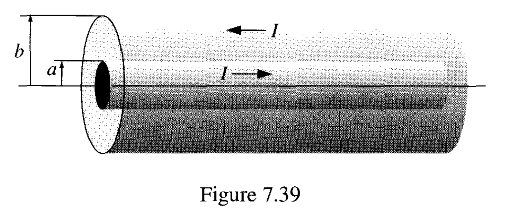
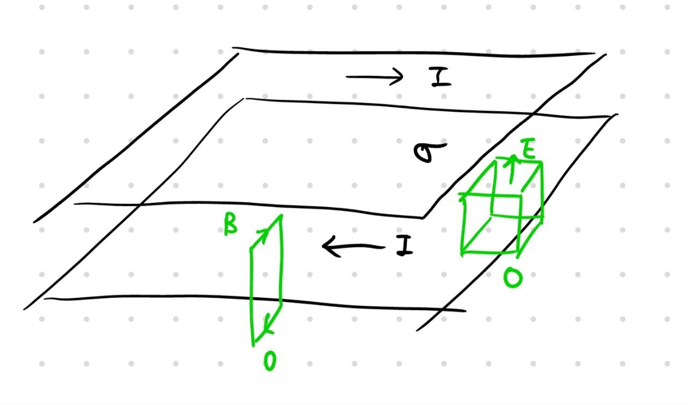
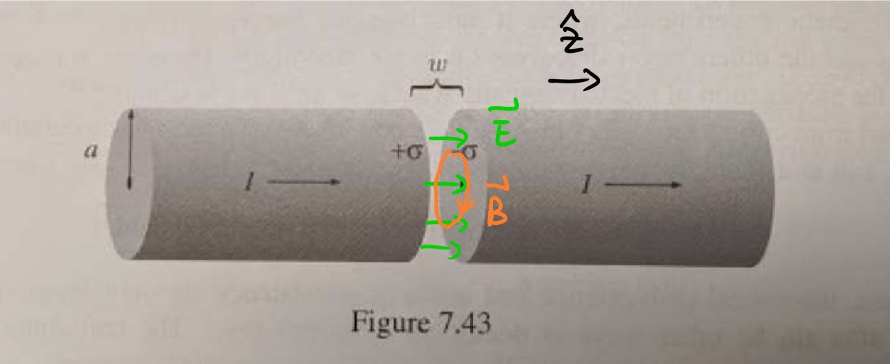
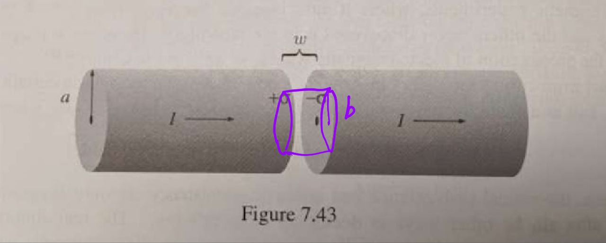

$$
{\def\B{\bold{B}}}
{\def\fac#1/#2;{\frac{#1}{#2}}}
{\def\muz{\mu_0}}
{\def\E{\bold{E}}}
{\def\S{\bold{S}}}
{\def\bphi{\boldsymbol{\hat\phi}}}
{\def\bz{\boldsymbol{\hat z}}}
{\def\bx{\boldsymbol{\hat x}}}
{\def\by{\boldsymbol{\hat y}}}
{\def\inv#1{\frac{1}{#1}}}
{\def\iv#1;{\frac{1}{#1}}}
{\def\d{\text{d}}}
{\def\deri#1/#2;{\frac{\d #1}{\d #2}}}
{\def\pderi#1/#2;{\frac{\partial #1}{\partial #2}}}
{\def\tsub#1;{_\text{#1}}}
{\def\half{\frac{1}{2}}}
$$

#### Problem 1

From Example 7.13, we know that the magnetic field is
$$
\bold B = \fac \muz I /2\pi s; \boldsymbol {\hat \phi}
$$
assume the inner surface has linear charge density of $\lambda$, then we know that (via a simple gaussian surface)
$$
\bold E = \fac \lambda / 2\pi \epsilon_0 ; \fac 1/s; \boldsymbol{\hat s};
$$
we could therefore calculate the Poynting vector
$$
\bold S = \iv \mu_0; (\E \cross \B) = \fac \lambda I /4\pi^2 \epsilon_0; \iv s^2; \bz
$$
we could then find the energy flows across the boundary of the coaxial wire. Since Poynting vector only has $\bz$ direction, we see that the energy only flow in and out at ends of the wire. We could calculate the power transported by the wire, by calculating one of its ends (let's say the right end)
$$
P = \int \S \cdot \d\bold a = \int_a^b S\cdot 2\pi s \d s = \fac \lambda I/2\pi \epsilon_0; \int_a^b \inv s \d s = \fac \lambda I/2\pi \epsilon_0; \ln(\fac b/a;)
$$
we could perform a line integral between surface to find the relationship of the voltage and electric field
$$
V = \int_a^b \E \cdot \d \bold l= \fac \lambda /2\pi \epsilon_0; \int_a^b \inv s \d s = \fac \lambda/2\pi\epsilon_0; \ln(\fac b/a;)
$$
It it obvious to see that
$$
P = VI
$$
as we expected.

For Problem 7.58, the situation is roughly looks like below

we get the current flow density $K = \fac I/w;$ from the question description. This question is actually done in PHYS 435 discussion before. 

To calculate the magnetic field, one consider the ampere loop indicated, notice that the magnetic field outside the enclosing volume is 0. This could be shown by realizing that an ampere loop that includes both surface will have 0 included current (top and bottom cancels out) and therefore 0 included magnetic field, yet when putting one side of the loop inside the enclosing volume, the ampere loop will no longer have 0 included current. That means the current in bottom ribbon contributes only to magnetic field $B$ indicated above, we therefore get
$$
\int_L \B \cdot \d \bold l = \muz K \cdot L \\
B \cdot L = \muz K \cdot L \\
B = \muz K \\
\B = \muz K \boldsymbol{\hat x}
$$
Top $B$ is same due to symmetry, $B$ on the side cancels out due to symmetry.

We could do similar reasoning for the electric field and get
$$
E\cdot A = \fac \sigma \cdot A/\epsilon_0;\\
\E = \fac \sigma/\epsilon_0; \boldsymbol{\hat z}
$$
therefore we could calculate the Poynting vector
$$
\S = \iv \mu_0; (\E \cross \B) = \fac \sigma K/\epsilon_0; \boldsymbol{\hat y} = \fac \sigma I/\epsilon_0 w; \boldsymbol{\hat y}
$$
we see that the power flowing into the ribbons on one side (right side with area of $w \cdot h$) is
$$
P = \int \S \cdot \d \bold a = w\cdot h \cdot \fac \sigma I/\epsilon_0 w; = \fac h\sigma I/\epsilon_0;
$$
and we see that the voltage across the ribbon is simply $V = h\fac \sigma/\epsilon_0;$, we could again see the familiar formula that
$$
P = VI
$$

#### Problem 2

##### (a)

derivation of electric field is similar as Problem 1 (b), since we have the assumption that $w \ll a$. We see that
$$
\E = \fac \sigma/\epsilon_0; \boldsymbol{\hat z}
$$
The $\boldsymbol{\hat z}$ is pointing towards right direction. Since the charge is accumulating on the cross section, we see that
$$
\sigma \pi a^2 = Q = It
$$
since at $t = 0$, there is no charge. so
$$
\E = \fac It/\pi a^2 \epsilon_0; \bz
$$
we do an ampere loop as indicated. Using ampere-maxwell equation, we see that
$$
B \cdot 2\pi s = \mu_0\epsilon_0 \pderi E/t; \pi s^2 = \mu_0 \fac s^2/a^2;\cdot I \\
\B = \fac \mu_0 s I/2\pi a^2; \boldsymbol{\hat \phi}
$$

##### (b)

the electromagnetic energy density is
$$
u\tsub em; = \half(\epsilon_0 E^2 + \inv \muz B^2) = \half \left( \fac I^2t^2/\pi^2 a^4 \epsilon_0; + \fac \muz s^2 I^2 /4\pi^2 a^4 ; \right) = \fac \mu_0 I^2/2\pi^2 a^4;(c^2t^2 + (\fac s/2;)^2)
$$
by using the fact that $c^2 = \fac 1/\mu_0\epsilon_0;$

Calculate the Poynting vector
$$
\S = \inv \muz (\E \cross \B) = \fac I^2 t\cdot s /2\pi^2 a^4 \epsilon_0; (\bz \cross \bphi) = -\fac I^2 t\cdot s /2\pi^2 a^4 \epsilon_0; \boldsymbol{\hat s}
$$
We want to show that
$$
\pderi/t; (u\tsub mech; + u\tsub em;) = -\grad \cdot \S
$$
we know that $u\tsub mech; = 0$, so we need to check
$$
\pderi u\tsub em;/t; = \fac \mu_0 I^2/2\pi^2 a^4;(2c^2 t) = \fac I^2 t/\pi^2 \epsilon_0 a^4;
$$
and we check that
$$
-\grad \cdot \S = \fac I^2 t/2\pi a^4 \epsilon_0; \grad \cdot (s \boldsymbol{\hat s}) = \fac I^2 t/2\pi a^4 \epsilon_0; \cdot \inv s \pderi s^2/s; = \fac I^2 t/\pi^2 \epsilon_0 a^4; = \pderi u\tsub em;/t;
$$
as expected.

##### (c)

we see that we could calculate the energy of the cylinder indicated above.
$$
U\tsub em; = \int u\tsub em; w2\pi s \d s = \fac \mu_0 w I^2/\pi a^4; \int_0^b s(c^2t^2 + (\fac s/2;)^2) \d s = \fac \mu_0 w I^2/\pi a^4;b^2 \cdot  (\half c^2 t^2 + \iv 16; b^2)
$$
we see that the energy received is (we only calculate the side of the cylinder, since it has only $\boldsymbol{\hat s}$ component)
$$
P\tsub received; = - \int \S \cdot \d \bold a = \fac I^2 t\cdot b /2\pi^2 a^4 \epsilon_0; \cdot 2\pi b w = \fac I^2 t b^2w /\pi a^4 \epsilon_0;
$$
and
$$
\deri U\tsub em;/t; = \fac \mu_0 w I^2/\pi a^4;b^2 \cdot  (c^2t) = \fac I^2tb^2w/\pi a^4 \epsilon_0; 
$$
and we see that they are indeed equal (thus, energy is conserved, as expected).

$$
\sqrt{
\begin{array}{}
1\\
2\\
3\\
4\\
4\\
5\\
6\\
7\\
\end{array}
}
\widehat {i}
\hat \imath
\\
\left(
\begin{array}{}
1\\
2\\
3\\
4\\
4\\
5\\
6\\
7\\
8\\
8\\
8\\
8\\
8\\
\end{array}
\right)\\

\bigsum{
\begin{array}{}
1\\
2\\
3\\
4\\
4\\
5\\
6\\
7\\
\end{array}
}
$$
