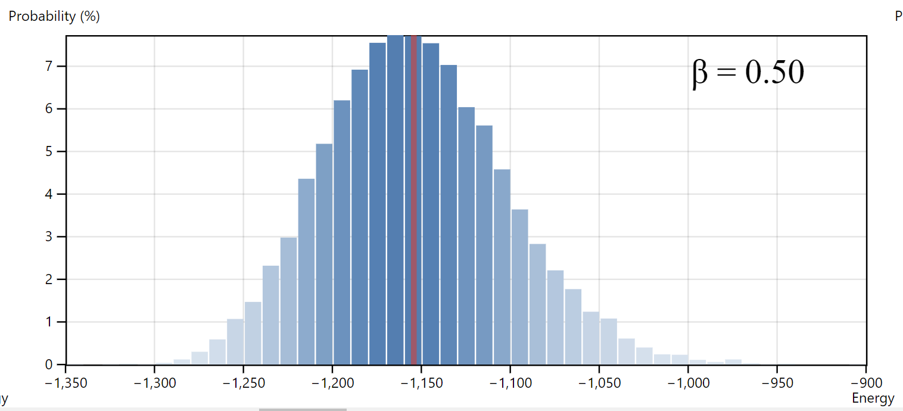
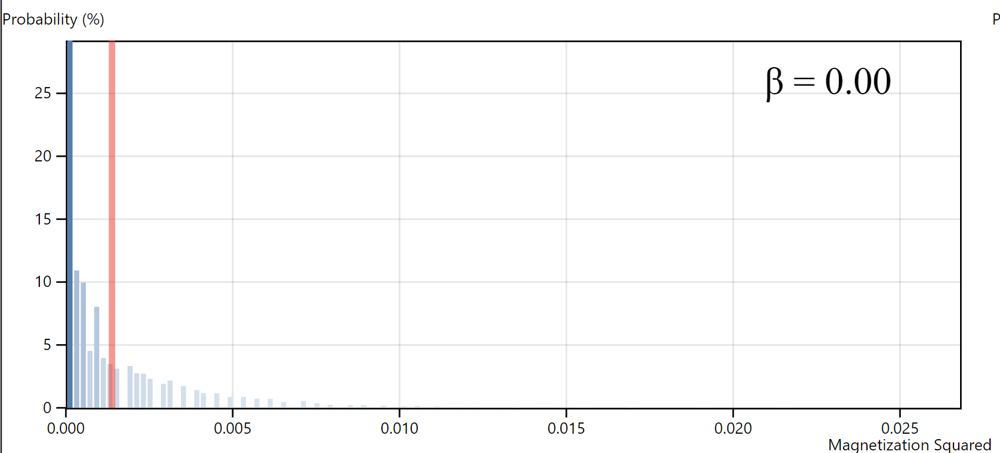
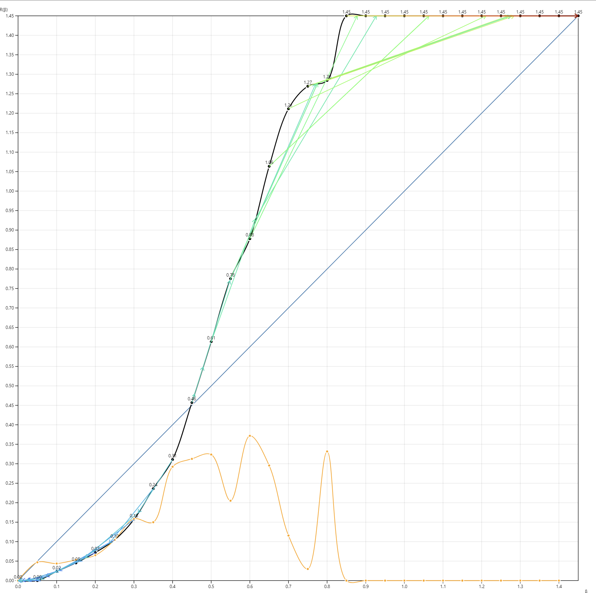

### Simulating Ising Model

The corresponding webpage is in `/dist/Simulation/index.html` for real time demonstration.

The data for corresponding $\beta$ could also be accessed by opening the developer console, it's a string displayed in `csv` format.

For $\beta = 0.3$, the corresponding graph is shown below. The <span style = "color:blue; font-weight: bold">blue</span> one is the theoretical result, and the <span style = "color:red; font-weight: bold">red</span> is the simulation result. The difference is so small, so the data in real-time webpage display might be better.


---

The **bonus**: The $81 \cdot 81$ lattice of $1000$ sweeps take approximately $0.8 \sim 1.1$ seconds. (It may depend on machine). The code is in function `timingTest()` the `src/tests/Simulation/index.ts`, it's also shown below:

```typescript
const timingTest = () => {
    const start = new Date().getTime();
    const model = IsingModel.fromRandom(81, 0.5);
 
    // do 1000 sweep
    for (let i = 0; i < 1000; i++) {
        model.sweep();
    }
  
    const end = new Date().getTime();
    // log time taking in seconds
    console.log(`Time taken: ${(end - start) / 1000} seconds`);
}
```

The logging information could be seen in the developer console in the webpage `dist/Simulation/index.html`

### Measuring Ising Model

The corresponding webpage is in `dist/Measurement/index.html` for real time demonstration. The real time simulation takes about 1 - 2 minutes.

The following is the distribution of $E$ in different $\beta \in [0, 0,1 \cdots 1.4]$. The red line indicates the $\langle E \rangle$





The following is the distribution of $M^2$ in different $\beta \in [0, 0,1 \cdots 1.4]$. The red line indicates the $\langle M^2 \rangle$




The $\langle E \rangle$ with respect to $\beta$


The yellow-greenish rectangle in the first graph indicates the probability for each energy.

The blue bar on second graph indicates the standard error (since the stats.py is still unavailable on website, the autocorrelation time couldn't be calculated).

The $\langle M^2 \rangle$ with respect to $\beta$


Specific Heat with respect to temperature.


### Renormalization group

The corresponding webpage is in `dist/Renormalization/index.html` for real time demonstration. The real time simulation for this webpage is slow, the webpage might even show "the page is not responding", but please just wait patiently.

#### Coarse Grinding

The snapshot for $\beta \in [0, 0.1, 0.2 \cdots 1.4]$ (Consider $1.4$ as $\infin$)

1. $81 \times 81$ Ising Model
2. $27 \times 27$ Coarse Grained Ising Model
3. $9 \times 9$ Double Coarse Grained Ising Model


(Yellow = Spin Up, Blue = Spin Down)

The snapshot actually reveal one problem, that is there might be some cluster refuse to change to the dominate spin. (That is possible when flip only one spin at once, if there are already two clusters, flipping the spin inside that cluster actually increase the energy, which is unfavorable, only flipping the spin on the boundary could eliminate the cluster, but the probability of choosing the boundary has a really small probability).

#### Getting $R(J)$




Note, the x-axis and y-axis are actually $\beta$ and $R(\beta)$. Since the $\beta$, $\beta J$ and $J$ is interchangeable, so it's effectively just $R(\beta)$.

The fixed point, which are shown by both graph, is approximately $0.45$. Since the $\beta = {1\over{kT}}$, and it's assumed that $k = 1$. Therefore, the critical temperature $T = \frac{1}{k} = 2.22$.

#### Critical Exponents and Stability of Fixed Points

There are several families of arrows in the graph. Each family of arrows starting from different initial $\beta$ are marked with different color (from blue to red). It's obvious that any $\beta$ below the $\beta_{critical}$ (which is $0.45$ in this case) all tends $0$, and the $\beta$ that is bigger then $\beta_{critical}$ all tend to the maximum $\beta$. While the $\beta_{critical}$ should stay in the same place. (It's hard to see on graph). Therefore,

1. Stable Fixed Points: $0$ and $\beta_{max}$
2. Unstable Fixed Points: $\beta_{critical}$

The **yellow** line in the graph indicates the derivative of the curve (scale down by 10). The curve around the critical point is indeed linear. According to the formula:
$$
b^{1/{\nu}} = \text{slope} \\
3^{1/\nu} \approx 32 \\
\frac{1}{\nu} = \frac{\ln32}{\ln 3} \\
\nu = \frac{\ln 3}{\ln 32} = 0.317
$$


 
