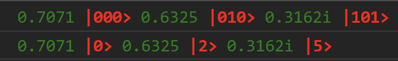
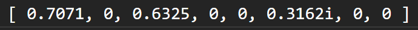
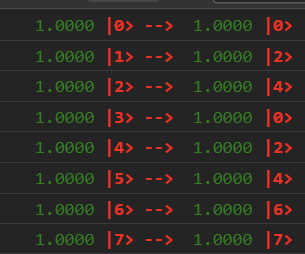

### Dirac Notation

Given the state

```typescript
const state = QuantumState.create(3) // wire length
state.incrementState('000', ComplexNumber.fromReal(Math.sqrt(0.5)));
state.incrementState('101', ComplexNumber.fromImaginary(Math.sqrt(0.1)));
state.incrementState('010', ComplexNumber.fromReal(Math.sqrt(0.4)));
```

Print the state

```typescript
state.printStringColorful(PrintType.Binary);
state.printStringColorful(PrintType.Integer);
```

The log is



Convert the state to vector, print the vector.

```typescript
console.log(state.toVector().toString());
```

The log is



Converting vector back to the original state via

```typescript
Quantum.fromVector(state.toVector())
```

will work properly.

### Phase Estimation

### Quantum Fourier Transform

???

### Shor's Algorithm

The corresponding code is in `./lib/ShorAlgorithm.ts`

For $N = 33$, $x = 5$ and $r = 10$. (The $x = 2$ and $r = 10$ doesn't satisfy, because $x^{r/2} - 1 = 0$)

### $U_{x, N}$ Gate

Implemented in: `./lib/QuantumGate/ExtendedGate/Shor.ts`. They are implemented in the way of **Simulation II**. 

The core code is

```typescript
getStateFunction() : TransformFunction<QuantumState> {
  return (quantumState : QuantumState) => {
    checkQuantumStateLengthMatched(quantumState, this.wireLength);

    return quantumState.transform((value, key, _, newState) => {
      const y = QuantumState.toDecimal(key.slice(this.startWire, this.endWire));
      const newY = (y >= this.N) ? y : (y * this.x) % this.N;

      newState.incrementState(
        QuantumState.replaceCharBetween(
          key, 
          this.startWire, this.endWire, 
          QuantumState.toBinaryString(newY, this.endWire - this.startWire)
        ),
        value.clone()
      )
    });
  }
}
```

We use a small example $N = 6$ and $x = 2$, with the following code

```typescript
const testShor = () => {
  // 3 indicates the wireLength of the gate
  const shor = Shor.create(3, {
    startWire : 0,
    endWire : 3,
    x : 2,
    N : 6,
  })

  const transformFn = shor.getStateFunction();

  for (let i = 0; i < 8; i++) {
    const state = QuantumState.create(3);
    state.incrementState(i, ComplexNumber.ONE);
    const transformedState = transformFn(state);
    /// <log functions> not important
  }
}
```



As $y < 6$, all the input multiply by 2 and mod by 6. As $y \geq 6$, the input is kept.

