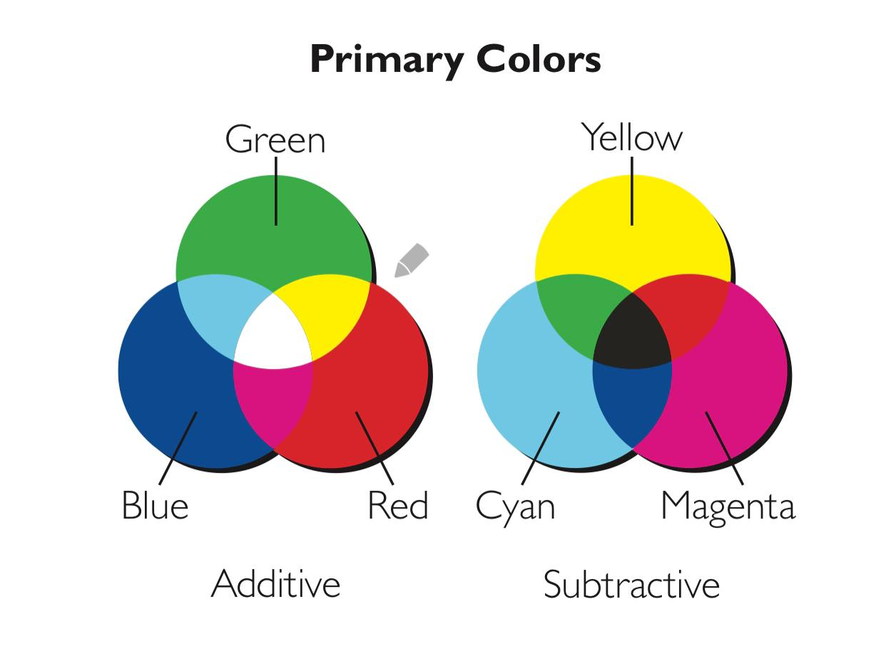
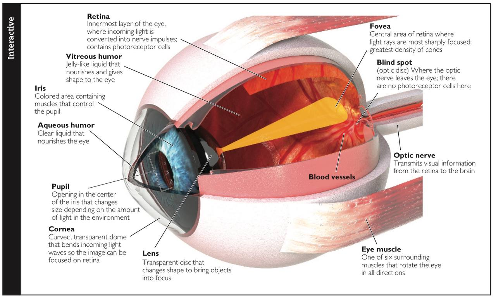

# Sensation and Perception

`Illusion`: perception in wehich the way we perceive a stimulus deosn't match its physical reality.

`Sensation`: detection of physical energy by sense organs, which then send information to the brain.

`Perception`: the brain's interpretation of raw sensory inputs.

## 4.1 Two side of coin: Sensation & Perception

### Sensation: Our Senses as Detectives

#### Transduction: Going from the outside world to the within

`Transduction`: the process of converting an external energy of substance into electrical activity within neurons. 

`Sense Receptor`: specialized cell responsible for converting external stimuli into neural activity for a specific sensory system.

`Sensory adaptation`: activation is gtreatest when a stimulus is first detected. 

#### Psychophysics: Measuring the barely detectable

`Psychophysics`: the study of how we perceive sensory stimuli based on their physical characteristics.

`Absolute threshold`: lowest level of a stimulus needed for the nervous system to detect a change 50 percent of the time.

`Just noticeable difference (JND)`: the smallest change in the intensity of a stimulus that we can detect.

`Weber's law`: there's a **constant proportional** relationship between `JND` and the original stimulus intensity.

`Signal detection theory`: theory regarding how stimuli are detected under different conditions.

`Signal-to-noise ratio`: greater the ratio, less harder to understand the signal.

`Specific nerve energies`: the sensation experienced is determined by the natrue of the sense receptor, not the stimulus.

`Cross-model Effects (McGurk Effects)`:  Integration of multiple sensational information. 

A single brain region may serve double duty.

`synthesia`: a condition in which people experience cross-modal sensations.

### The Role of Attention

#### Selective Attention: How we foucs on specific inputs

`Selective attention`: process of selecting one sensory channel and ignoring or minimizing others. 

`Cocktail party effect`: 

#### Inattentional Blindess

`Inattentional blindness`: failure to detect stimuli that are in plain sight when our attention is focused elsewhere.

### The Binding Problem: Putting the Pieces Together

## Seeing: The Visual System

### Light: The Energy of Life

Brightness, hue, addivtive and subtractive color mixing.

#### The Eye: How We Represent the Visual Realm

#### How lights enters the eye

##### Sclera, Iris, and Pupil

`Sclera`: The white of the eye

`Iris`: The colored part of the eye

`Pupil`: The cicular hole through which light enters the eye. 

`Pupil` reflexs to adapt to different intensity of light. **Expansion** of `pupil` indicates **processing of the complex information** or the **sexual interests**.

##### The cornea, Lens, and Eye Muscles

`Cornea`: part of the eye containing transarent cells that focus light on the `retina`.

`Lens`: part of the eye that changes curvature to keep images in focus.

`Accommodation`: changing the shapes of `Lens` to foucs on objects near or far.

##### The shape of the Eye

`Myopia (Nearsightedness)`: Images are focused in front of the rear of the eye, resulted when cornea is too steep or eyes too long.

`Hyperopia (Farsightedness)`: images are focused behing the rear of the eye, resulted when cornea is too flat or eyes too short.

#### The Retina, changing light into neural activity

`Retina`: membrane at the back of the eye repsonsible for converting light into neural activity.

`Fovea`: the central portion of the retina, reposible for `acuity (sharpness of vision)`

##### Rods and Cones

`Rods`: receptor cells in retina allowing us to see in low levels of light. 

`Dark adaptation`: Time in dark before rods regain maximum light sensitivity.

`Cones`: receptor cells in the retina allowing us to see in color.

`Photopigments`: chemcials that cahgne following exporsure.

`Rhodopsin`: the `photopigments` in `Rods`, contained Vitamin A.

 

