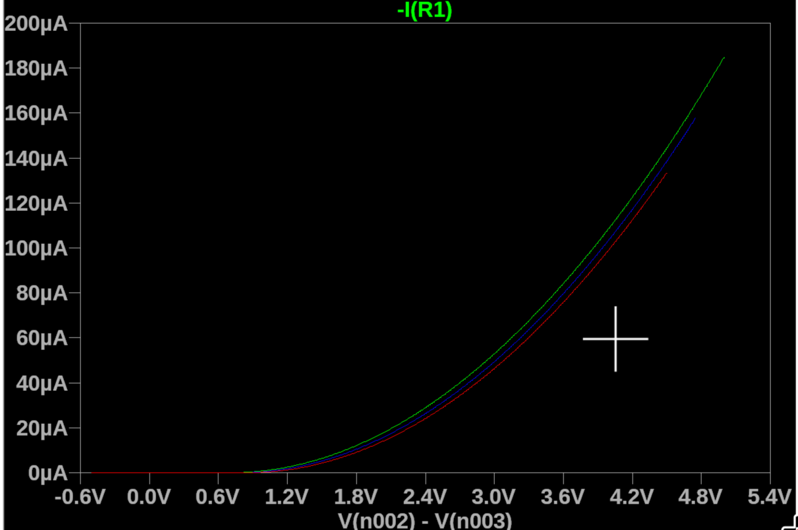
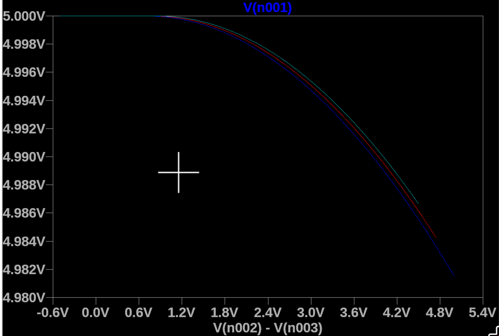
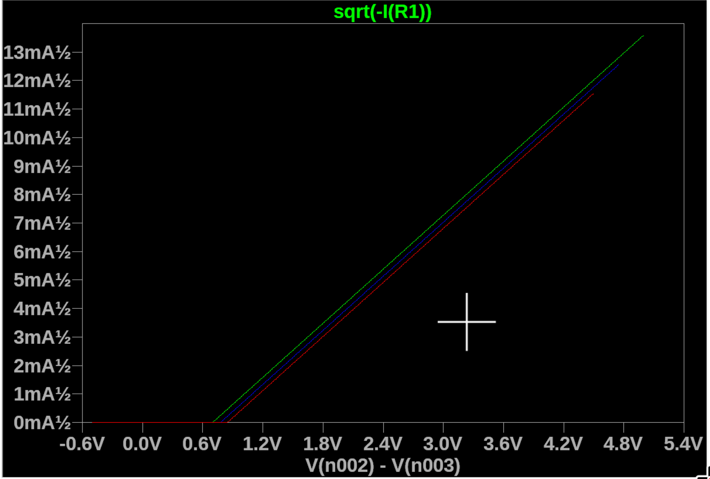
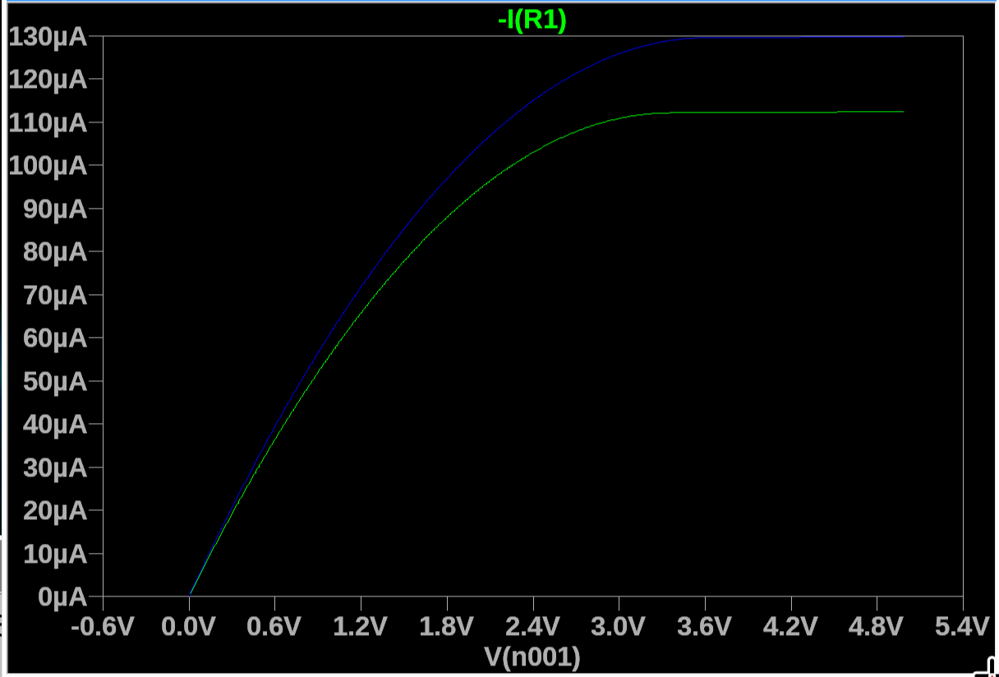
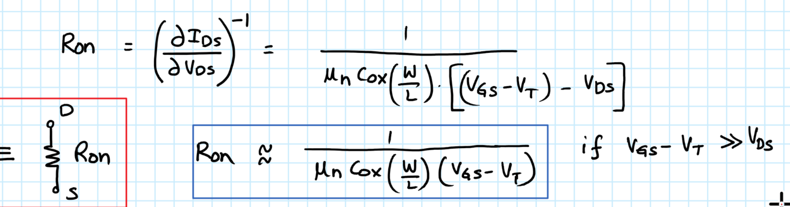
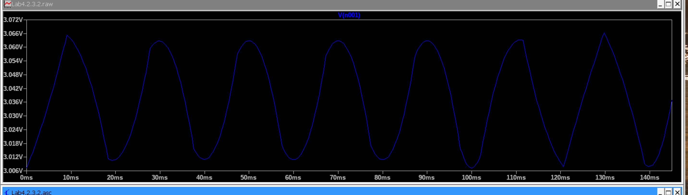
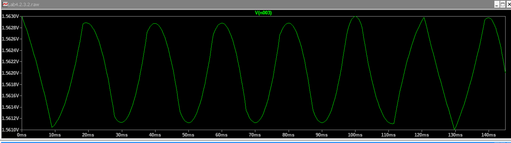
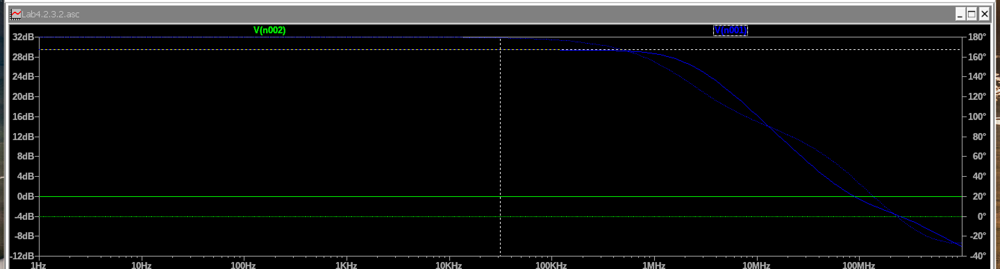

700, 780, 850 mV

It seems that $V_T$ actually changes. Since 
$$
I_D = C(V_{GS} - V_T)^2
$$
bigger $V_T$ makes the $I_D$ smaller. So the case  where $V_{SB}$ is bigger make the $V_T$ bigger, and therefore make $I_D$ smaller and therefore $V_D$ bigger (at same $V_{GS}$).

 4V -> $1.89V / 100\mu A$

4.25V -> $1.6V/81 \mu A$

$R_{on} \to \infin$ (Sat)

$\lambda = 0$
$$
I_D = k_n (V_{GS} - V_T)^2
$$

$R_{on}$ goes to infinite in the saturation region, while gradually increase in the linear region (not really linear, so to say).

On techonology ($V_T, W, L, \mu_n, C_{ox}, etc.$), and on $V_{GS}$.

cutoff voltage around 1.25V. 

saturation voltage around 1.63V.

$V_{GS}$ provides DC bias, $V_{in}$ is the small signal.

$A = -G_m (R_{out})$

$G_m = g_m$

$R_{out} = R_D || r_{ds}$

0.002 Vpp -> 0.059171 Vpp

30

50Hz -> -33.58dB

100Hz -> -83.44dB

150Hz -> -139.55dB 

50Hz -> 716.071mdB

100Hz -> -15.45dB

150Hz -> -37.944dB

1MHz

Gain +29dB

$g_m = 2I_D/V_{ov}$

$V_{ov} = 1.562 - 1.25 = 312mV$

1.310mA, 8.40m, +29dB, 1MHz

1.306mA, 8.371m, +30dB , 700-800

1.3095mA,  8.40m, +30dB, +200kHz-300kHz

