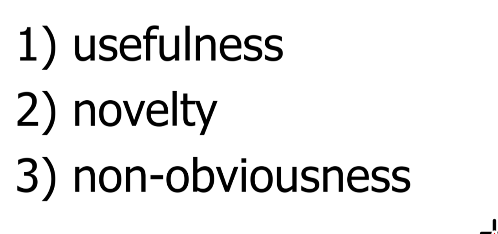

1. Which definition of privacy means “freedom from physical intrusion”?

   Accessibility Privacy.

2. “I refuse to take part in cyberbullying or trolling, because I strive to be kind and honorable person.” What ethical theory is being employed in this argument?

   Merit-based Theory.

3. Under which philosophical theory of ethics is intellectual property considered a natural right?

   Labor Thoery. 

4. What do we call the situation where technological development outpaces society’s development of relevant norms?

   Morally opaque.

5. “Doughnuts must taste like rubber, because they’re shaped like tires.” What logical fallacy is being made here?

   False Analogy.

6. “Which of the following intellectual property schemes grants an inventor an exclusive legal monopoly?

   Patents

7. The famous Coco-Cola company protects its soda formula under which of the following intellectual property schemes?

   Trade Secrets

8. “Stripping someone else of their privacy to protect myself is using that person as a means to an end. We have a moral duty to protect and respect the privacy of others.” What kind of ethical reasoning is being employed in this argument?

   Entonological theory.

9. Which of the following organizations, founded by Lawrence Lessig, leverages existing copyright laws to give greater flexibility and choices to the creator?

   Creative Commons

10. “Everyone can see ghosts, except for people who don’t believe in them. That’s because ghosts are invisible to people who don’t believe in them.” What kind of logical fallacy is this?

    Begging the Question (Circular Reasoning)

11. What do we call confidential information about a person (e.g. their medical records?)

    Nonpublic personal information (NPI)

12. “All doughnuts are chocolate-covered. Sure, Dunkin Donuts sells caramel-covered doughnuts, but those aren’t real doughnuts.” What kind of logical fallacy is this?

    

13. The “third party doctrine” could apply to the contents of your refrigerator if you...

    

14. “Distributing copyrighted works is a form of stealing. Stealing is wrong, because it violates moral responsibilities which I believe to be universal. We should not engage in cyberpiracy.” What ethical theory is being employed in this argument?

    Deontological Theory.

15. “Distributing copyrighted material robs the creator of wealth, which discourages artists from creating more works for the public to enjoy. Distributing copyrighted works is therefore unethical.” What ethical theory is being employed in this argument?

    Utilitarian Thoery.

16. “If I get rich by taking advantage of the foolish, it’s not immoral. When a lion preys upon the slowest gazelle, it’s evolution. I should behave the same way.” What kind of logical fallacy is this?

    False Analogy.

17. Two researchers discuss whether or not it is ethical to collect the names of subjects in a psychological study. What are they wrestling with?

    Personal identifying information (PII) - information used to uniquely identify a person

18. What do we call public information about a person (e.g. their being in a public place?)

    Public personal information (PPI)

19. “You say I should wear my seatbelt because it will protect me in an accident, but you didn’t wear your seatbelt last week.” What kind of logical fallacy is this?

    Tu quoque.

20. Which of the following philosophies is rooted in the idea that intellectual property should be protected because the creator is entitled to the benefits of their work.

21. Which of the following intellectual property schemes lasts for exactly 20 years?

    Patent.

22. “Illinois CS students should strive to protect sensitive user data.” What can we say about this statement?

    Normative Privac .

23. “Cyberbullying and trolling are unethical. While they might at first seem like a fun diversion, this dubious social utility is far outweighed by the emotional toll these actions take on their victims.” What ethical theory is being employed in this argument?

    Utilitarian Theory

24. Two employees for a cell phone company discuss whether or not it is ethical o share user data with a marketing firm. What are they wrestling with?

    User Privacy.

25. Which of the following is not required of a moral system?

    ..

26. “You only support Open Source because you’re cheap,” is an example of what logical fallacy?

    Ad hominem

27. You are in a classroom by yourself. A classmate enters the room. Which kind of privacy have you lost?

    

28. Which of the following is part of the deliberate step of Tavani’s “Comprehensive Strategy for Approaching Cyberethics Issues”?

29. If we argue that privacy is a “means to an end,” we are arguing it has what kind of value?

    Utilitarian value.

30. You and your friend Luke are standing in line at the Einstein’s Bagels. All of a sudden, the Joker appears in the atrium and demands two hostages (out of the 300 people in the building) – otherwise, he says he will blow up the building. Luke pushes the two people in front of him towards the Joker. The Joker leaves the building with the two unfortunate hostages. Luke’s actions were moral under the premises of which ethical theory?

    Utilitarian Theory.

31. Which definition of privacy protects freedom of conscience?

    Decision Privacy.

32. Kant’s “Categorical Imperative” concerns treating people as ends in themselves and not means to ends that they do not share. Always, sometimes or never?

    Always

33. What do we call data that must be protected because it is intimate or confidential?

    PII

34. Which of the following is not on the Creative Commons “Menu”?

    1.Attribution—Permit others to copy, distribute, display, and perform the work
    and derivative works based upon it only if they give you credit
    2.Noncommercial—Permit others to copy, distribute, display, and perform the
    work and derivative works based upon it only for noncommercial purposes
    3.Derivative works—Permit others to copy, distribute, display, and perform only
    verbatim copies of the work, not derivative works based upon it
    4.Share alike—Permit others to distribute derivative works only under a license
    identical to the license that governs your work

35. What do we call the situation that arises when a technology creates nonobvious ethical concerns?

    Conceptual muddle.

36. What do we call an argument whose premises lead us to believe that the conclusion is likely true?

    Inductive Argument

37. Software can be copyrighted. Always, sometimes, or never?

    Sometimes

38. Which definition of privacy is concerned with the way personal data is gathered?

    Informational Privacy.

39. “Illinois CS students should use their expertise to make the world a better place.” What can we say about this statement?

    Normative Claim

40. What do we call data used to uniquely identify a person (e.g. their SSN or fingerprint?)

    PII

41. Which of the following is an example of a moral agent?

    

42. The practices of merging and matching personal information potentially violate which of the following?

    Informational Privacy

43. “The Earth’s surface is flat. The top level is obviously smooth and level. Furthermore, we can see that it is not round.” What kind of logical fallacy is this?

    Assuming the consequence.

44. “Staying up late makes you sleepy. You look sleepy, so you must have stayed up late.” What kind of logical fallacy is this?

    Assuming the consequence.

45. Which of the following intellectual property schemes could be used to protect a novel?

    Copyright.

46. When a fixed copy of a work is purchased, what grants the buyer the freedom to give the fixed copy to a friend without the author’s permission?

    First-sale doctrine

47. As you are typing your PIN into an ATM, someone behind you watches you enter the numbers. Which kind of privacy have they violated?

    

48. When does a sound argument contain one or more false premises?

    The conclusion is then wrong.

49. “You think this house is worth a million dollars. The appraiser thinks it’s worth three million dollars. The true value is probably around two million dollars.” What kind of logical fallacy is this?

    middle ground assumption.

50. Which of the following is an example of cybercrime (as opposed to cyber-related crime)?

51. In which of the following practices is implicit personal data discovered?
52. According to U.S. patent law, which of the following is one of the three criteria that an invention must satisfy for a patent application to be approved?

53. Which of the following intellectual property schemes typically involves employees signing NDAs?

    Trade Secrets.

54. According to U.S. patent law, which of the following is not one of the three criteria that an invention must satisfy for a patent application to be approved?

    

55. Which of the following laws criminalizes accessing a “protected computer” “without authorization”?

    CFAA

56. “Cyberbullying and trolling are unethical. While they might at first seem like a fun diversion, the abusers are using humans as a means to an end. Ultimately, humiliating people for entertainment violates our moral
    obligation to protect them from harm.” What ethical theory is being employed in this argument?

    Entonological theory.

57. Under which philosophical theory of ethics is intellectual property considered an artificial right?

    Util.

58. Software can be patented. True or False?

    True.

59. Which of the following laws protects private student information in the US?

    FERPA

60. What do we call the philosophical stance that there are multiple plausible answers to ethical dilemmas, as long as rational criteria are satisfied, but some answers are more right than others?

    Moral Objectivism

61. Your friend says, “We should respect this inventor’s patents, because that incentivizes him to invent even more useful products to benefit society.” What philosophy of intellectual property is she using?

    Util.

62. When we question whether personal information should be transferred from its original context, what are we talking about?

    

63. Which of the following is the U.S. law that created the concept of a “takedown notice”?

    DMCA

64. Which of these terms means “having privacy”?
65. Which of the following would least likely be considered “fair use”?
66. Which of the following organizations primarily promotes open source as a development process, while allowing for proprietary software and commercial use?

67. What is the definition of a logical argument?

68. Which of these philosophers is associated with deontological ethics?

    Kant.

69. “Three of my friends lost 10 pounds eating coffee beans, and there’s no other way to explain their weight loss. These beans are magical.” What kind of logical fallacy is this?

    Ignorance

70. Which of the following is not part of the identify step of Tavani’s “Comprehensive Strategy for Approaching Cyberethics Issues”?

71. Which of these philosophers is associated with virtue-based ethics?
72. “Though a sentient machine might seem like something out of science fiction, I would strive to be just and tolerant in my interactions with one. Perhaps a sufficiently advanced AI could pursue eudaemonia.” What kind of ethical reasoning is being employed in this argument?

73. What do we call the situation where technological development causes

confusion between pWhat do we call the situation where technological development outpaces society’s development of relevant norms?reviously distinct ideas?

6

74. Which of the following laws includes both criminal and civil punishments

for “exceeding authorization”?

75. Which definition of privacy protects against unwarranted search and

seizure?

76. You and your friend Luke are standing in line at the Einstein’s Bagels kiosk.

All of a sudden, the Joker appears in the atrium and demands two hostages
(out of the 300 people in the building) – otherwise, he says he will blow up
the building. You and Luke volunteer as the hostages, and leave the
building with the Joker. Your actions were moral under the premises of
which ethical theory?

77. “Regardless of how intelligent a computer is, people should ultimately use

it as they would any other machine: to promote human happiness.” What
kind of ethical reasoning is being employed in this argument?

78. The name of the famous shoe brand “Nike” is protected by which of the

following intellectual property schemes?

79. What do we call the descriptive proposition that cultures have different

beliefs about what is moral and immoral?

80. Which of the following is the U.S. law that provides the “safe harbor”

provision for ISPs?

81. When we say a person is a “utilitarian”, to what ethical theory do they

subscribe?

82. Which of the following philosophies is rooted in the idea that intellectual

property should be respected as an extension of the creator’s identity?

83. Your friend says, “Pirating music is wrong, because you are stealing from

hard working artists. They have a right to benefit from their efforts.” What
philosophy of intellectual property is she using?

84. “Cheating is wrong, so no one is going to try and cheat on this test” is an

example of what logical fallacy?

85. What do we call the phenomenon where people assume the probability of

a random match is equal to the probability of innocence?

86. If we argue that privacy is “an end in and of itself”, we are arguing it has

what kind of value?

87. Which of the following intellectual property schemes has a “fair use”

exemption?

88. “Illinois CS students have created software that makes people safer and

happier.” What can we say about this statement?

7

89. Which of these terms means “having a right to privacy”?
90. “When I weigh the social utility of preserving individual privacy against the

safety risks, maintaining privacy leads to greater overall happiness.
Preserving privacy is therefore morally right.” What kind of ethical
reasoning is being employed in this argument?

91. Which amendment to the U.S. constitution protects against unwarranted

search and seizure?

92. People or organizations who own and enforce patents for the sole purpose

of collecting licensing fees without actually manufacturing products or
supplying services are sometimes called...

93. ”We all torrent music, so it can’t be unethical!” is an example of what logical

fallacy?

94. Which definition of privacy means “freedom from interference in one’s

choices”?

95. Under which philosophical theory of ethics is intellectual property

considered a moral right?

96. When we say a person is a “deontologist”, to what ethical theory do they

subscribe?

97. Which of the following is an administrative subpoena that includes a gag

order?

98. “The Earth is clearly flat, because there is no evidence that the Earth is

round.” What kind of logical fallacy is this?

99. Which of these philosophers is associated with utilitarianism?
100. In which of the following practices is data not necessarily exchanged?
101. Which of the following is true of a warrant but not true of a subpoena?
102. “You say I should wear my seatbelt because it will protect me in an

accident, but you’re only telling me to wear my seatbelt because you’re a
control freak.” What kind of logical fallacy is this?

103. What do we call an argument whose premises have no bearing on the truth

of their conclusion?

104. Which of the following is an example of cybercrime (not cyber-related

crime)?

105. What do we call the philosophical stance that we cannot morally evaluate

the ethical behavior of a person from another culture?

8

106. What do we call an argument with all true premises whose conclusion must

logically follow from the premises?

107. In class, we discussed a hypothetical facial recognition technology that

was used to identify a suspect. The odds of a random match were extremely
low, but we searched a very large database. If we only report the low odds
of a random match, what intellectually dishonest practice are we guilty of?

108. Which of the following intellectual property schemes has been abused

lately by “rent seeking” behavior?

109. “I aspire to be an honest, just, and disciplined person. If I cannot afford to

pay for copyrighted material, I will cultivate these virtues by refusing to
pirate it.” What ethical theory is being employed in this argument?

110. “A sentient artificial intelligence would be a moral agent. Because of this, it

would have intrinsic moral worth. We would therefore have the same
moral obligations to a self-aware AI that we have to any other person.”
What kind of ethical reasoning is being employed in this argument?

111. Which of the following intellectual property schemes could be used to

protect a chemical formula for hundreds of years?

112. The “third party doctrine” could apply to your email password if you did

which of the following things?

113. When we say a person is a “Aristotelian”, to what ethical theory do they

subscribe?

114. Your friend says, “It’s wrong to paint over this artist’s painting, because it

could diminish their reputation.” What philosophy of intellectual property
is she using?

115. Which of the following organizations, founded by Richard Stallman, rejects

all notions of proprietary software?

116. “Illinois CS students have a flawless history of protecting sensitive user

data.” What kind of statement is this?

117. What do we call the philosophical stance that there is one and only one

correct answer to every ethical dilemma?

118. Which of the following is part of the analyze step of Tavani’s

“Comprehensive Strategy for Approaching Cyberethics Issues”?

119. “My friend told me he saw a ghost, and he wouldn’t lie, because that’s

unethical.” What kind of logical fallacy is this?

9

120. What do we call the philosophical stance that morality is a private

individual choice? Based on Gert’s definition of morality, this is an
oxymoron.

121. If a person hacked into a government computer and to steal government

secrets, which of these laws would most likely be used to prosecute them?

122. Like any mathematical formula, an algorithm can be patented without a

practical application. Always, sometimes, or never?

123. Which of the following intellectual property schemes can be used to

protect databases that “exhibit authorship”?

124. When does a sound argument contains all true premises?
125. If a person hacked a video game to circumvent copyright restrictions,

which of these laws would most likely be used to prosecute them?

126. “Round things are like balls. They roll and bounce. The Earth doesn’t

bounce or roll, so it must be flat.” What kind of logical fallacy is this?

127. “Everyone who eats magic coffee beans will lose weight. Yes, Bill gained

weight when he ate them, but he wears leather shoes so he doesn’t count.”
What kind of logical fallacy is this?

128. In class, we discussed a machine learning algorithm that was trained to

distinguish between wolves and dogs. It was fooled by snow in the
background. What is this an example of?

129. Kant’s Categorical Imperative permits sacrificing one person against their

will as long as it serves a greater good. Always, sometimes or never?

130. The practice of dataveillance potentially violates which of the following?
131. “We both agree that slavery is wrong and people should be free. Why are

you asking me to pay you for your work? Shouldn’t you be free?” What kind
of logical fallacy is this?

132. What do we call data describing other data (e.g. data describing where and

when a photograph was taken?)

133. When we question whether personal information should be gathered or divulged within a given context, what are we talking about?

134. A so-called “national security letter” is an example of which of the following?

135. Which of the following is the U.S. law that first criminalized the circumvention of DRM?

136. What do we call it when we focus on what is the case rather than what ought to be the case?

137. “I shouldn’t have to wear a seatbelt. I’m survived tours in Iraq and Afghanistan.” What kind of logical fallacy is this?

138. “Either my magic coffee beans can cure diseases, or all the people who bought them are mindless fools. They can’t all be fools, so they must cure disease!” What kind of logical fallacy is this?

139. Which definition of privacy means “control over the flow of one’s personal information”?

140. Which of the following scenarios would most likely be considered “fair use”?

141. Which of the following philosophies is rooted in the idea that intellectual property should be protected only because it benefits society?

142. Who deliberately sabotaged the Nazi census in France to prevent the tracking of Jewish people?

143. “No one should pay attention to Paul’s argument. He is a liar and a thief.” What kind of logical fallacy 